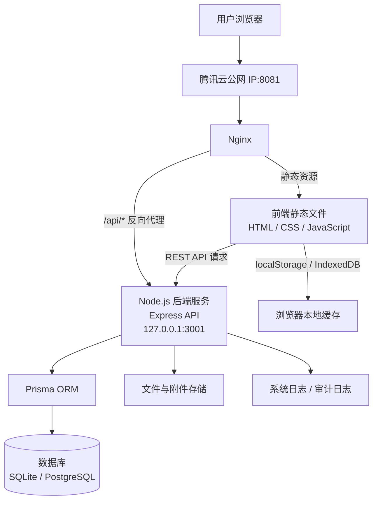
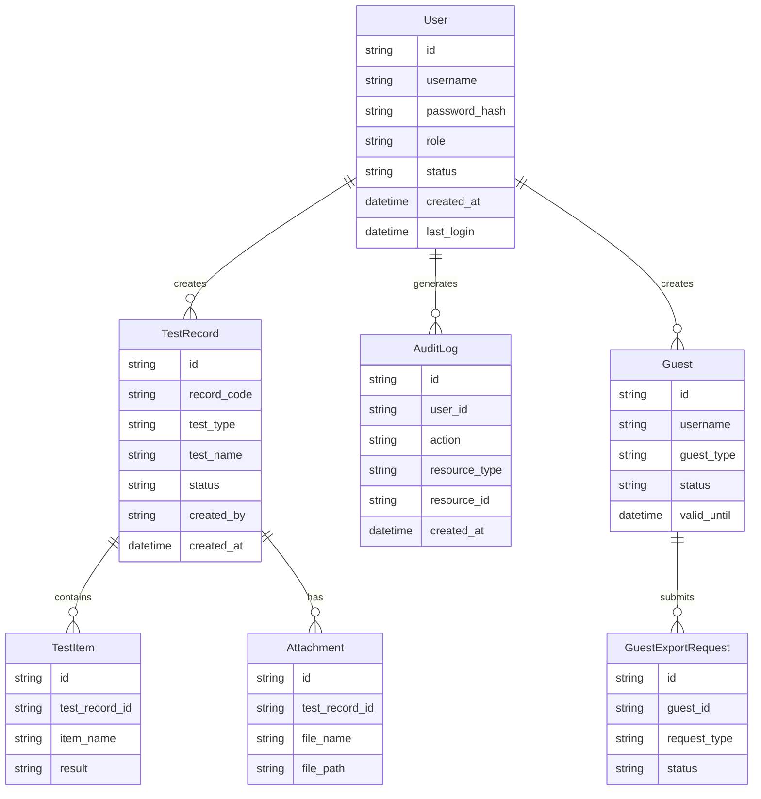
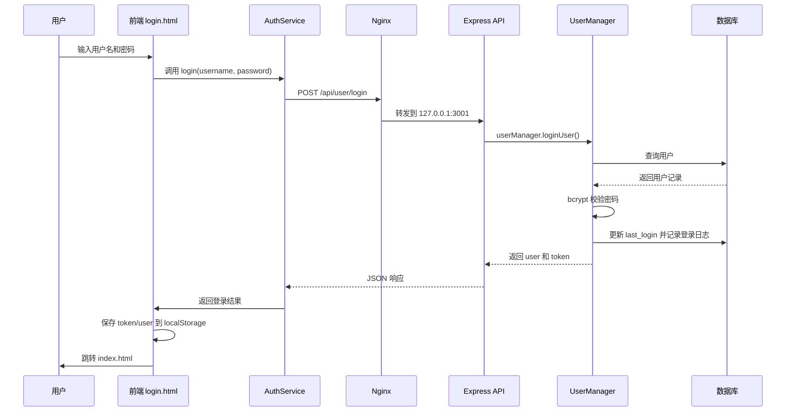
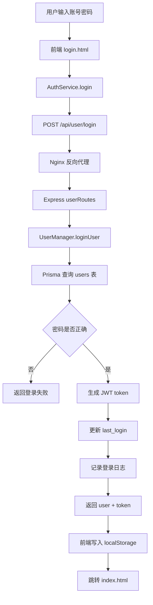
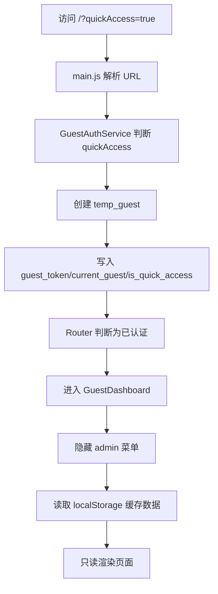
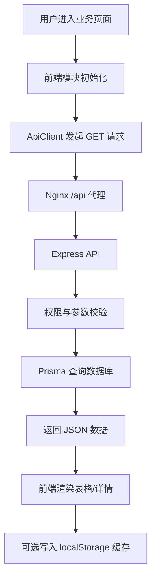
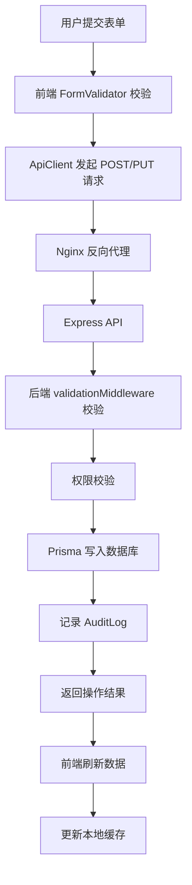
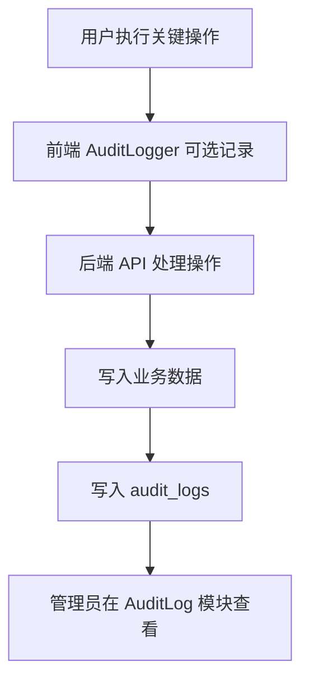
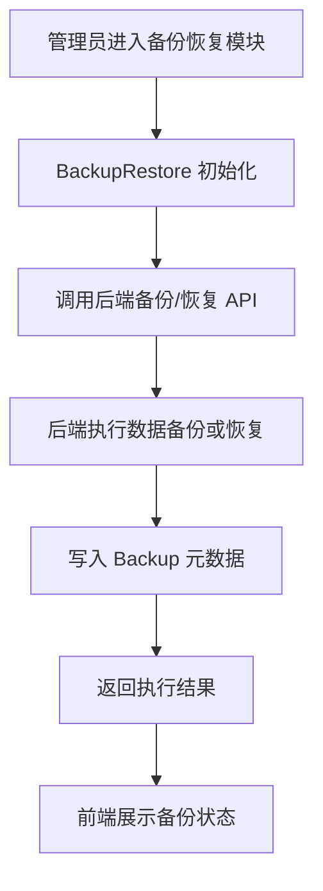

# 食品安全检测系统架构说明

## 1. 文档目的

本文档用于说明食品安全检测系统的整体技术架构、前后端交互方式、服务器部署关系、权限体系、快速访问模式以及核心数据流向。

本文档面向以下人员：

- 系统开发人员
- 部署与运维人员
- 项目管理人员
- 后续维护和二次开发人员

通过本文档，维护人员应能够理解系统由哪些组件组成、各组件之间如何通信、用户权限如何控制，以及数据如何在浏览器、后端服务和数据库之间流转。

---

## 2. 系统概述

食品安全检测系统是一个面向食品安全检测业务场景的 Web 管理系统，用于支持检测数据录入、检测记录管理、访客查看、数据导出、审计日志、备份恢复等功能。

系统主要服务对象包括：

- 系统管理员
- 普通业务用户
- 临时访客或快速访问用户

系统采用前后端分离的轻量化架构，前端由静态 HTML、CSS、JavaScript 模块组成，后端基于 Node.js 与 Express 提供 REST API 服务，数据库通过 Prisma ORM 进行访问和管理。

---

## 3. 技术架构概览

### 3.1 总体架构

系统整体由以下部分组成：

| 层级 | 组件 | 主要职责 |
|---|---|---|
| 用户访问层 | 浏览器 | 访问系统页面，提交业务操作 |
| Web 服务层 | Nginx | 托管前端静态文件，反向代理 API 请求 |
| 前端应用层 | HTML / CSS / JavaScript | 页面渲染、路由控制、表单交互、本地缓存 |
| 后端服务层 | Node.js / Express | 认证、权限、业务逻辑、数据库读写 |
| 数据访问层 | Prisma ORM | 统一访问数据库 |
| 数据持久层 | SQLite / PostgreSQL | 保存用户、检测记录、附件、日志、备份等数据 |
| 服务器层 | 腾讯云服务器 | 承载 Nginx、Node.js 后端服务及数据库 |

---

## 4. 整体架构图



---

## 5. Windows 生产部署架构

### 5.1 部署环境

当前食品安全检测系统部署在腾讯云 Windows Server 环境中。系统采用 Nginx 托管前端静态资源，Node.js + Express 提供后端 REST API 服务，PM2 负责后端进程守护，SQLite 数据库文件存放于独立数据目录。

| 项目 | 配置 |
|---|---|
| 服务器环境 | 腾讯云 Windows Server |
| 项目根目录 | `C:\foodtestlab` |
| 后端目录 | `C:\foodtestlab\backend` |
| 前端目录 | `C:\foodtestlab` |
| 前端构建产物目录 | `C:\foodtestlab\dist` |
| Nginx 目录 | `C:\nginx` |
| Nginx WebRoot | `C:\foodtestlab\dist` |
| 数据目录 | `D:\foodtestlab\data` |
| SQLite 数据库文件 | `D:\foodtestlab\data\foodtestlab.db` |
| 部署分支 | `runon_tencentcloud` |
| 前端端口 | `8081` |
| API 端口 | `3001` |
| PM2 进程名 | `foodtestlab-api` |

---

### 5.2 访问地址与 API 路径

| 类型 | 地址 |
|---|---|
| 前端公网访问地址 | `http://公网IP:8081` |
| API 公网基础路径 | `http://公网IP:8081/api` |
| 后端本机服务地址 | `http://127.0.0.1:3001` |
| 后端本机 API 基础路径 | `http://127.0.0.1:3001/api` |
| 后端本机健康检查 | `http://127.0.0.1:3001/api/health` |
| 公网健康检查 | `http://公网IP:8081/api/health` |
| 登录接口 | `POST /api/user/login` |

当前系统部署验证以 `/api/health` 为标准健康检查路径。若 Nginx 配置中存在 `/health` 独立转发规则，该路径不作为当前文档中的主健康检查入口。

---

### 5.3 双系统隔离部署

当前服务器同时部署 RDPMS 系统和食品检验系统。两套系统通过前端端口、API 端口和 PM2 进程名进行隔离。

| 系统 | 前端端口 | API 端口 | PM2 进程名 |
|---|---:|---:|---|
| RDPMS | `8080` | `3000` | `rdpms-backend` |
| 食品检验系统 | `8081` | `3001` | `foodtestlab-api` |

部署脚本会检查端口矩阵和 PM2 名称，避免两个系统发生端口冲突、进程覆盖或服务混淆。

部署日志中的正常提示包括：

```text
端口矩阵通过：食品系统 8081/3001 与 RDPMS 8080/3000 已隔离
PM2 名称检查通过：foodtestlab-api 与 rdpms-backend 已隔离
```

若出现以下警告：

```text
警告: 端口 8081 当前被占用，部署后请确认为 Nginx 使用
警告: 端口 3001 当前被占用，部署后请确认为 Node API 使用
```

在系统已部署运行的情况下，该提示通常表示端口正在被预期服务占用，并不必然代表错误。应结合以下命令确认：

```powershell
pm2 list
netstat -ano | findstr ":8081"
netstat -ano | findstr ":3001"
```

---

### 5.4 Nginx 反向代理关系

Nginx 监听服务器 `8081` 端口，并负责前端静态文件托管和 API 反向代理。

请求流向如下：

```text
用户浏览器
  ↓
http://公网IP:8081
  ↓
Nginx
  ├── /            → C:\foodtestlab\dist\index.html
  ├── /js /css     → C:\foodtestlab\dist 静态资源
  └── /api/*       → http://127.0.0.1:3001/api/*
```

Nginx 的核心职责包括：

1. 托管 `C:\foodtestlab\dist` 下的前端构建产物；
2. 支持前端路由回退到 `index.html`；
3. 将 `/api/` 请求反向代理到本机 Node.js 后端；
4. 对 JS、CSS、图片、字体等静态资源启用缓存；
5. 对 HTML 文件禁用强缓存，保证入口文件及时更新；
6. 校验配置后重载服务，避免错误配置影响线上访问。

---

### 5.5 一键部署脚本

系统通过 PowerShell 脚本执行一键部署：

```powershell
cd C:\foodtestlab
.\deploy.ps1
```

部署脚本主要执行以下步骤：

1. 输出部署基础信息；
2. 检查 Node.js、npm、PM2 等基础工具；
3. 检查食品系统与 RDPMS 系统端口隔离；
4. 检查 Git 仓库和远程地址；
5. 停止 `foodtestlab-api` PM2 进程以释放文件锁；
6. 拉取 `runon_tencentcloud` 分支最新代码；
7. 检查环境变量文件；
8. 安装后端依赖；
9. 设置数据库目录和 `DATABASE_URL`；
10. 执行 Prisma Client 生成；
11. 执行数据库 schema 同步；
12. 执行 `seed.js` 种子数据初始化；
13. 启动或重启 `foodtestlab-api` 后端服务；
14. 保存 PM2 进程列表；
15. 安装前端依赖；
16. 执行前端静态构建；
17. 验证 `dist/index.html` 是否存在；
18. 检查 Nginx 配置语法；
19. 执行本机 API 健康检查。

部署成功的关键标志包括：

```text
数据库 schema 同步完成
Build completed: dist/ generated successfully
前端构建验证通过：dist/index.html 存在
nginx: configuration file C:\nginx/conf/nginx.conf test is successful
API 健康检查通过：http://127.0.0.1:3001/api/health 状态码: 200
食品检验系统部署完成
```

---

### 5.6 PM2 进程管理

食品检验系统后端由 PM2 管理，进程名为：

```text
foodtestlab-api
```

常用命令如下：

```powershell
pm2 list
pm2 logs foodtestlab-api
pm2 restart foodtestlab-api
pm2 stop foodtestlab-api
pm2 save
```

正常部署后，PM2 状态应显示：

```text
foodtestlab-api    online
rdpms-backend      online
```

其中 `foodtestlab-api` 对应食品检验系统，`rdpms-backend` 对应 RDPMS 系统。

---

### 5.7 数据库部署位置

当前生产环境使用 SQLite 数据库，数据库文件位于：

```text
D:\foodtestlab\data\foodtestlab.db
```

部署脚本会设置：

```text
DATABASE_URL=file:D:/foodtestlab/data/foodtestlab.db
```

并执行：

```powershell
npx prisma generate
npx prisma db push
```

用于生成 Prisma Client 并同步数据库 schema。

该数据库文件位于独立数据目录，便于后续备份、迁移和权限管理。

### 5.8 当前部署验证状态

根据最近一次部署日志，系统当前部署状态如下：

| 检查项 | 状态 |
|---|---|
| Git 分支 | `runon_tencentcloud` |
| 最新提交 | `2639a5e feature: 新增果蔬农残检测-噻虫嗪-胶体金检测卡` |
| 后端依赖安装 | 通过 |
| Prisma Client 生成 | 通过 |
| 数据库 schema 同步 | 通过 |
| 前端构建 | 通过 |
| Nginx 配置语法检查 | 通过 |
| PM2 后端进程 | `foodtestlab-api online` |
| API 健康检查 | `200 OK` |
| RDPMS 隔离 | 通过 |
| 食品系统端口 | 前端 `8081`，API `3001` |

当前部署中存在 seed 初始化 email 唯一约束提示，但未阻断部署完成。建议后续优化 seed 脚本的幂等处理逻辑。

## 6. 前端架构

### 6.1 前端技术形态

本系统前端不是 React 或 Vue 单页应用，而是基于原生 HTML、CSS、JavaScript 的模块化前端架构。

主要入口文件包括：

```text
index.html
login.html
css/style.css
js/main.js
```

前端模块按职责划分为：

```text
js/
├── core/
├── modules/
├── services/
└── utils/
```

---

### 6.2 前端目录说明

| 目录 | 作用 |
|---|---|
| `js/core/` | 核心能力，包括认证、路由、存储等 |
| `js/modules/` | 业务模块，包括 Dashboard、检测模块、用户管理、备份恢复等 |
| `js/services/` | 服务封装，包括认证服务、审计日志服务、导出服务 |
| `js/utils/` | 工具类，包括 API 客户端、缓存管理、校验、网络检测等 |
| `css/` | 全局样式 |
| `docs/` | 项目文档 |
| `deploy/` | 部署配置，包括 Nginx 和 PM2 |
| `scripts/` | 构建、诊断、初始化等脚本 |

---

### 6.3 主要前端模块

| 文件 / 模块 | 职责 |
|---|---|
| `js/main.js` | 系统前端主入口，初始化应用、导航和 quickAccess 逻辑 |
| `js/core/Auth.js` | 前端认证核心逻辑 |
| `js/core/Router.js` | 前端路由和访问控制 |
| `js/core/Storage.js` | 本地存储和缓存封装 |
| `js/services/AuthService.js` | 普通用户登录、token 管理 |
| `js/services/GuestAuthService.js` | 访客登录和快速访问模式 |
| `js/utils/ApiClient.js` | API 请求封装 |
| `js/utils/CacheManager.js` | localStorage 和内存缓存管理 |
| `js/modules/Dashboard.js` | 系统首页和数据看板 |
| `js/modules/GuestDashboard.js` | 访客首页 |
| `js/modules/Tableware.js` | 餐具检测模块 |
| `js/modules/Pathogen.js` | 病原体检测模块 |
| `js/modules/GenericTest.js` | 通用检测模块 |
| `js/modules/UserManagement.js` | 用户管理模块 |
| `js/modules/BackupRestore.js` | 数据备份与恢复 |
| `js/modules/AuditLog.js` | 审计日志展示 |

---

## 7. 后端架构

### 7.1 后端技术栈

后端采用 Node.js + Express 构建，使用 Prisma ORM 访问数据库。

后端主要依赖包括：

| 依赖 | 用途 |
|---|---|
| `express` | Web API 框架 |
| `@prisma/client` | 数据库 ORM 客户端 |
| `prisma` | 数据库 schema 与迁移工具 |
| `bcryptjs` | 密码哈希与密码校验 |
| `jsonwebtoken` | JWT token 生成与验证 |
| `cors` | 跨域访问控制 |
| `dotenv` | 环境变量管理 |

---

### 7.2 后端目录结构

```text
backend/
├── server.js
├── package.json
├── config/
│   └── telemetry.js
├── middleware/
│   ├── idempotencyMiddleware.js
│   └── validationMiddleware.js
├── modules/
│   └── UserManager.js
├── prisma/
│   ├── schema.prisma
│   ├── seed.js
│   └── dedupe-test-records.js
├── routes/
│   ├── auditRoutes.js
│   ├── syncRoutes.js
│   └── userRoutes.js
└── sql/
    ├── 01_users_schema.sql
    ├── 02_guests_schema.sql
    ├── 02_seed_test_users.sql
    └── 03_set_admin_password.sql
```

---

### 7.3 后端服务职责

后端服务主要承担以下职责：

1. 用户登录认证；
2. JWT token 生成与校验；
3. 用户、访客、角色相关管理；
4. 检测记录的增删改查；
5. 审计日志记录；
6. 数据同步；
7. 数据备份元信息管理；
8. 数据库访问与业务校验；
9. API 请求参数校验；
10. 幂等性控制。

---

## 8. 数据库架构

### 8.1 数据库技术

系统使用 Prisma ORM 管理数据库，支持：

- SQLite：适用于本地开发、小规模部署或轻量化场景；
- PostgreSQL：适用于生产环境和多用户并发场景。

Prisma 配置示例：

```prisma
generator client {
  provider = "prisma-client-js"
}

datasource db {
  provider = "sqlite"
  url      = env("DATABASE_URL")
}
```

实际部署时，数据库类型和连接地址以 `.env` 中的 `DATABASE_URL` 为准。

---

### 8.2 核心数据表

| 表 / 模型 | 用途 |
|---|---|
| `User` / `users` | 系统用户管理 |
| `Guest` / `guests` | 访客账户管理 |
| `TestRecord` / `test_records` | 检测记录主表 |
| `TestItem` / `test_items` | 检测项目明细 |
| `Attachment` / `attachments` | 附件与文件记录 |
| `AuditLog` / `audit_logs` | 用户操作审计 |
| `Backup` / `backup` | 数据备份元信息 |
| `SystemLog` / `system_logs` | 系统运行日志 |
| `guest_export_requests` | 访客导出申请 |

---

### 8.3 数据库关系



---

## 8.4 数据库字段命名与 ORM 映射

当前数据库结构由 Prisma ORM 管理，数据库字段和 Prisma 模型字段以 `backend/prisma/schema.prisma` 为最终准绳。

根据当前数据库文档，主要模型字段采用 snake_case 命名，例如：

```prisma
model User {
  id            String   @id @default(cuid())
  username      String   @unique
  email         String?  @unique
  password_hash String
  full_name     String?
  phone         String?
  role          String   @default("user")
  status        String   @default("active")
  created_at    DateTime @default(now())
  updated_at    DateTime @updatedAt
  last_login    DateTime?
}
```

因此，在数据库文档和架构说明中，用户密码字段应优先表述为：

```text
password_hash
```

时间字段应表述为：

```text
created_at
updated_at
last_login
```

如业务代码中出现 `passwordHash`、`createdAt`、`lastLogin` 等 camelCase 字段，应结合 `schema.prisma` 中是否存在 `@map` 映射进行确认。

可能存在两种情况：

| 情况 | 说明 |
|---|---|
| 直接 snake_case | Prisma Client 使用 `password_hash` |
| Prisma `@map` 映射 | Prisma Client 使用 `passwordHash`，数据库列名为 `password_hash` |

当前架构文档以 `schema.prisma` 和实际部署运行状态为准，不以概括性说明代码片段作为最终字段依据。

建议通过以下命令确认实际字段：

```powershell
cd C:\foodtestlab\backend
Get-Content .\prisma\schema.prisma
Select-String -Path .\modules\UserManager.js -Pattern "password" -Context 3,3
```

## 9. 前后端交互方式

### 9.1 交互模式

前端和后端采用 REST API 方式通信。

```text
浏览器前端
  ↓ HTTP / JSON
Nginx /api 反向代理
  ↓
Node.js Express API
  ↓
Prisma ORM
  ↓
数据库
```

---

### 9.2 API 基础路径

生产环境中，后端服务监听本地端口：

```text
http://127.0.0.1:3001
```

公网访问通过 Nginx 暴露：

```text
http://公网IP:8081/api/*
```

例如：

```text
POST http://公网IP:8081/api/user/login
GET  http://公网IP:8081/api/health
```

---

### 9.3 登录接口

系统用户登录接口为：

```text
POST /api/user/login
```

生产环境公网访问示例：

```text
POST http://公网IP:8081/api/user/login
```

后端本机访问示例：

```text
POST http://127.0.0.1:3001/api/user/login
```

请求体示例：

```json
{
  "username": "admin",
  "password": "8888"
}
```

成功响应示例：

```json
{
  "success": true,
  "user": {
    "id": "user_id",
    "username": "admin",
    "role": "admin",
    "status": "active"
  },
  "token": "jwt-token-string"
}
```

失败响应示例：

```json
{
  "success": false,
  "message": "Incorrect username or password"
}
```

根据部署日志和 seed 初始化说明，系统初始账户仅在首次创建时生效：

```text
admin / 8888
operator / operator123
viewer / viewer123
```

如果账户已经存在，seed 脚本会跳过已有账户。

### 9.4 登录处理流程



---

### 9.5 请求与响应格式

前端请求后端 API 时，默认使用 JSON 格式：

```http
Content-Type: application/json
```

登录后，前端应在后续请求中携带 token：

```http
Authorization: Bearer <token>
```

常见响应格式为：

```json
{
  "success": true,
  "data": {},
  "message": "操作成功"
}
```

或：

```json
{
  "success": false,
  "message": "错误信息"
}
```

---

### 9.6 常见 HTTP 状态码

| 状态码 | 含义 |
|---:|---|
| 200 | 请求成功 |
| 204 | OPTIONS 预检请求成功 |
| 400 | 请求参数错误或登录失败 |
| 401 | 未认证或 token 无效 |
| 403 | 已认证但无权限 |
| 404 | 接口不存在 |
| 500 | 服务器内部错误 |

---

## 10. localStorage 缓存机制

### 10.1 localStorage 的用途

系统大量使用 `localStorage` 保存前端状态和缓存数据，主要包括：

1. 用户认证 token；
2. 当前用户信息；
3. 访客 token；
4. 当前访客信息；
5. 快速访问模式标识；
6. 业务数据缓存；
7. 审计日志临时缓存；
8. 同步状态；
9. 调试配置；
10. 示例数据。

---

### 10.2 主要 localStorage 字段

| Key | 用途 | 示例 |
|---|---|---|
| `auth_token` | 普通用户登录 token | JWT token |
| `current_user` | 当前登录用户信息 | JSON 字符串 |
| `auth_timestamp` | 登录时间戳 | Unix timestamp |
| `guest_token` | 访客 token | temp-token |
| `current_guest` | 当前访客信息 | JSON 字符串 |
| `is_quick_access` | 是否快速访问模式 | `true` |
| `cache_tableware` | 餐具检测数据缓存 | JSON |
| `cache_pesticide` | 检测数据缓存 | JSON |
| `pending_requests` | 待同步请求 | JSON |
| `block_data_sync` | 是否阻塞数据同步 | boolean |
| `audit_YYYY-MM-DD` | 某日审计日志缓存 | JSON |
| `debug_*` | 调试配置 | string / boolean |

---

### 10.3 localStorage 使用位置

| 文件 | 作用 |
|---|---|
| `js/services/AuthService.js` | 保存、读取和清除用户认证信息 |
| `js/utils/UserAuth.js` | 加载和持久化当前用户 |
| `js/core/Storage.js` | 本地缓存、认证 token 管理 |
| `js/services/GuestAuthService.js` | 访客 token 和访客信息管理 |
| `js/utils/CacheManager.js` | 统一缓存管理 |
| `js/utils/AuditLogger.js` | 前端审计日志缓存 |
| `js/modules/BackupRestore.js` | 备份、同步、缓存清理 |
| `js/main.js` | quickAccess 判断和系统初始化 |
| `js/utils/ApiClient.js` | API token 读取和请求封装 |

---

### 10.4 登录态恢复机制

用户刷新页面后，前端会从 `localStorage` 中读取：

```text
auth_token
current_user
auth_timestamp
```

如果 token 存在且未过期，则恢复用户登录状态，并根据用户角色加载对应菜单和功能。

访客模式下，前端会读取：

```text
guest_token
current_guest
is_quick_access
```

用于恢复访客会话或快速访问状态。

---

### 10.5 缓存安全边界

`localStorage` 位于浏览器端，属于不可信存储。  
因此：

- localStorage 中的角色信息只能用于前端 UI 展示；
- 不应仅依赖 localStorage 判断敏感权限；
- 数据新增、修改、删除、导出、用户管理等操作，应由后端 API 进行最终权限校验；
- token 过期或退出登录时，应清除认证相关数据；
- quickAccess 模式不应授予写入、删除、导出等高风险能力。

---

## 11. 快速访问模式

### 11.1 入口方式

系统支持通过 URL 参数进入快速访问模式：

```text
http://公网IP:8081/?quickAccess=true
```

前端通过以下逻辑识别：

```javascript
const urlParams = new URLSearchParams(window.location.search);
const isQuickAccessParam = urlParams.get('quickAccess') === 'true';
```

同时，系统还会检查 localStorage 中是否已经存在快速访问状态。

---

### 11.2 激活逻辑

当 URL 中包含 `quickAccess=true`，且当前没有有效访客登录态时，系统会调用：

```javascript
guestAuthService.quickAccessAsViewer()
```

该方法会创建临时访客对象：

```javascript
const tempGuest = {
    id: 'temp_guest',
    username: 'Temporary Guest',
    is_quick_access: true,
    guest_type: 'viewer',
    valid_until: new Date(Date.now() + 3600 * 1000).toISOString()
};
```

随后写入 localStorage：

```text
guest_token
current_guest
is_quick_access
```

---

### 11.3 生命周期

quickAccess 临时访客默认有效期为 1 小时：

```javascript
valid_until: new Date(Date.now() + 3600 * 1000).toISOString()
```

超过有效期后，前端应清除 quickAccess 状态或要求用户重新通过快速访问入口进入系统。

---

### 11.4 权限边界

quickAccess viewer 属于临时只读访问模式。

| 功能 | quickAccess viewer |
|---|---:|
| 访问首页 | 是 |
| 查看公开数据 | 是 |
| 查看缓存数据 | 是 |
| 新增检测记录 | 否 |
| 编辑检测记录 | 否 |
| 删除检测记录 | 否 |
| 用户管理 | 否 |
| 数据导出 | 否 |
| 备份恢复 | 否 |
| 审计日志 | 否 |
| 系统配置 | 否 |

quickAccess 不应绕过后端权限控制。所有写操作、导出操作、用户管理、备份恢复等敏感接口必须拒绝 quickAccess 访问。

## 12. 权限体系

### 12.1 角色与访问类型

当前系统的权限体系由两部分组成：

1. 系统用户角色；
2. 访客访问类型。

系统用户角色主要存储在 `User.role` 字段中，访客类型主要存储在 `Guest.guest_type` 字段中。

根据当前数据库文档、Prisma 模型注释、SQL 初始化脚本和 seed 初始化日志，系统涉及以下角色或访问类型：

| 类型 | 标识 | 说明 |
|---|---|---|
| 系统用户角色 | `admin` | 系统管理员，拥有最高权限 |
| 系统用户角色 | `manager` | 管理人员或部门经理，拥有一定范围内的数据管理权限 |
| 系统用户角色 | `operator` | 检测操作员，负责录入和维护检测数据 |
| 系统用户角色 | `viewer` | 查看员，主要拥有只读权限 |
| 系统用户角色 | `user` | 普通用户，系统默认角色 |
| 访客类型 | `viewer` | 只读访客 |
| 访客类型 | `export_applicant` | 可申请导出权限的访客 |
| 快速访问类型 | `quickAccess viewer` | 通过 `?quickAccess=true` 创建的临时只读访客 |

需要注意的是，部分历史 SQL 文件中可能仅包含 `admin`、`manager`、`user` 三类角色约束，而 Prisma 注释和 seed 初始化中已经出现 `operator`、`viewer`。因此，当前角色体系应以 `backend/prisma/schema.prisma`、`backend/prisma/seed.js` 和实际权限判断代码为准。

---

### 12.2 系统用户角色说明

#### 12.2.1 admin

`admin` 为系统管理员角色，拥有系统最高权限。

典型权限包括：

- 用户管理；
- 角色管理；
- 查看全部检测数据；
- 新增、编辑、删除检测记录；
- 数据导出；
- 数据备份与恢复；
- 查看审计日志；
- 查看系统日志；
- 访客管理；
- 审批访客导出申请；
- 系统配置和维护。

典型模块包括：

```text
UserManagement
BackupRestore
ExportService
AuditLog
Dashboard
Tableware
Pathogen
GenericTest
```

---

#### 12.2.2 manager

`manager` 为管理人员或部门经理角色，权限低于管理员，但高于普通操作用户。

典型权限包括：

- 查看管理范围内的检测数据；
- 创建检测记录；
- 编辑管理范围内的检测记录；
- 审核或管理部分业务数据；
- 查看部分统计数据；
- 可根据系统配置拥有部分删除或导出权限；
- 不拥有系统级用户管理和系统配置权限，除非后端显式授权。

---

#### 12.2.3 operator

`operator` 为检测操作员角色，主要负责检测业务数据的录入和维护。

典型权限包括：

- 创建检测记录；
- 编辑自己创建或分配给自己的检测记录；
- 上传或关联检测附件；
- 查看与自身工作相关的数据；
- 不允许管理用户；
- 不允许执行系统备份恢复；
- 默认不允许查看审计日志；
- 默认不允许删除关键业务数据。

---

#### 12.2.4 viewer

`viewer` 为查看员角色，主要用于只读访问场景。

典型权限包括：

- 查看检测记录；
- 查看统计看板；
- 查看部分公开或授权数据；
- 不允许新增、编辑、删除数据；
- 不允许导出数据，除非系统另行配置；
- 不允许进入用户管理、备份恢复和审计日志模块。

---

#### 12.2.5 user

`user` 为系统默认普通用户角色。  
该角色用于未被明确划分为 manager、operator 或 viewer 的普通业务用户。

典型权限包括：

- 查看授权范围内的数据；
- 创建部分检测记录；
- 编辑自己负责的数据；
- 不允许访问系统管理功能；
- 不允许查看审计日志；
- 默认不允许执行备份恢复；
- 默认不允许管理其他用户。

---

### 12.3 访客类型说明

#### 12.3.1 guest viewer

`guest viewer` 为普通只读访客，主要通过 `Guest` 模型管理。

典型权限包括：

- 查看访客首页；
- 查看公开数据；
- 查看授权范围内的数据；
- 不允许新增、编辑、删除数据；
- 不允许用户管理；
- 不允许备份恢复；
- 不允许查看审计日志；
- 不允许直接导出数据。

---

#### 12.3.2 export_applicant

`export_applicant` 为可申请导出权限的访客类型。

该类型访客本身不应默认拥有直接导出权限，而是通过 `guest_export_requests` 表提交导出申请。

典型流程为：

```text
访客提交导出申请
  ↓
写入 guest_export_requests
  ↓
管理员或授权人员审批
  ↓
审批通过后在有效期内开放导出权限
  ↓
导出行为写入审计日志
```

---

#### 12.3.3 quickAccess viewer

`quickAccess viewer` 是通过 URL 参数快速创建的临时只读访客。

入口形式为：

```text
http://公网IP:8081/?quickAccess=true
```

前端检测到该参数后，会调用：

```javascript
guestAuthService.quickAccessAsViewer()
```

并在 localStorage 中写入：

```text
guest_token
current_guest
is_quick_access
```

该模式默认有效期为 1 小时，主要用于无需完整登录流程的临时查看场景。

---

### 12.4 权限矩阵

| 功能模块 | admin | manager | operator | user | viewer | guest viewer | export_applicant | quickAccess viewer |
|---|---:|---:|---:|---:|---:|---:|---:|---:|
| 登录系统 | 是 | 是 | 是 | 是 | 是 | 是 | 是 | URL 触发 |
| 查看首页 / 看板 | 是 | 是 | 是 | 是 | 是 | 是 | 是 | 是 |
| 查看检测记录 | 全部 | 管理范围 | 相关数据 | 授权范围 | 授权范围 | 公开/授权 | 公开/授权 | 缓存/公开 |
| 新增检测记录 | 是 | 是 | 是 | 可选 | 否 | 否 | 否 | 否 |
| 编辑检测记录 | 是 | 管理范围 | 自己负责 | 自己负责 | 否 | 否 | 否 | 否 |
| 删除检测记录 | 是 | 可选 | 否 | 否 | 否 | 否 | 否 | 否 |
| 数据导出 | 是 | 可选 | 否 | 否 | 默认否 | 否 | 申请后可选 | 否 |
| 用户管理 | 是 | 否 | 否 | 否 | 否 | 否 | 否 | 否 |
| 访客管理 | 是 | 可选 | 否 | 否 | 否 | 否 | 否 | 否 |
| 导出申请审批 | 是 | 可选 | 否 | 否 | 否 | 否 | 否 | 否 |
| 数据备份恢复 | 是 | 否 | 否 | 否 | 否 | 否 | 否 | 否 |
| 查看审计日志 | 是 | 可选 | 否 | 否 | 否 | 否 | 否 | 否 |
| 系统配置 | 是 | 否 | 否 | 否 | 否 | 否 | 否 | 否 |

说明：

- “可选”表示取决于后端权限配置和实际业务规则；
- 前端隐藏菜单不等于后端权限控制；
- 所有敏感操作应由后端 API 进行最终权限校验；
- quickAccess 模式必须保持只读。

---

### 12.5 权限控制实现层级

系统权限控制分布在多个层级：

| 层级 | 作用 |
|---|---|
| 前端路由层 | 判断是否允许访问页面 |
| 前端 UI 层 | 根据角色隐藏菜单、按钮和管理功能 |
| 前端服务层 | 根据 token、guest_token 或 quickAccess 状态决定请求方式 |
| 后端 API 层 | 对登录态、角色和权限进行最终校验 |
| 数据库层 | 保存用户角色、访客类型、有效期、导出申请和审计信息 |

需要强调的是，localStorage 中的角色或访客状态仅用于前端展示和状态恢复，不应作为最终安全依据。敏感操作必须在后端校验用户身份和权限。

## 13. 数据流向说明

### 13.1 普通用户登录数据流



---

### 13.2 quickAccess 数据流



---

### 13.3 数据查询流程



---

### 13.4 数据写入流程



---

### 13.5 审计日志流程



---

### 13.6 备份恢复流程



---

## 14. 安全设计

### 14.1 密码安全

系统使用 `bcryptjs` 对用户密码进行哈希处理。数据库中只保存密码哈希值，不保存明文密码。

登录时处理流程为：

1. 根据用户名查询用户；
2. 使用 bcrypt 比对用户输入密码和数据库中的密码哈希；
3. 校验成功后生成 token；
4. 更新最后登录时间；
5. 记录登录日志。

---

### 14.2 Token 认证

系统使用 JWT 作为认证凭据。登录成功后，后端返回 token，前端保存到 localStorage。

后续请求应通过请求头携带：

```http
Authorization: Bearer <token>
```

后端应对需要登录的接口验证 token 的有效性。

---

### 14.3 CORS 控制

Nginx 中配置了 CORS 白名单：

```nginx
map $http_origin $cors_allow_origin {
    default "";
    "http://159.75.106.179:8081" $http_origin;
    "http://localhost:5173" $http_origin;
}
```

仅允许指定来源访问 API，降低跨站请求风险。

---

### 14.4 审计日志

系统设计了 `audit_logs` 表，用于记录关键操作，包括：

- 登录；
- 新增；
- 修改；
- 删除；
- 导出；
- 导入；
- 备份；
- 恢复。

审计日志可用于问题追溯、责任界定和安全检查。

---

### 14.5 访客安全

访客和 quickAccess 模式应遵循以下原则：

1. 默认只读；
2. 不允许访问用户管理；
3. 不允许访问备份恢复；
4. 不允许查看审计日志；
5. 不允许导出数据；
6. 不允许修改或删除业务数据；
7. 设置有效期；
8. 超期后自动失效或要求重新进入。

---

## 15. 构建与运行

### 15.1 根目录脚本

根目录 `package.json` 提供以下主要脚本：

| 脚本 | 作用 |
|---|---|
| `npm start` | 启动后端服务 |
| `npm run dev` | 使用 nodemon 启动开发服务 |
| `npm run build` | 构建静态前端资源 |
| `npm test` | 执行 Jest 测试 |
| `npm run test:e2e` | 执行 Cypress 端到端测试 |
| `npm run lint` | 执行代码检查 |
| `npm run format` | 格式化代码 |

---

### 15.2 后端脚本

后端 `package.json` 提供以下主要脚本：

| 脚本 | 作用 |
|---|---|
| `npm start` | 启动 `server.js` |
| `npm run dev` | 使用 watch 模式启动 |
| `npm run db:push` | 推送 Prisma schema 到数据库 |
| `npm run db:generate` | 生成 Prisma Client |
| `npm run db:migrate` | 执行 Prisma 迁移 |
| `npm run db:studio` | 打开 Prisma Studio |
| `npm run seed` | 执行种子数据 |
| `npm run dedupe:preview` | 预览检测记录去重 |
| `npm run dedupe:apply` | 执行检测记录去重 |

---

### 15.3 后端启动方式

后端服务默认启动文件为：

```text
backend/server.js
```

启动命令：

```bash
node backend/server.js
```

或在后端目录中：

```bash
npm start
```

生产环境建议使用 PM2 或系统服务进行进程守护。

---

## 16. 运维与监控

### 16.1 健康检查

推荐健康检查地址：

```text
http://127.0.0.1:3001/api/health
http://公网IP:8081/api/health
```

如果 Nginx 配置中启用了独立健康检查转发，也可使用：

```text
http://公网IP:8081/health
```

具体以 `server.js` 实际注册路由为准。

---

### 16.2 日志类型

系统日志主要包括：

| 日志类型 | 来源 |
|---|---|
| Nginx 访问日志 | Nginx |
| Nginx 错误日志 | Nginx |
| 后端运行日志 | Node.js / Express |
| 系统日志 | `SystemLog` |
| 操作审计日志 | `AuditLog` |
| 前端临时日志 | `localStorage` 中的 `audit_YYYY-MM-DD` |

---

### 16.3 常见故障定位路径

| 问题 | 排查方向 |
|---|---|
| 页面无法访问 | 检查 Nginx 是否启动、8081 端口是否开放 |
| 静态资源 404 | 检查 Nginx root 目录和构建产物 |
| API 404 | 检查 `/api/` 代理和后端路由 |
| API 502 | 检查后端 3001 服务是否运行 |
| 登录失败 | 检查用户表、密码哈希、登录接口 |
| 权限异常 | 检查 localStorage、token、后端权限判断 |
| quickAccess 失效 | 检查 URL 参数、guest_token、current_guest、is_quick_access |
| 数据不更新 | 检查 localStorage 缓存、API 响应、数据库记录 |

---

## 17. 后续优化建议

### 17.1 权限体系优化

建议逐步将权限控制从前端 UI 层扩展到后端 API 层，形成完整 RBAC 权限体系：

- 角色表；
- 权限表；
- 角色-权限关联；
- 用户-角色关联；
- API 权限中间件。

---

### 17.2 quickAccess 安全优化

建议对 quickAccess 模式进行进一步安全加固：

1. 后端识别 quickAccess token；
2. 所有写操作拒绝 quickAccess；
3. quickAccess token 设置明确过期时间；
4. quickAccess 访问行为写入审计日志；
5. 可配置 quickAccess 访问范围。

---

### 17.3 缓存机制优化

建议统一 localStorage key 命名规范，并增加缓存版本号和过期时间。

例如：

```json
{
  "version": "3.1.0",
  "expiresAt": "2026-06-15T12:00:00Z",
  "data": []
}
```

---

### 17.4 API 文档化

建议后续补充 `API.md` 或 OpenAPI 文档，明确每个接口的：

- URL；
- Method；
- 请求参数；
- 响应格式；
- 权限要求；
- 错误码；
- 示例。

---

### 17.5 部署配置统一

当前项目中存在 Linux 和 Windows 两种部署路径描述，建议后续拆分为：

```text
docs/DEPLOYMENT_LINUX.md
docs/DEPLOYMENT_WINDOWS.md
```

并在 `ARCHITECTURE.md` 中只保留通用部署架构。

---

## 18. 附录：关键配置摘要

### 18.1 生产访问地址

```text
前端访问：http://公网IP:8081
API 访问：http://公网IP:8081/api/*
后端本地：http://127.0.0.1:3001
```

---

### 18.2 登录接口

```text
POST /api/user/login
```

---

### 18.3 quickAccess 入口

```text
http://公网IP:8081/?quickAccess=true
```

---

### 18.4 主要角色

```text
admin
user
guest
```

---

### 18.5 关键 localStorage 字段

```text
auth_token
current_user
auth_timestamp
guest_token
current_guest
is_quick_access
cache_tableware
pending_requests
audit_YYYY-MM-DD
```

---

## 19. 版本记录

| 版本 | 日期 | 说明 |
|---|---|---|
| v1.0 | 2026-06-15 | 初始架构文档，说明系统总体架构、部署关系、权限体系、quickAccess 和数据流 |
