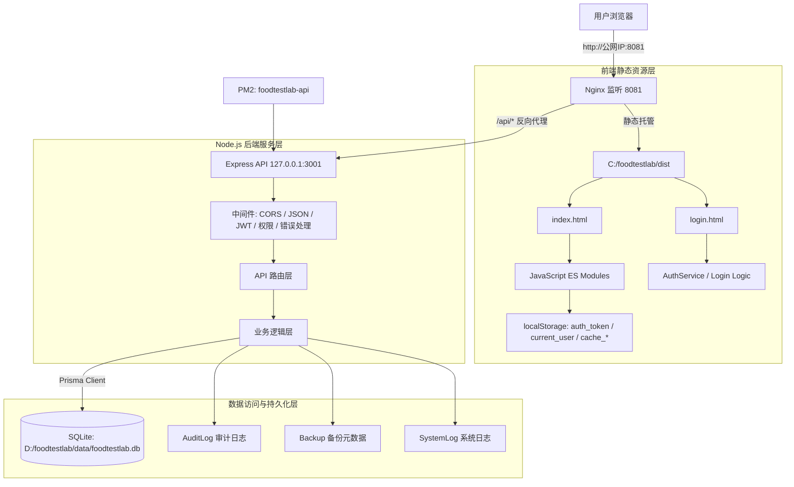
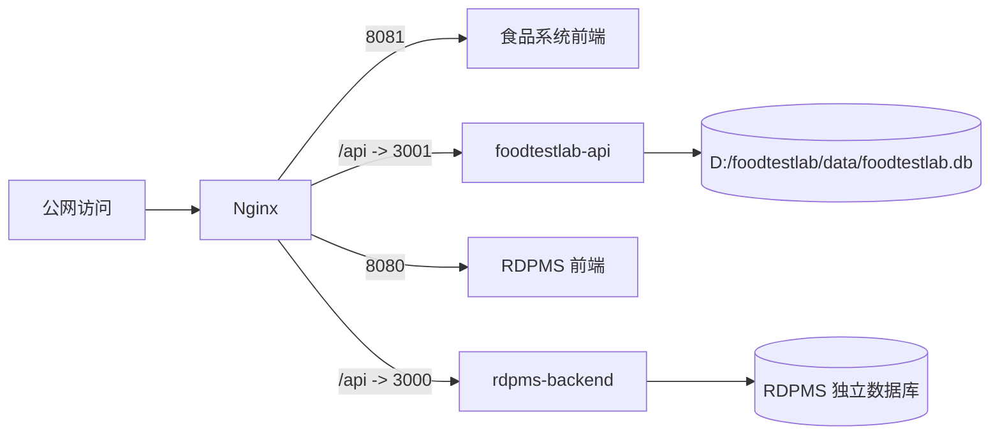

# 食品安全检测系统架构说明

**文档名称**：`ARCHITECTURE.md`  
**系统名称**：食品安全检验管理系统 Pro / 田家炳中学食品安全检验系统  
**项目名称**：`tianjiabing-foodtestlab`  
**当前部署分支**：`runon_tencentcloud`  
**当前生产环境**：腾讯云 Windows Server  
**文档版本**：v1.3  
**更新时间**：2026-06-16  
**适用对象**：开发人员、运维人员、测试人员、项目管理人员、后续维护人员  

---

## 1. 文档目的

本文档用于系统性说明食品安全检测系统的整体技术架构、前后端交互方式、Windows 生产部署方案、数据库设计、权限控制、快速访问模式、localStorage 缓存机制、构建运行方式、运维监控方法以及后续优化方向。

本文档主要服务于以下目标：

1. 为开发人员提供系统结构、模块边界和数据流说明；
2. 为运维人员提供生产部署架构、端口配置、进程管理和故障排查依据；
3. 为测试人员提供关键业务流、接口流向和权限逻辑参考；
4. 为项目管理人员提供系统能力边界和后续扩展方向；
5. 为后续维护人员提供项目交接和二次开发基础资料。

本文档与其他文档的关系如下：

| 文档 | 定位 |
|---|---|
| `README.md` | 项目总入口和文档导航 |
| `ARCHITECTURE.md` | 系统架构、组件关系和技术拓扑说明 |
| `API_REFERENCE.md` | 后端正式 API 文档 |
| `DATABASE_SCHEMA.md` | 数据库模型、字段和关系说明 |
| `FRONTEND_GUIDE.md` | 前端模块、页面、路由和缓存机制说明 |
| `DEPLOYMENT_GUIDE.md` | 腾讯云 Windows Server 部署与运维主文档 |

如本文档与部署操作细节不一致，应以：

```text
DEPLOYMENT_GUIDE.md
```

为准。

如本文档与接口行为不一致，应以：

```text
API_REFERENCE.md
backend/server.js
backend/routes/
```

为准。

如本文档与数据库字段不一致，应以：

```text
backend/prisma/schema.prisma
```

为准。

---

## 2. 系统概述

食品安全检测系统是面向校园食堂食品安全快速检测场景设计的轻量化 Web 管理系统，主要用于食品安全检测数据的录入、管理、查询、归档、审计和备份。

系统当前定位为：

- 学校食品安全检测工作的数字化记录工具；
- 食堂日常检测数据归档平台；
- 管理员进行用户管理、审计追踪和数据维护的内部系统；
- 后续功能扩展、部署运维和多开发者协作的基础项目。

### 2.1 核心业务能力

当前系统主要支持以下业务能力：

1. 用户登录与身份认证；
2. 用户管理；
3. 角色权限控制；
4. 检测记录录入；
5. 检测记录查询；
6. 多类型检测项目管理；
7. 审计日志记录与查询；
8. 数据备份与恢复；
9. 访客或快速访问模式；
10. 前端本地缓存；
11. 腾讯云 Windows Server 部署；
12. 与 RDPMS 系统在同服务器共存。

### 2.2 当前检测业务范围

当前系统可覆盖或计划覆盖以下检测类型：

- 餐具洁净度检测；
- 果蔬农药残留检测；
- 食用油品质检测；
- 肉、蛋类相关检测；
- 病原体检测；
- 通用检测项目；
- 自定义检测项目。

果蔬农残检测当前包括或可配置以下项目：

- 克百威-胶体金检测卡；
- 水胺硫磷-胶体金检测卡；
- 噻虫嗪-胶体金检测卡；
- 通用显色试纸；
- 二氧化硫显色试剂。

### 2.3 当前生产部署口径

当前腾讯云生产部署以以下配置为准：

| 项目 | 当前配置 |
|---|---|
| 部署环境 | 腾讯云 Windows Server |
| 部署分支 | `runon_tencentcloud` |
| 项目根目录 | `C:\foodtestlab` |
| 前端托管 | Nginx 静态资源托管 |
| 前端访问端口 | `8081` |
| 后端服务 | Node.js + Express |
| 后端 API 端口 | `3001` |
| PM2 进程名 | `foodtestlab-api` |
| ORM | Prisma |
| 数据库 | SQLite |
| 生产数据库文件 | `D:\foodtestlab\data\foodtestlab.db` |
| 正式 API 前缀 | `/api` |
| 正式登录接口 | `POST /api/user/login` |

需要明确：

- 当前生产环境不使用 PostgreSQL；
- 当前生产环境不使用 Docker / Kubernetes；
- 当前生产环境不使用 Redis / Elasticsearch / Prometheus / Grafana；
- 当前前端不是 React / Vue / Angular，而是原生 HTML、CSS、JavaScript ES Modules；
- PostgreSQL、Redis、Docker、HTTPS、监控告警等可作为未来扩展方向。

---

## 3. 技术架构概览

系统采用轻量化前后端分离架构，由浏览器、Nginx、前端静态资源、Node.js 后端、Prisma ORM 和 SQLite 数据库组成。

### 3.1 分层架构

| 层级 | 组件名称 | 核心职责 |
|---|---|---|
| 用户访问层 | 现代浏览器 | 页面渲染、用户交互、本地缓存、Token 存储 |
| Web 服务层 | Nginx | 静态资源托管、SPA 路由回退、API 反向代理、gzip 压缩 |
| 前端应用层 | HTML / CSS / JavaScript ES Modules | 路由控制、业务页面、表单校验、API 调用、本地状态管理 |
| 后端服务层 | Node.js / Express | REST API、认证、鉴权、业务逻辑、审计记录 |
| 进程管理层 | PM2 | 后端进程守护、日志查看、服务重启 |
| 数据访问层 | Prisma ORM | 数据模型映射、数据库读写、关系管理 |
| 数据持久层 | SQLite | 用户、检测记录、审计日志、备份元数据、系统日志 |
| 基础设施层 | 腾讯云 Windows Server | 计算资源、存储空间、公网访问、Windows 运维环境 |

### 3.2 技术栈摘要

| 类型 | 技术 |
|---|---|
| 前端 | 原生 HTML / CSS / JavaScript ES Modules |
| Web 服务 | Nginx |
| 后端 | Node.js + Express |
| ORM | Prisma |
| 当前数据库 | SQLite |
| 认证 | JWT Bearer Token |
| 密码哈希 | bcryptjs |
| 进程管理 | PM2 |
| 部署脚本 | PowerShell `deploy.ps1` |
| 生产系统 | 腾讯云 Windows Server |

### 3.3 架构设计特点

当前系统架构具有以下特点：

1. **轻量化部署**：使用 SQLite，避免额外数据库服务部署；
2. **前后端分离**：前端由 Nginx 托管，后端独立运行；
3. **统一 API 入口**：生产环境通过 `/api` 统一访问后端；
4. **低资源占用**：适合低配置 Windows Server；
5. **可扩展性**：后续可迁移 PostgreSQL、配置 HTTPS、增加监控；
6. **多系统共存**：通过端口、路径、进程名和数据库文件隔离食品系统与 RDPMS。

---

## 4. 整体架构图

### 4.1 系统拓扑图



### 4.2 生产请求链路

生产环境请求链路如下：

```text
用户浏览器
  ↓
http://公网IP:8081
  ↓
Nginx
  ├── /               → C:\foodtestlab\dist\index.html
  ├── /login.html     → C:\foodtestlab\dist\login.html
  ├── /js /css 等     → C:\foodtestlab\dist 静态资源
  └── /api/*          → http://127.0.0.1:3001/api/*
                         ↓
                       Express 后端
                         ↓
                       Prisma Client
                         ↓
                       D:\foodtestlab\data\foodtestlab.db
```

### 4.3 双系统共存关系

当前服务器同时运行食品检验系统与 RDPMS 系统，两套系统通过端口和进程隔离。



---

## 5. Windows 生产部署架构

系统当前部署在腾讯云 Windows Server 上，采用 Nginx 作为公网入口，PM2 管理 Node.js 后端进程，Prisma 访问 SQLite 数据库。

### 5.1 部署路径规划

| 配置项 | 当前路径或配置 |
|---|---|
| 项目根目录 | `C:\foodtestlab` |
| 前端构建目录 | `C:\foodtestlab\dist` |
| 后端代码目录 | `C:\foodtestlab\backend` |
| 后端入口文件 | `C:\foodtestlab\backend\server.js` |
| 数据存放目录 | `D:\foodtestlab\data` |
| SQLite 数据库文件 | `D:\foodtestlab\data\foodtestlab.db` |
| 建议备份目录 | `D:\foodtestlab\backup` |
| Nginx 安装目录 | `C:\nginx` |
| Nginx 配置文件 | `C:\nginx\conf\nginx.conf` |
| 部署脚本 | `C:\foodtestlab\deploy.ps1` |

### 5.2 端口与进程隔离

| 系统名称 | 前端端口 | API 端口 | PM2 进程名 |
|---|---:|---:|---|
| 食品检验系统 | `8081` | `3001` | `foodtestlab-api` |
| RDPMS 系统 | `8080` | `3000` | `rdpms-backend` |

部署和维护时必须避免：

- 食品系统占用 `8080` 或 `3000`；
- 食品系统 PM2 进程命名为 `rdpms-backend`；
- Nginx 配置覆盖 RDPMS 的 server block；
- 使用 `pm2 restart all` 误重启所有系统；
- 将食品系统数据库放入 Nginx WebRoot。

### 5.3 Nginx 配置逻辑

食品系统 Nginx 逻辑如下：

```nginx
server {
    listen 8081;
    server_name _;

    root  C:/foodtestlab/dist;
    index index.html;

    location / {
        try_files $uri $uri/ /index.html;
    }

    location /api/ {
        proxy_pass         http://127.0.0.1:3001;
        proxy_http_version 1.1;
        proxy_set_header   Host              $host;
        proxy_set_header   X-Real-IP         $remote_addr;
        proxy_set_header   X-Forwarded-For   $proxy_add_x_forwarded_for;
        proxy_read_timeout 60s;
    }
}
```

当前口径说明：

- 当前 Nginx 负责静态资源托管和 API 反向代理；
- 当前 Nginx 支持 SPA 路由回退；
- 当前 Nginx 全局配置已启用 gzip；
- 当前 Nginx 未显式配置 JS/CSS/图片长期缓存策略；
- 当前 Nginx 未显式配置 CORS 响应头；
- CORS 主要由后端 Express 中间件和环境变量控制。

### 5.4 部署脚本逻辑

当前一键部署脚本为：

```text
C:\foodtestlab\deploy.ps1
```

部署脚本主要负责：

1. 检查 Git、Node.js、npm、PM2、Nginx；
2. 检查端口 `8081` 和 `3001`；
3. 检查 PM2 进程名 `foodtestlab-api`；
4. 拉取 `runon_tencentcloud` 分支；
5. 检查 `.env`；
6. 安装后端依赖；
7. 创建 `D:\foodtestlab\data`；
8. 设置 `DATABASE_URL`；
9. 执行 `npx prisma generate`；
10. 执行 `npx prisma db push --accept-data-loss`；
11. 执行 `node prisma/seed.js`；
12. 启动或重启 PM2 进程；
13. 执行 `pm2 save`；
14. 安装前端依赖；
15. 执行 `npm run build`；
16. 检查 `dist/index.html`；
17. 检查 Nginx 配置；
18. 执行 `nginx.exe -t`；
19. 执行 `nginx.exe -s reload`；
20. 执行 `/api/health` 健康检查。

生产环境执行数据库同步前应备份：

```text
D:\foodtestlab\data\foodtestlab.db
```

---

## 6. 前端架构

系统前端采用原生 HTML、CSS 和 JavaScript ES Modules 构建，不依赖 React、Vue 或 Angular 等大型前端框架。

### 6.1 前端架构特点

前端架构特点包括：

1. 页面结构清晰，入口文件简单；
2. 通过 ES Modules 管理业务模块；
3. 通过自定义 Router 实现模块切换；
4. 通过服务层封装 API 请求；
5. 通过 localStorage 管理 Token、用户状态和缓存；
6. 构建后生成静态目录 `dist`；
7. 由 Nginx 直接托管静态资源。

### 6.2 前端目录结构

典型结构如下：

```text
C:\foodtestlab
├── index.html
├── login.html
├── js
│   ├── core
│   ├── modules
│   ├── services
│   └── utils
├── scripts
│   └── build-static.js
└── dist
    └── index.html
```

### 6.3 前端核心目录职责

| 目录 | 职责 |
|---|---|
| `js/core/` | 核心逻辑，如认证、路由、存储封装、全局状态 |
| `js/modules/` | 业务模块，如检测、看板、用户管理、审计日志 |
| `js/services/` | 后端接口封装，如认证服务、访客服务、记录服务 |
| `js/utils/` | 工具函数，如 API 客户端、缓存、校验、通知 |
| `scripts/` | 构建脚本 |
| `dist/` | 生产构建产物 |

### 6.4 典型前端模块

| 模块或文件 | 功能 |
|---|---|
| `index.html` | 系统主页 |
| `login.html` | 登录页面 |
| `Router.js` | 页面路由与模块加载 |
| `AuthService.js` | 登录、登出、Token 管理 |
| `ApiClient.js` | API 请求统一封装 |
| `Dashboard.js` | 数据看板 |
| `UserManagement.js` | 用户管理 |
| `AuditLog.js` | 审计日志 |
| `BackupRestore.js` | 数据备份与恢复页面 |
| `GenericTest.js` | 通用检测模块 |
| `Tableware.js` | 餐具洁净度检测 |
| `Pathogen.js` | 病原体检测 |
| `GuestDashboard.js` | 访客或快速访问看板 |
| `SampleDataGenerator.js` | 示例数据或演示数据生成 |

具体文件名以当前仓库实际代码为准。

### 6.5 前端权限边界

前端可根据用户角色隐藏菜单和按钮，但前端权限控制只属于用户体验层面的控制。

安全边界必须由后端实现：

- Token 校验；
- 用户状态校验；
- 角色权限校验；
- 写接口权限限制；
- 审计记录。

---

## 7. 后端架构

后端基于 Node.js 运行时，采用 Express 框架提供 REST API，通过 Prisma Client 访问 SQLite 数据库。

### 7.1 后端技术栈

| 技术 | 作用 |
|---|---|
| Node.js | 后端运行时 |
| Express | HTTP 服务与 REST API 框架 |
| Prisma Client | 数据库访问 |
| SQLite | 当前生产数据库 |
| jsonwebtoken | JWT 生成与验证 |
| bcryptjs | 密码哈希与校验 |
| dotenv | 环境变量加载 |
| cors | 跨域控制，视当前代码实现而定 |
| PM2 | 进程管理 |

### 7.2 后端入口

后端入口文件：

```text
backend/server.js
```

生产环境由 PM2 启动：

```powershell
pm2 start server.js --name foodtestlab-api --cwd C:\foodtestlab\backend --time
```

### 7.3 后端分层

后端可按以下逻辑理解：

| 层级 | 职责 |
|---|---|
| Server 层 | 创建 Express 应用、加载中间件、挂载路由 |
| Middleware 层 | CORS、JSON 解析、JWT、权限、错误处理 |
| Routes 层 | 定义 API 路径 |
| Controller / Service 层 | 执行业务逻辑 |
| Prisma 层 | 数据库读写 |
| Audit 层 | 记录关键操作 |

### 7.4 核心 API

当前正式 API 以 `API_REFERENCE.md` 为准。常用接口包括：

| 方法 | 路径 | 功能 |
|---|---|---|
| `GET` | `/api/health` | 健康检查 |
| `POST` | `/api/user/login` | 用户登录 |
| `POST` | `/api/user/logout` | 用户登出 |
| `GET` | `/api/users` | 查询用户 |
| `POST` | `/api/users` | 创建用户 |
| `PUT` | `/api/users/:id` | 更新用户 |
| `DELETE` | `/api/users/:id` | 删除用户 |
| `GET` | `/api/audit-logs` | 查询审计日志 |
| `GET` | `/api/test-records` | 查询检测记录 |
| `POST` | `/api/test-records` | 创建检测记录 |
| `GET` | `/api/records/:tableName` | 查询指定类型记录 |
| `POST` | `/api/records/:tableName` | 创建指定类型记录 |

历史路径如：

```text
/api/login
/api/auth/login
```

不作为当前正式登录接口。

### 7.5 环境变量

后端通过 `.env` 管理配置。

常见变量：

| 变量 | 说明 |
|---|---|
| `NODE_ENV` | 运行环境 |
| `PORT` | 后端端口，生产为 `3001` |
| `DATABASE_URL` | Prisma 数据库连接 |
| `JWT_SECRET` | JWT 签名密钥 |
| `JWT_EXPIRES_IN` 或 `JWT_EXPIRE` | Token 有效期 |
| `CORS_ORIGIN` | 允许访问来源 |
| `SERVE_STATIC` | 是否由后端托管静态资源 |

生产数据库连接字符串：

```env
DATABASE_URL="file:D:/foodtestlab/data/foodtestlab.db"
```

---

## 8. 数据库架构

系统使用 Prisma ORM 管理数据库模型。当前生产环境使用 SQLite。

### 8.1 数据库选型

| 环境 | 数据库 | 说明 |
|---|---|---|
| 本地开发 | SQLite | 易初始化、便于调试 |
| 当前生产 | SQLite | 当前腾讯云 Windows Server 实际部署方式 |
| 未来扩展 | PostgreSQL | 可用于高并发、多实例或企业级部署 |

当前生产数据库文件：

```text
D:\foodtestlab\data\foodtestlab.db
```

当前 Prisma datasource：

```prisma
generator client {
  provider = "prisma-client-js"
}

datasource db {
  provider = "sqlite"
  url      = env("DATABASE_URL")
}
```

PostgreSQL 仅作为未来扩展选项，不代表当前生产状态。

### 8.2 Prisma Schema

数据库结构由以下文件定义：

```text
backend/prisma/schema.prisma
```

常用 Prisma 命令：

```powershell
npx prisma generate
npx prisma db push --accept-data-loss
node prisma/seed.js
```

说明：

- `prisma generate` 用于生成 Prisma Client；
- `prisma db push` 用于将 schema 同步到数据库；
- 生产执行 `db push --accept-data-loss` 前应备份数据库；
- `seed.js` 用于初始化账号和系统日志。

### 8.3 核心数据模型

当前核心模型包括：

| 模型 | 说明 |
|---|---|
| `User` | 用户账号、角色、状态和登录信息 |
| `AuditLog` | 用户操作审计日志 |
| `TestRecord` | 检测记录主表 |
| `TestItem` | 检测项目或检测明细 |
| `Attachment` | 附件或文件信息 |
| `Guest` | 访客账号信息 |
| `Backup` | 备份元数据 |
| `SystemLog` | 系统运行日志 |

#### 8.3.1 User

关键字段：

```text
id
username
email
password_hash
full_name
phone
role
status
created_at
updated_at
last_login
```

#### 8.3.2 TestRecord

关键字段：

```text
id
record_code
test_type
test_name
sample_info
result_data
status
created_by
created_at
updated_at
version
completed_at
```

#### 8.3.3 AuditLog

关键字段：

```text
id
user_id
action
resource_type
resource_id
details
ip_address
created_at
```

#### 8.3.4 Guest

当前 `Guest` 模型字段包括：

```text
id
username
email
password_hash
full_name
created_by
status
created_at
updated_at
```

注意：

- 早期文档中如出现 `guest_type`、`valid_until` 等字段，应以当前 `schema.prisma` 为准；
- 当前已提供 schema 中未定义这些字段；
- 如后续需要访客类型或有效期，应先修改 schema，再同步后端、前端和文档。

### 8.4 数据库字段命名与 ORM 映射

当前数据库字段整体采用 `snake_case` 命名方式，例如：

```text
password_hash
full_name
created_at
updated_at
last_login
record_code
test_type
result_data
resource_type
ip_address
```

JavaScript 前端或 API 响应中可能存在 `camelCase` 使用习惯，例如：

```text
passwordHash
fullName
createdAt
updatedAt
lastLogin
recordCode
testType
resultData
resourceType
ipAddress
```

设计建议：

1. 数据库层以 `schema.prisma` 字段为准；
2. 后端 API 如需输出 camelCase，应在服务层或响应层统一转换；
3. 前端不应直接假定数据库字段名称；
4. 修改字段时应同步修改：
   - `schema.prisma`；
   - 后端 API；
   - 前端模块；
   - 数据库文档；
   - API 文档；
   - 示例数据；
   - 导入导出逻辑。

### 8.5 种子数据初始化

当前 `backend/prisma/seed.js` 首次执行时会创建以下账号：

| 用户名 | 初始密码 | 角色 | 邮箱 |
|---|---|---|---|
| `admin` | `8888` | `admin` | `admin@foodlab.local` |
| `operator` | `operator123` | `operator` | `operator@foodlab.local` |
| `viewer` | `viewer123` | `viewer` | `viewer@foodlab.local` |

初始化逻辑：

- 若账号不存在，则创建；
- 若账号已存在，则跳过；
- 重复执行不会覆盖已存在账号密码；
- 每次执行可写入系统初始化日志。

生产环境要求：

- 首次登录后必须修改 `admin` 默认密码；
- 不需要的示例账号应修改密码或禁用；
- 不应在公开文档中暴露真实生产密码。

---

## 9. 前后端交互方式

### 9.1 交互原则

前端通过 HTTP API 与后端交互。生产环境中，前端不直接访问公网 `3001` 端口，而是统一访问：

```text
/api/...
```

Nginx 将 `/api/` 请求代理到：

```text
http://127.0.0.1:3001
```

### 9.2 API 地址规范

推荐前端使用相对路径：

```text
/api/user/login
/api/users
/api/test-records
/api/audit-logs
```

不建议在前端硬编码：

```text
http://localhost:3001
http://公网IP:3001
```

原因：

- 生产环境由 Nginx 统一代理；
- `3001` 不建议直接暴露公网；
- 硬编码会导致本地、测试、生产环境切换困难；
- 可能破坏同服务器多系统隔离。

### 9.3 登录接口

当前正式登录接口为：

```text
POST /api/user/login
```

请求示例：

```json
{
  "username": "admin",
  "password": "8888"
}
```

历史路径：

```text
/api/login
/api/auth/login
```

不作为当前正式登录接口。

### 9.4 鉴权请求头

登录成功后，前端应在后续受保护请求中携带：

```http
Authorization: Bearer <token>
```

后端根据 Token 判断：

- Token 是否存在；
- Token 是否有效；
- Token 是否过期；
- 用户是否存在；
- 用户状态是否启用；
- 用户角色是否有权限访问该接口。

### 9.5 统一错误处理

常见响应状态：

| 状态码 | 含义 |
|---|---|
| `200` | 请求成功 |
| `201` | 创建成功 |
| `400` | 请求参数错误 |
| `401` | 未认证或 Token 无效 |
| `403` | 权限不足 |
| `404` | 接口不存在或资源不存在 |
| `500` | 服务端错误 |

前端应对 `401` 和 `403` 做特殊处理：

- `401`：提示重新登录；
- `403`：提示权限不足；
- `500`：提示系统异常并查看后端日志。

---

## 10. localStorage 缓存机制

系统前端使用 `localStorage` 保存登录状态、用户信息、部分业务缓存和快速访问状态。

### 10.1 常见 Key

| Key | 说明 |
|---|---|
| `auth_token` | JWT 登录令牌 |
| `current_user` | 当前用户信息 |
| `token_expiry` | Token 过期时间，视实现而定 |
| `is_quick_access` | 快速访问模式标识，视实现而定 |
| `cache_tableware` | 餐具洁净度检测缓存 |
| `cache_pesticide` | 果蔬农残检测缓存 |
| `cache_oil` | 食用油品质检测缓存 |
| `cache_leanMeat` | 肉、蛋类检测缓存 |
| `cache_pathogen` | 病原体检测缓存 |
| `pending_*` | 待同步数据 |
| `audit_YYYY-MM-DD` | 前端临时审计缓存，视实现而定 |

### 10.2 缓存用途

localStorage 主要用于：

1. 保存登录 Token；
2. 保存当前用户角色和基础信息；
3. 减少部分数据重复请求；
4. 支持快速访问和示例数据；
5. 支持离线或弱网场景下的临时数据暂存；
6. 提升页面切换速度。

### 10.3 安全限制

localStorage 存在以下风险：

- 不适合保存明文密码；
- 如果存在 XSS 漏洞，Token 可能被窃取；
- 浏览器清理缓存会导致登录状态丢失；
- 多用户共用浏览器时可能存在残留状态风险。

安全建议：

- 不保存明文密码；
- 生产环境启用强 `JWT_SECRET`；
- 合理设置 Token 过期时间；
- 管理端尽量使用可信设备；
- 出现登录异常时可清理 localStorage 后重新登录。

### 10.4 localStorage 与数据库的关系

localStorage 不是正式数据库。

权威数据源为：

```text
D:\foodtestlab\data\foodtestlab.db
```

localStorage 中的缓存仅用于前端展示和临时状态管理。涉及正式检测记录、用户、审计日志、备份元数据时，应以后端数据库为准。

---

## 11. 快速访问模式

系统存在快速访问或访客访问相关设计，用于演示、受限查看或无需完整登录流程的轻量访问场景。

### 11.1 可能触发方式

快速访问可能通过以下方式触发：

```text
?quickAccess=true
```

或由前端入口、演示入口、访客看板模块触发。

具体触发逻辑以当前前端代码为准。

### 11.2 相关前端模块

可能涉及以下模块：

| 模块 | 说明 |
|---|---|
| `GuestDashboard.js` | 访客或快速访问看板 |
| `GuestAuthService.js` | 访客身份或临时身份处理 |
| `SampleDataGenerator.js` | 示例数据生成 |
| `Router.js` | 根据访问模式控制路由 |
| `localStorage` | 保存快速访问状态和缓存数据 |

### 11.3 设计目标

快速访问模式的设计目标包括：

1. 支持演示环境快速查看；
2. 支持访客或非正式用户受限访问；
3. 避免破坏真实业务数据；
4. 隐藏或限制新增、编辑、删除等写操作；
5. 与正式登录模式保持隔离。

### 11.4 当前实现注意事项

需要注意：

- 快速访问模式实际能力以当前前端和后端代码为准；
- 不应在文档中承诺“所有写接口均已被后端强制拦截”，除非代码已经明确实现；
- 如果前端调用 `/api/guest/*` 或 `/api/guest-export-request/*` 返回 404，应检查后端是否实现并挂载对应路由；
- 访客功能异常不应直接判定为系统部署失败；
- 生产验收优先检查健康检查、登录、用户管理、检测记录和审计日志接口。

### 11.5 与正式账号体系的关系

快速访问不应替代正式账号体系。

正式业务操作仍应通过：

```text
POST /api/user/login
```

登录后完成，并由后端执行 Token 和权限校验。

---

## 12. 权限体系

系统采用基于角色的访问控制思路，通过前端显示控制和后端接口鉴权共同实现权限边界。

### 12.1 角色定义

当前系统角色包括：

```text
admin / manager / operator / viewer / user
```

角色说明：

| 角色 | 典型职责 |
|---|---|
| `admin` | 系统管理、用户管理、备份恢复、审计查看、数据维护 |
| `manager` | 管理类用户，可根据业务授予部分管理权限 |
| `operator` | 检测记录录入、编辑和日常操作 |
| `viewer` | 数据查看，不具备主要写操作权限 |
| `user` | 默认普通用户，权限以后端实际实现为准 |

### 12.2 权限控制原则

权限控制应遵循：

1. 前端根据角色隐藏菜单和按钮；
2. 后端对受保护接口校验 Token；
3. 后端对写操作校验角色权限；
4. 管理类接口仅允许授权角色访问；
5. 关键操作写入审计日志；
6. 不应仅依赖前端隐藏按钮实现安全控制。

### 12.3 参考权限矩阵

以下为设计目标或建议权限矩阵，具体以后端代码实现为准。

| 功能模块 | admin | manager | operator | viewer | guest |
|---|---:|---:|---:|---:|---:|
| 用户管理 | 是 | 否/部分 | 否 | 否 | 否 |
| 检测记录查看 | 是 | 是 | 是 | 是 | 受限 |
| 检测记录录入 | 是 | 是 | 是 | 否 | 否 |
| 检测记录编辑 | 是 | 是 | 是/受限 | 否 | 否 |
| 检测记录删除 | 是 | 否/受限 | 否 | 否 | 否 |
| 审计日志查看 | 是 | 部分 | 否 | 否 | 否 |
| 数据导出 | 是 | 视业务规则 | 视业务规则 | 否/受限 | 视业务规则 |
| 备份恢复 | 是 | 否 | 否 | 否 | 否 |

### 12.4 权限与审计

以下操作建议强制写入审计日志：

- 登录；
- 登出；
- 创建用户；
- 修改用户；
- 删除用户；
- 创建检测记录；
- 修改检测记录；
- 删除检测记录；
- 数据导出；
- 数据备份；
- 数据恢复；
- 权限变更。

---

## 13. 数据流向说明

### 13.1 登录认证流程

```text
用户打开 login.html
  ↓
输入用户名和密码
  ↓
前端 AuthService 调用 POST /api/user/login
  ↓
Nginx 将 /api 请求转发至 127.0.0.1:3001
  ↓
Express 后端接收请求
  ↓
查询 User 表
  ↓
bcryptjs 校验 password_hash
  ↓
生成 JWT Token
  ↓
返回 user 与 token
  ↓
前端保存 auth_token / current_user
  ↓
跳转至 index.html
```

### 13.2 Token 验证流程

```text
前端访问受保护 API
  ↓
请求头携带 Authorization: Bearer <token>
  ↓
后端认证中间件解析 Token
  ↓
校验 JWT_SECRET、过期时间和用户状态
  ↓
校验用户角色权限
  ↓
校验通过进入业务逻辑
  ↓
校验失败返回 401 或 403
```

### 13.3 检测记录保存流程

```text
操作员填写检测表单
  ↓
前端执行基础表单校验
  ↓
ApiClient 或业务 service 发起 POST 请求
  ↓
请求携带 Authorization Token
  ↓
后端校验 Token 和角色权限
  ↓
Prisma 写入 TestRecord / TestItem
  ↓
后端记录 AuditLog
  ↓
前端更新页面和本地 cache_*
```

### 13.4 审计日志流程

```text
用户执行登录 / 新增 / 修改 / 删除 / 导出等操作
  ↓
后端业务逻辑处理
  ↓
写入 AuditLog
  ↓
管理员通过审计日志模块查询
```

### 13.5 数据备份与恢复流程

当前生产环境核心备份对象为：

```text
D:\foodtestlab\data\foodtestlab.db
```

推荐备份流程：

```text
停止或保持低写入状态
  ↓
复制 foodtestlab.db 至备份目录
  ↓
文件名加入时间戳
  ↓
可选：写入 Backup 元数据
  ↓
执行部署或数据库同步
```

推荐恢复流程：

```text
停止 foodtestlab-api
  ↓
将备份数据库复制回 D:\foodtestlab\data\foodtestlab.db
  ↓
重启 foodtestlab-api
  ↓
执行 /api/health
  ↓
登录验证
```

---

## 14. 安全设计

### 14.1 密码安全

系统不应保存明文密码。当前采用 `bcryptjs` 对密码进行哈希后存储。

数据库字段：

```text
password_hash
```

### 14.2 JWT 认证

系统采用 JWT Bearer Token 认证方式。

登录成功后，后端签发 Token，前端保存至 localStorage，后续请求携带：

```http
Authorization: Bearer <token>
```

当前文档不应写成 `RS256 或 HS256`，除非代码已明确实现非对称密钥机制。当前按 `JWT_SECRET` 签名机制描述更稳妥。

### 14.3 环境变量安全

以下信息不应提交到 Git：

- `.env`；
- 真实 `JWT_SECRET`；
- 真实数据库连接信息；
- 服务器密码；
- 生产数据库文件；
- 备份文件；
- 日志中的敏感信息。

### 14.4 网络安全

当前建议：

- 公网开放 `8081`；
- 不建议公网开放 `3001`；
- RDP `3389` 建议限制来源 IP；
- 后续正式使用建议配置 HTTPS；
- 不必要端口应关闭。

### 14.5 数据安全

数据库文件不应放在：

```text
C:\foodtestlab\dist
C:\nginx\html
```

当前推荐：

```text
D:\foodtestlab\data\foodtestlab.db
```

### 14.6 默认账号安全

初始账号仅用于首次部署验证。

生产环境上线后必须：

- 修改 `admin` 默认密码；
- 禁用或修改 `operator` 示例账号；
- 禁用或修改 `viewer` 示例账号；
- 定期检查用户列表。

---

## 15. 构建与运行

### 15.1 本地开发运行

后端初始化：

```bash
cd backend
npm install
npx prisma generate
npx prisma db push
node prisma/seed.js
node server.js
```

前端可通过静态服务器或浏览器访问入口页面。建议使用本地静态服务器，避免模块加载和跨域问题。

### 15.2 生产构建

前端构建命令以 `package.json` 为准，常见为：

```bash
npm install
npm run build
```

构建产物：

```text
C:\foodtestlab\dist
```

Nginx WebRoot：

```text
C:/foodtestlab/dist
```

### 15.3 后端生产运行

生产环境 PM2 启动：

```powershell
cd C:\foodtestlab\backend
pm2 start server.js --name foodtestlab-api --time
pm2 save
```

重启：

```powershell
pm2 restart foodtestlab-api --update-env
```

### 15.4 一键部署运行

推荐部署命令：

```powershell
cd C:\foodtestlab
.\deploy.ps1
```

部署后验证：

```powershell
pm2 list
Invoke-WebRequest -Uri "http://127.0.0.1:3001/api/health" -UseBasicParsing
```

浏览器访问：

```text
http://公网IP:8081
```

---

## 16. 运维与监控

### 16.1 健康检查

本地健康检查：

```text
http://127.0.0.1:3001/api/health
```

公网健康检查：

```text
http://公网IP:8081/api/health
```

### 16.2 PM2 运维

查看进程：

```powershell
pm2 list
```

查看日志：

```powershell
pm2 logs foodtestlab-api
```

重启食品系统：

```powershell
pm2 restart foodtestlab-api --update-env
```

不建议使用：

```powershell
pm2 restart all
```

因为同服务器还运行 RDPMS 系统。

### 16.3 Nginx 运维

检查配置：

```powershell
cd C:\nginx
.\nginx.exe -t
```

重载配置：

```powershell
.\nginx.exe -s reload
```

查看日志：

```powershell
Get-Content C:\nginx\logs\error.log -Tail 100
Get-Content C:\nginx\logs\access.log -Tail 100
```

### 16.4 常见问题

| 问题 | 可能原因 | 优先排查 |
|---|---|---|
| 502 Bad Gateway | 后端未启动、端口错误、进程崩溃 | `pm2 list`、`pm2 logs foodtestlab-api` |
| 401 Unauthorized | Token 缺失、过期、JWT_SECRET 变化 | 清理 localStorage 后重新登录 |
| 403 Forbidden | 用户权限不足 | 检查角色和接口权限 |
| 页面刷新 404 | Nginx 缺少 SPA fallback | 检查 `try_files` |
| 登录 500 | 数据库未同步、seed 未执行、环境变量错误 | 检查 `DATABASE_URL` 和 PM2 日志 |
| SQLite 锁定 | 并发写入或文件占用 | 避免部署时并发写操作 |
| 访客接口 404 | 后端未实现或未挂载路由 | 检查 `server.js` 和 routes |

---

## 17. 后续优化建议

### 17.1 数据库扩展

当前生产使用 SQLite。后续如数据量和并发增加，可评估迁移 PostgreSQL。

迁移时需同步修改：

- `schema.prisma`；
- `.env`；
- 部署脚本；
- 数据迁移脚本；
- 备份恢复策略；
- API 文档；
- 数据库文档；
- 运维文档。

### 17.2 HTTPS 与域名

后续正式长期使用建议：

- 绑定域名；
- 配置 HTTPS；
- 使用 80/443 标准端口；
- 加强 Token 传输安全；
- 限制管理端访问来源。

### 17.3 日志与监控

可逐步增加：

- PM2 日志轮转；
- Nginx 日志轮转；
- 定时健康检查；
- 异常告警；
- 备份成功/失败通知；
- 简单运行状态看板。

### 17.4 备份自动化

建议后续增加：

- Windows 计划任务定时备份；
- 备份文件保留策略；
- 自动清理过期备份；
- 备份完整性校验；
- 恢复演练流程。

### 17.5 权限体系增强

后续可考虑：

- 更细粒度权限表；
- 角色-权限映射；
- 导出审批；
- 访客有效期；
- 访客访问范围；
- 审计日志防篡改策略。

### 17.6 前端架构优化

可考虑：

- 统一 API Client 错误处理；
- 统一缓存过期策略；
- 减少硬编码检测项目；
- 增加配置化检测项目；
- 优化移动端适配；
- 增加前端异常日志采集。

---

## 18. 附录：关键配置摘要

### 18.1 当前生产关键配置

| 项目 | 当前配置 |
|---|---|
| 部署环境 | 腾讯云 Windows Server |
| 项目目录 | `C:\foodtestlab` |
| 前端目录 | `C:\foodtestlab\dist` |
| 后端目录 | `C:\foodtestlab\backend` |
| 数据目录 | `D:\foodtestlab\data` |
| 数据库文件 | `D:\foodtestlab\data\foodtestlab.db` |
| 前端端口 | `8081` |
| API 端口 | `3001` |
| PM2 进程名 | `foodtestlab-api` |
| Nginx 配置 | `C:\nginx\conf\nginx.conf` |
| 部署脚本 | `C:\foodtestlab\deploy.ps1` |
| 部署分支 | `runon_tencentcloud` |

### 18.2 常用命令

```powershell
cd C:\foodtestlab
.\deploy.ps1
```

```powershell
pm2 list
pm2 logs foodtestlab-api
pm2 restart foodtestlab-api --update-env
```

```powershell
cd C:\nginx
.\nginx.exe -t
.\nginx.exe -s reload
```

```powershell
Invoke-WebRequest -Uri "http://127.0.0.1:3001/api/health" -UseBasicParsing
```

### 18.3 初始账号

| 用户名 | 初始密码 | 角色 |
|---|---|---|
| `admin` | `8888` | `admin` |
| `operator` | `operator123` | `operator` |
| `viewer` | `viewer123` | `viewer` |

生产环境首次登录后必须修改默认密码。

### 18.4 当前正式接口摘要

| 方法 | 路径 | 说明 |
|---|---|---|
| `GET` | `/api/health` | 健康检查 |
| `POST` | `/api/user/login` | 登录 |
| `POST` | `/api/user/logout` | 登出 |
| `GET` | `/api/users` | 用户列表 |
| `GET` | `/api/test-records` | 检测记录 |
| `GET` | `/api/audit-logs` | 审计日志 |

---

## 19. 版本记录

| 版本 | 日期 | 修改内容 |
|---|---|---|
| v1.0 | 2026-06-15 | 初始架构文档发布 |
| v1.1 | 2026-06-16 | 修正当前生产部署口径，统一为 Windows Server + Nginx + PM2 + Express + Prisma + SQLite |
| v1.2 | 2026-06-16 | 增强架构说明，修正 PostgreSQL、Nginx CORS、Guest 模型、快速访问、PM2 运维、JWT 表述等不准确内容 |
| v1.3 | 2026-06-16 | 保留原始 19 章结构，恢复前后端交互、localStorage、快速访问、构建运行等独立章节，并统一当前生产部署口径 |