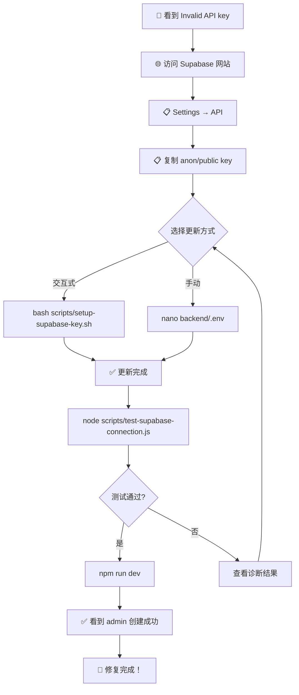

# ⚡ 快速修复 - Supabase Invalid API Key

## 🔴 问题

```
❌ 创建测试用户 admin 失败: Invalid API key
❌ 创建测试用户 testuser 失败: Invalid API key
```

**原因**: `backend/.env` 中的 `SUPABASE_KEY` 无效或已过期

---

## ✅ 立即修复 (3 步)

### 步骤 1️⃣: 获取正确的 API Key

1. 访问 https://app.supabase.com
2. 选择您的项目
3. 点击 **Settings → API**
4. 复制 **ANON/PUBLIC KEY**

### 步骤 2️⃣: 更新配置

**选项 A - 交互式 (推荐)**

```bash
# macOS/Linux:
bash scripts/setup-supabase-key.sh

# Windows:
scripts/setup-supabase-key.bat
```

**选项 B - 手动编辑**

```bash
nano backend/.env  # 或用您喜欢的编辑器
```

找到这一行:
```ini
SUPABASE_KEY=eyJhbGciOi...
```

替换为从 Supabase 复制的密钥

### 步骤 3️⃣: 验证并重启

```bash
# 测试连接
node scripts/test-supabase-connection.js

# 应该看到: ✅ 所有诊断测试通过！

# 重启后端
npm run dev

# 应该看到: ✅ 用户创建成功: admin (admin@foodlab.com)
```

---

## 📊 验证修复成功

### ✅ 成功标志

**后端日志中看到:**
```
✅ 用户创建成功: admin (admin@foodlab.com)
✅ 用户创建成功: testuser (testuser@example.com)
✅ 用户创建成功: qa_tester (qa@example.com)
✅ 用户创建成功: disabled_user (disabled@example.com)
✅ 用户初始化完成，新建 4 个，更新 0 个
```

**浏览器登录成功:**
```
用户名: admin
密码: 8888
```

---

## 🔍 诊断工具

### 测试 Supabase 连接

```bash
node scripts/test-supabase-connection.js
```

**输出示例:**
```
✅ SUPABASE_URL: https://mqnzaxwvyjtfktzqjugl.supabase.co
✅ SUPABASE_KEY: eyJhbGciOi...
✅ Supabase 客户端创建成功
✅ 数据库连接成功
✅ 插入数据成功
✅ 所有诊断测试通过！
```

---

## ❌ 如果仍然失败

### 常见错误和解决方案

| 错误 | 原因 | 解决方案 |
|------|------|---------|
| `Invalid API key` | 密钥无效或已过期 | 从 Supabase 重新获取密钥 |
| `Failed to fetch` | 网络问题或 URL 错误 | 检查 SUPABASE_URL 和网络连接 |
| `users table does not exist` | 数据库未初始化 | 运行 SQL 初始化脚本 |
| `Permission denied` | 密钥权限不足 | 确保使用 anon/public key |

### 完全重置

```bash
# 1. 恢复备份 (如果有)
cp backend/.env.backup backend/.env

# 2. 从 Supabase 获取新密钥
# 3. 使用脚本更新: bash scripts/setup-supabase-key.sh

# 4. 测试: node scripts/test-supabase-connection.js

# 5. 重启: npm run dev
```

---

## 📋 关键文件

- `backend/.env` - Supabase 配置
- `backend/config/testDataInitializer.js` - 自动创建测试用户
- `scripts/setup-supabase-key.sh` - 交互式配置脚本 (macOS/Linux)
- `scripts/setup-supabase-key.bat` - 交互式配置脚本 (Windows)
- `scripts/test-supabase-connection.js` - 连接诊断工具
- `docs/SUPABASE_API_KEY_FIX.md` - 详细指南

---

## 🎯 完整修复流程



---

## 💡 提示

1. **安全**: API key 会被保存在 `.env` 中，不要提交到 Git
2. **备份**: 脚本会自动备份原 `.env` 到 `.env.backup`
3. **验证**: 总是运行诊断脚本验证连接
4. **日志**: 检查后端启动日志看是否有 `✅ 用户创建成功` 信息

---

## 🔗 相关文档

- [SUPABASE_API_KEY_FIX.md](./SUPABASE_API_KEY_FIX.md) - 详细的 API key 配置指南
- [FIX_401_UNAUTHORIZED.md](./FIX_401_UNAUTHORIZED.md) - 401 错误排查指南
- [QUICK_FIX_401_ERROR.md](./QUICK_FIX_401_ERROR.md) - 快速修复 401 错误

---

**准备好了? 开始修复吧！** 🚀
