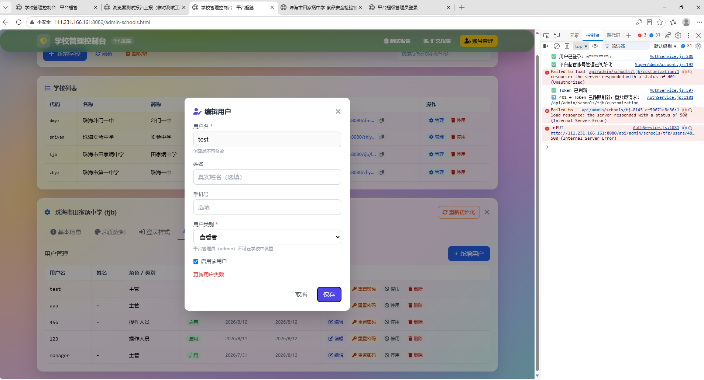

# 待修复问题深度分析报告

> **生成时间**：2026-08-14
> **数据源**：`docs/test-results/latest/REPORT.md` + `snapshot.json`
> **分析范围**：全部失败用例中 **未收口（open）** 的部分（含截图证据 + 代码根因定位）

> **重要数据口径说明**：
> 报告里失败用例共 20 个，但其中 **4 个已被 renkang 标记为"收口"（closed）**，即已知问题/已有处理结论、不再作为待修复项跟踪。
> 这 4 个已收口项 **不在本次待修复计划内**（详见文末"已收口清单"）：
> - Q1-果蔬阶段A（复检阶段A不刷新）
> - Q1-油（复检三阶段无错误弹窗）
> - V8-基本信息（保存修改无反应）
> - V1-肉蛋（界面定制新增项目报错）
>
> 注：本报告最初曾误用 `test-report.html`（旧版/另一份）作为数据源，已校正为 `docs/test-results/latest/REPORT.md` + `snapshot.json` 为准。

---

## 总览（仅列未收口的待修复项）

| 编号 | 问题 | 分组 | 严重度 | 根因类别 | 状态 |
|---|---|---|---|---|---|
| FIX-03 | V6 登录页帮助中心跳转无反应 | 业务复测 | **中** | 子路径相对路径 | 待修复 |
| FIX-04 | V7 超管登录·学校代码非法输入无红框提示 | 业务复测 | **中** | 校验时机+Tailwind类未生成 | 待修复 |
| FIX-05 | 回归V6地址·帮助链接子路径核对失败 | 业务复测 | **中** | 同FIX-03（同一根因） | 待修复 |
| FIX-06 | B7 旧schema保留与清理（SSH psql） | 备份模块 | **低** | 恢复服务未执行DROP SCHEMA | 待修复 |
| FIX-07 | B9 SSH侧检查（定时任务/文件权限） | 备份模块 | **中** | 备份脚本文件缺失 | 待修复 |
| FIX-08 | R01 学校列表无法删除/恢复学校 | 历史问题 | **高** | jsonb列缺::jsonb cast（确定根因）| 待修复 |
| FIX-09 | R03 数据同步无取消按钮 | 历史问题 | **低** | UI交互缺陷 | 待修复 |
| FIX-10 | R06 病原体检测下载模板打不开 | 历史问题 | **低** | 模板文件不存在 | 待修复 |
| FIX-11 | R07 界面定制果蔬检测项目删不掉 | 历史问题 | **中** | 内置字段语义限制 | 待修复 |
| FIX-12 | R13 登录页帮助跳转失败 | 历史问题 | **中** | 同FIX-03（同一根因）| 待修复 |
| FIX-13 | R15 回收站恢复学校报jsonb类型错误 | 历史问题 | **高** | 同FIX-08（同一根因，确定）| 待修复 |
| FIX-14 | NEW-170443 超管平台修改账户类别失败 | 新问题 | **高** | 鉴权401/后端异常吞没500 | 待修复 |
| FIX-15 | NEW-140845 viewer账号可新增食用油检测 | 新问题 | **高** | 前端缺records:create权限拦截 | 待修复 |
| FIX-16 | NEW-140219 viewer账号可新增果蔬检测 | 新问题 | **高** | 同FIX-15（同一根因）| 待修复 |
| FIX-17 | NEW-170648 洗涤剂残留识别结果不准 | 新问题 | **中** | 算法鲁棒性不足 | 待修复 |
| FIX-18 | NEW-170647 洗涤剂残留拍照识别不符 | 新问题 | **中** | 同FIX-17（同一根因）| 待修复 |

> 注：V6/R13/回归V6为同一根因合并为FIX-03；R01/R15为同一根因合并为FIX-08；NEW-140219/NEW-140845合并为FIX-15；NEW-170647/NEW-170648合并为FIX-17。实际独立待修复项 **13 个**（已排除 4 个已收口项）。

---

## 已收口清单（不纳入本次待修复计划）

以下 4 个用例在报告中 `result=failed` 但已被 **renkang** 标记为 **收口（closed）**，属已知问题/已有处理结论，本次**不列为待修复项**。这里保留其现象与初步根因，仅供后续回溯参考。

### 已收口-01：Q1 复检显示·果蔬农残（阶段A不刷新）
- **收口人/时间**：renkang @ 2026-08-14T02:50:23Z
- **现象**：复检录入"合格"后列表仍显示"不合格"，F5 也未更新（截图：`Q1-果蔬阶段A/1786515621542_8c893b99.png`）
- **初步根因**：前端乐观更新 + Storage 30s 冷却 + 409 冲突重试失败导致本地缓存停留在 `updating` 脏状态。
- **结论**：已收口，暂不处理。

### 已收口-02：Q1 复检显示·食品油品质（三阶段）
- **收口人/时间**：renkang @ 2026-08-14T02:55:01Z
- **现象**：复检三阶段无错误弹窗。
- **结论**：已收口，暂不处理。

### 已收口-03：V8 基本信息「保存修改」无反应
- **收口人/时间**：renkang @ 2026-08-14T03:10:48Z
- **现象**：网页管理报错，保存修改无反应。
- **结论**：已收口，暂不处理。

### 已收口-04：V1 界面定制·肉蛋新增检测项目显示
- **收口人/时间**：renkang @ 2026-08-14T03:10:55Z
- **现象**：点击应用后弹窗报错 500，食安页刷新项目仍未新增（截图：`V1-肉蛋/1786436392302_b17e5eb7.png`）。
- **初步根因**：`field_options` 中肉蛋 `batchNo` 选项序列化产生非法 JSON，导致 `GET /config` 的 `JSON.parse` 抛 500。
- **结论**：已收口，暂不处理。

> ⚠️ 说明：这 4 项虽同为 failed，但报告已标注收口，故从待修复范围中剔除。若后续收口被重新打开（reopen），再按 FIX 流程纳入。

---

## FIX-03：帮助中心跳转失败（V6 / R13 / 回归V6地址）

### 现象
- 学校系统登录页直接点击"需要帮助？"无反应/页面不变
- 从超管平台进入学校系统后再点"需要帮助？"可以正常打开help.html
- 直接访问`/<code>/login.html`点帮助也不行

### 截图证据


- 控制台一致显示：`GET /<code>/help.html` 返回 **404** 或 **409**
- 从根路径 `/login.html` 点帮助时请求的是 `/help.html`（正常）
- 从子路径 `/<code>/login.html` 点帮助时请求的是 `/<code>/help.html`（404）

### 根因定位
| 层 | 文件:行 | 问题 |
|---|---|---|
| 链接定义 | `login.html:278-284` | 使用相对路径 `./help.html` |
| Caddy路由 | `deploy/deploy.sh:694-718` | 仅rewrite了`/<code>/login`路径，**未对help.html做子路径兜底** |
| 静态文件 | `dist/help.html` | 只存在于根级，不存在`dist/<code>/help.html` |

**根因链路**：
```
用户在 /dmyz/login.html 点击"需要帮助？"
  → 浏览器解析相对路径 ./help.html → /dmyz/help.html
  → Caddy @schoolLogin 正则仅匹配 login → 不命中
  → 走 handle try_files → dist/dmyz/help.html 不存在
  → 回退到 dist/index.html（SPA主页）或直接404
  → 表现为"点了没反应"
```

### 解决思路
1. **方案A（推荐）**：将`login.html`中的帮助链接改为绝对路径`/help.html?school=<currentCode>`，并在`help.html`中读取`?school=`参数保留上下文
2. **方案B**：在Caddy配置中增加`@schoolHelp`规则：`path_regexp ^/[^/]+/help\.html$` → rewrite到`/help.html`
3. **方案C**：构建时将help.html拷贝到多份（不推荐，扩展性差）

同时需修复`help.html`的返回链接（第19行`./login.html`）也改为带school参数的绝对路径。

---

## FIX-04：V7 超管登录·学校代码非法输入无红框提示

### 现象
在超管登录页（super-admin-login.html）的学校代码输入框中输入非法字符（中文、特殊符号等），没有出现红框错误提示。

### 截图证据

- 截图显示：输入框为空状态，无任何红框/错误提示文字
- 页面正常显示"学校不存在或未激活"的通用红字（这是另一个提示，非红框）

### 根因定位
| 层 | 文件:行 | 问题 |
|---|---|---|
| 校验触发 | `super-admin-login.html:202-222` | 校验**仅在点击"进入"按钮或回车时触发**，非实时input校验 |
| 校验范围 | `super-admin-login.html:208-211` | 正则`/^[a-z0-9-]+$/`只拦截**字符集合法性**，不校验学校是否存在 |
| 红框实现 | `super-admin-login.html:214-216` | 动态添加Tailwind类`ring-2 ring-red-400` |
| Tailwind构建 | `css/tailwind.css` | 若使用JIT模式且HTML静态代码中无`ring-red-400`，则**该类不会被生成** → 红框不渲染 |

**三重叠加导致"看不到红框"**：
1. 用户输入过程中不触发校验（必须点按钮）
2. 输入合法但不存在 的学校代码不会触发红框（直接跳转）
3. 即使触发了，`ring-red-400`可能因Tailwind JIT未扫描到而不生效

### 解决思路
1. 给`schoolCodeInput`添加`input`事件监听，实现**实时校验**反馈
2. 在校验正则之外增加**后端预校验**（blur时调用`/api/schools/:code/config`探测是否存在）
3. 将红框样式从动态Tailwind类改为**内联style**或确保`tailwind.css`内容配置包含该类

---

## FIX-06：B7 旧schema保留与清理

### 现象
影子恢复（shadow restore）成功后，旧schema（如`school_dmyz_old_20260812xxxxxx`）残留在数据库中未被自动清理。

### 截图证据

- PowerShell截图显示：
  - `SELECT nspname FROM pg_namespace WHERE nspname LIKE 'school_dmyz_old_%'` 能查到旧schema
  - 手动执行`DROP SCHEMA "school_dmyz_old_..." CASCADE;`时报错：`unexpected argument '-u' found`（Windows下sudo命令语法差异）
  - 提示文档中的清理命令在PowerShell环境下不可直接使用

### 根因定位
| 层 | 文件:行 | 问题 |
|---|---|---|
| 恢复完成 | `backend/lib/restoreService.js:149-156` | **无论RESTORE_DROP_OLD环境变量为何值，都只打印日志不执行DROP** |
| 代码注释自相矛盾 | `restoreService.js:149` | 注释声称"默认立即删除"，实际**永远只log不执行** |
| 失败清理 | `restoreService.js:173` | 仅清理影子schema（`_restore`后缀），不清理`_old_*` |
| 测试文档 | REPORT.md | 清理命令针对Linux sudo，未提供Windows PowerShell等价写法 |

```javascript
// restoreService.js 第149-156行 —— 实际代码
if (process.env.RESTORE_DROP_OLD !== 'keep') {
    log(`${TAG} 旧 schema 保留: ${oldSchema}（确认无误后手动 DROP SCHEMA ...）`)
    // ← 只有log，没有实际的 DROP SCHEMA 执行！
}
```

### 解决思路
1. **修复恢复服务**：当`RESTORE_DROP_OLD !== 'keep'`时，在COMPLETE阶段事务内执行`DROP SCHEMA "${oldSchema}" CASCADE`
2. **增加安全确认机制**：默认行为改为"保留24h后自动清理"或"需二次确认API调用才清理"
3. **补充多平台文档**：提供Linux（sudo -u postgres psql）和Windows（psql -U postgres）两种清理命令

---

## FIX-07：B9 SSH侧定时任务/文件权限/失败告警

### 现象
SSH侧检查定时任务、文件权限、失败告警机制——检查失败。

### 根因定位（无截图，证据链接undefined）
| 层 | 文件:行 | 问题 |
|---|---|---|
| 定时任务 | `deploy/deploy.sh:605` | systemd timer的ExecStart指向`scripts/003_backup-now.mjs`，**该文件根本不存在** |
| 脚本目录 | `scripts/` | 实际只有8个文件，**没有**`003_backup-now.mjs` |
| 密钥依赖 | `deploy/deploy.sh:589` | 要求`TENCENT_*`或`BACKUP_MASTER_KEY`，fail-closed策略下未配置则拒绝执行 |
| 告警推送 | — | 未找到失败告警通知机制（可能依赖受限目录`.ssh`中的配置） |

### 解决思路
1. 创建`scripts/003_backup-now.mjs`备份脚本（或修正deploy.sh中的路径指向已有脚本）
2. 配置备份密钥（`TENCENT_SECRET_ID/KEY`或`BACKUP_MASTER_KEY`）
3. 增加systemd服务的`OnFailure=`告警钩子（如发送webhook邮件）
4. 补充B9的截图证据（当前evidence为undefined）

---

## FIX-08：R01/R15 学校删除/恢复报jsonb类型错误（确定根因）

### 现象
- R01：无法删除已新增的学校，且回收站中无法恢复
- R15：回收站点击"恢复"按钮报数据库错误

### 截图证据


- 两张截图均显示完全相同的PostgreSQL错误：
  ```
  ❌ 恢复学校失败: Invalid `prisma.$executeRawUnsafe()`:
  Raw query failed. Code: 42804
  Message: ERROR: column "visible_types" is of type jsonb but expression is of type text
  HINT: You will need to rewrite or cast the expression.
  ```

### 根因定位（100%确定）
| 层 | 文件:行 | 问题 |
|---|---|---|
| 恢复INSERT | `backend/server.js:1146-1151` | 对`CUSTOMIZATION_COLUMNS`（全jsonb列）传参**无`::jsonb` cast** |
| 删除快照 | `backend/server.js:1058-1077` | 快照时用`JSON.stringify`成文本存入recycle_bin（OK） |
| 对比参照 | `backend/server.js:1254-1256` | **PUT customization的正确写法**：`"${col}" = $${params.length}::jsonb` |
| Schema定义 | `backend/prisma/schema.prisma:352-376` | Prisma模型字段定义为`String?`，但DB实际DDL是**jsonb** |

**BUG代码**（server.js 第1146-1151行）：
```javascript
// 当前错误写法 —— JS对象直接绑定 → PostgreSQL按text处理 → jsonb列拒绝
await tx.$executeRawUnsafe(
    `INSERT INTO public."SchoolCustomization" (id, school_code, ${colNames}, updated_at)
     VALUES ($1,$2,${placeholders},now())`,
    crypto.randomUUID(), bin.original_code,
    ...CUSTOMIZATION_COLUMNS.map((c) => customization[c] ?? null)  // ← 缺少 ::jsonb
)
```

**正确写法参照**（同文件第1254-1256行）：
```javascript
params.push(normalized[col] === null ? null : JSON.stringify(normalized[col]))
sets.push(`"${col}" = $${params.length}::jsonb`)   // ← 有 ::jsonb cast
```

### 解决思路
1. **立即修复**：将第1150行的map改为：
   ```javascript
   ...CUSTOMIZATION_COLUMNS.map((c) => {
       const val = customization[c] ?? null;
       return val === null ? null : JSON.stringify(val);
   })
   ```
   并将SQL占位符改为`${placeholders.map((p,i) => `$${i+2}::jsonb`).join(',')}`
2. **审查所有`$executeRawUnsafe`/`$queryRawUnsafe`调用**：统一排查是否有其他位置也存在jsonb列缺cast的问题
3. **长期**：将Prisma schema.prisma中`SchoolCustomization`的字段类型从`String?`改为`Json?`（需配合migration）

---

## FIX-09：R03 数据同步无取消按钮

### 现象
数据备份与恢复页面中，云端同步/暂停同步/清空本地缓存操作执行后无可取消/关闭的交互入口。

### 截图证据


- 截图显示：数据备份与恢复页面
  - 有"云端同步""暂停同步""清空本地缓存"三个操作按钮
  - 同步状态区显示"云端同步成功！页面即将刷新..."
  - **没有任何取消/关闭按钮**

### 根因定位
| 层 | 文件:行 | 问题 |
|---|---|---|
| 云端同步 | `js/modules/BackupRestore.js:234-236,322` | `handleCloudRestore()`直接执行，无取消模态框 |
| 暂停同步 | `js/modules/BackupRestore.js:252-254,327` | `pauseSync()`直接执行，无确认/取消 |
| 清空缓存 | `js/modules/BackupRestore.js:272-274,329-345` | 仅一个浏览器`confirm()`，确认即执行不可逆 |

### 解决思路
1. 为长时间运行的"云端同步"操作添加**进度对话框+取消按钮**（调用`/api/sync/status`的cancel端点）
2. "暂停同步"加二次确认模态框（而非静默执行）
3. "清空本地缓存"保留confirm但增加"撤销"能力（从云端重新拉取）

---

## FIX-10：R06 病原体检测下载模板打不开

### 现象
病原体检测模块点击"下载模板"后，下载的.docx文件Word无法打开，报"文件损坏"。

### 截图证据

- Word弹窗明确显示：
  ```
  Microsoft Word
  Word 在试图打开文件时遇到错误。
  请尝试下列方法：
  * 检查文档或驱动器文件的文件权限。
  * 确保有足够的内存和磁盘空间。
  * 用文本恢复转换器打开文件。
  (C:\Users\...\pathogen_template (4).docx)
  ```

### 根因定位
| 层 | 文件:行 | 问题 |
|---|---|---|
| 下载入口 | `js/modules/Pathogen.js:125-173` | HEAD探测`./templates/pathogen_template.docx` |
| 模板文件 | 仓库全局搜索 | **`pathogen_template(4).docx`不存在于代码库中** |
| 服务器行为 | Caddy静态托管 | 不存在的文件若被try_files回退到index.html，则返回200+HTML内容 |
| 前端判断 | `Pathogen.js:~140` | `res.ok`为true（因为200）→ 当作docx下载 → 内容实际是HTML |

### 解决思路
1. **方案A（推荐）**：移除"下载模板"按钮（复测备注建议），改为页面上直接展示检测项目填写说明
2. **方案B**：创建有效的`templates/pathogen_template.docx`模板文件并纳入仓库
3. **方案C**：在前端增加Content-Type校验，若响应不是`application/octet-stream`或`application/vnd.openxmlformats-officedocument.wordprocessingml.document`则提示"模板暂不可用"

---

## FIX-11：R07 界面定制果蔬检测项目删不掉

### 现象
界面定制中，果蔬农残检测项目的下拉选项无法删除。

### 截图证据

- 截图显示：界面定制的"检测项目"配置弹窗
  - 输入类型：下拉选择
  - 下拉选项区域显示多个可删除chip标签（克百威-胶体金检测卡、水胺硫磷-胶体金检测卡等）
  - 每个chip右侧有 × 删除按钮
  - 但用户反馈"删除不了"

### 根因定位
| 层 | 文件:行 | 问题 |
|---|---|---|
| 字段定义 | `admin-schools.html:2421` | 果蔬`batchNo`是**内置字段**（`builtin:true`），选项来自硬编码默认值 |
| 字段删除 | `admin-schools.html:2678-2680` | 内置字段的`.fl-delete`只显示"隐藏"图标（`fa-eye-slash`），**不能真正删除字段** |
| 选项删除 | `admin-schools.html:3330-3361` | 选项chips的×按钮代码层面可删，写入`fieldOptions[batchNo]` |
| 录入端应用 | `js/utils/schoolCustomization/fields.js:182-201` | 仅在`fieldOptions[name]`非空时替换默认项 |

**核心矛盾**："检测项目"是内置字段`batchNo`，其选项来源于`MODULE_FIELDS`硬编码。用户在定制弹窗中删除chip后：
- 若录入端（GenericTest/index.html）对内置字段**内联了默认`<option>`**，则定制删除无效
- 字段级的"删除"对内置字段只是"隐藏"而非真正删除

### 解决思路
1. 明确产品语义：内置字段的选项是否允许自定义删除？
   - 若**允许**：确保录入端完全从`fieldOptions`读取选项，不内联默认`<option>`
   - 若**不允许**：对内置字段隐藏选项编辑入口（或加tooltip说明"内置项不可删除"）
2. 检查`fields.js:182-201`的`applySchoolCustomizationToForm`——确保`fieldOptions[batchNo]`为空数组时也能覆盖默认值

---

## FIX-14：NEW-170443 超管平台修改账户类别失败

### 现象
在超管平台（admin-schools.html）的用户管理中，编辑tjb账户修改"用户类别"后点保存，报"更新用户失败"。

### 截图证据

- 截图显示：编辑用户弹窗
  - 用户名：test
  - 用户类别：查看者（下拉选择）
  - 底部红色提示：**"更新用户失败"**
  - Network面板显示：
    - `PUT /api/admin/schools/tjb/users/1` → **401 (Unauthorized)**
    - `PUT /api/admin/schools/tjb/users/:userId` → **500 (Internal Server Error)**

### 根因定位
| 层 | 文件:行 | 问题 |
|---|---|---|
| 前端提交 | `admin-schools.html:3798-3845` | PUT到`/api/admin/schools/${currentSchoolCode}/users/${id}` |
| 鉴权中间件 | `backend/server.js:1580` | `authenticateUser, requirePlatformSuperAdmin` |
| 超管校验 | `authMiddleware.js:320-327` | 要求`role==='admin' && !schoolCode`（纯平台超管） |
| 异常处理 | `backend/server.js:1632-1638` | catch块**吞掉所有异常**，统一返回500+通用消息 |

**双重故障可能**：
- **401**：当前登录态不是纯平台超管（可能是学校管理员manager，token中带schoolCode），被`requirePlatformSuperAdmin`拒绝
- **500**：即使鉴权通过，`createTenantClient(code)`/`$queryRawUnsafe`在特定条件下抛异常被catch吞掉

### 解决思路
1. **排查鉴权态**：确认编辑用户时的登录角色是否为平台超管（admin + 无schoolCode）
2. **细化后端错误码**：将catch块拆分为：
   - 400：参数校验失败
   - 403：权限不足（区分"非超管"和"非该校管理员"）
   - 404：用户不存在
   - 409：版本冲突
   - 500：真实内部错误（打印完整stack）
3. **前端适配**：对401提示"请重新以平台超管登录"；对403提示"无权操作此学校的用户"

---

## FIX-15：viewer角色越权可新增检测记录（NEW-140219 + NEW-140845）

### 现象
使用"查看者"（viewer）角色的账号登录后：
- 可以新增果蔬农残检测记录（NEW-140219）
- 可以新增食用油品质检测记录（NEW-140845）
- 可以新增肉蛋农残检测记录（NEW-140845子项）
- 新增后选择"复检合格"但不显示合格，F5刷新后也没有更新

### 截图证据


### 根因定位
| 层 | 文件:行 | 问题 |
|---|---|---|
| **后端（安全）** | `backend/middleware/authMiddleware.js:518-528` | `requireEditorOrAbove`**正确拒绝**viewer（返回403）✅ |
| **前端（漏防）** | `js/modules/GenericTest.js:1130` | `handleSubmit()`**无**`records:create`权限前置校验 |
| 表单可见性 | `js/modules/GenericTest.js:54-67,101` | 新增按钮和表单**未按角色隐藏** |
| 权限矩阵 | `js/services/PermissionService.js:53-59` | viewer矩阵**不含**`records:create`✓ 定义正确 |
| 本地缓存 | `js/core/Storage.js:130-169` | `save()`先写本地缓存（乐观更新）→ 显示"成功"→ 后端实际403被拒 |
| 复检不显示 | 表现类似已收口的FIX-01 | viewer"新增"的记录实际未落库，复检操作也无意义（但根因不同：此处是403被拒，FIX-01是409竞态且已收口） |

**攻击链路**：
```
viewer登录 → 进入检测页面 → 看到"+ 添加检测点位"按钮（未隐藏）
  → 填写表单 → 点保存 → storage.save()写本地缓存 → UINotification.success("成功保存")
  → 用户以为成功了（实际上后端PUT/POST返回403，记录停在pending状态）
  → 尝试复检 → 复检操作也对本地脏数据操作 → 刷新后数据消失
```

### 解决思路
1. **立即修复**：在`GenericTest.handleSubmit()`开头（第1130行前）增加：
   ```javascript
   if (!permissionService.hasPermission('records:create')) {
       UINotification.error('您的角色无新增检测记录权限');
       return;
   }
   ```
2. **隐藏入口**：在`render()`方法中根据角色隐藏"添加检测点位"按钮（参照第74行删除按钮的权限判断写法）
3. **隐藏表单**：第54-67行快速访问模式的判断之外，增加`!permissionService.hasPermission('records:create')`时隐藏整个表单区
4. **优化本地缓存**：`Storage.save()`前先检查权限，无权限时不写本地缓存（避免"假成功"错觉）

---

## FIX-17：洗涤剂残留拍照识别结果不准确（NEW-170647 + NEW-170648）

### 现象
洗涤剂残留检测中，拍照识别的结果与肉眼判断不符合；部分场景识别不到离心管。

### 截图证据


- 截图显示比色卡+离心管的拍摄图像，算法标注了色块检测框和离心管区域
- 存在的问题：色块定位偏移、离心管液面采样区域不准确、浓度判定与目视不一致

### 根因定位
| 层 | 文件:行 | 问题 |
|---|---|---|
| 算法主体 | `js/utils/detergentColorimetry.js:534-666` | 纯Canvas数值计算，**无ML模型** |
| 色块定位 | `detergentColorimetry.js:146-255` | 饱和度显著度图+峰检测，SAT_THRESH=0.04对光照敏感 |
| 离心管定位 | `detergentColorimetry.js:341-447` | 四周搜索垂直长条高饱和区，背景干扰易误判 |
| 颜色采样 | `detergentColorimetry.js:104-116` | 跳过v<20\|\|v>250像素，浅色液层（低浓度）采样偏差大 |
| 匹配算法 | `detergentColorimetry.js:463-515` | ΔE76欧式距离+邻域线性插值，经验阈值未校准批次差异 |

**算法局限性**（根本原因）：
- 零外部依赖的纯前端Canvas算法，对拍摄角度/光照/试剂批次高度敏感
- 无相机标定/无白平衡校正/无颜色特征库
- 等距外推补缺失色块（最多容忍3/7缺失），误差传导到浓度判定

### 解决思路
1. **短期**：增加拍摄引导UI（框选区域、亮度提示、角度校正提示），减少输入变异
2. **中期**：
   - 引入白平衡校正（取比色卡白色区域作为参考白点）
   - 色块定位改用模板匹配（固定比色卡布局先验）替代饱和度峰值检测
   - 增加置信度评分，低置信度时提示"请重新拍摄"
3. **长期**：考虑接入云端AI视觉服务（如腾讯云/阿里云图像识别API）替代纯前端算法
4. **产品层面**：对于争议结果，支持"人工判定覆盖"——允许用户手动选择比色级别

---

## 修复优先级建议

### P0 — 立即修复（数据完整性/安全性影响）

| 编号 | 问题 | 预估工作量 | 依赖 |
|---|---|---|---|
| FIX-08 | R01/R15 学校恢复jsonb类型错误 | 0.5h | 无（确定根因，参照已有正确写法） |
| FIX-15 | viewer越权新增检测记录 | 1h | 无（前端加权限检查即可） |
| FIX-14 | 超管修改账户类别401/500 | 2h | 需要排查鉴权态+细化错误码 |

### P1 — 本周修复（核心功能影响）

> 注：原计划中的 FIX-01（Q1复检）、FIX-02（V1肉蛋）已被 renkang 收口，移出待修复队列，故此处不再列出。

| 编号 | 问题 | 预估工作量 | 依赖 |
|---|---|---|---|
| FIX-03 | 帮助中心跳转失败 | 1h | 需要Caddy配置变更（运维配合） |
| FIX-04 | V7非法输入无红框 | 1h | 纯前端修改 |

### P2 — 下周修复（体验/运维改善）

| 编号 | 问题 | 预估工作量 | 依赖 |
|---|---|---|---|
| FIX-06 | B7旧schema未清理 | 1h | 需要在生产环境验证DROP逻辑 |
| FIX-07 | B9定时任务缺失 | 2h | 需要创建脚本+配置密钥 |
| FIX-09 | R03同步无取消按钮 | 2h | 前端UI改造 |
| FIX-10 | R06模板打不开 | 0.5h | 移除按钮或创建模板 |
| FIX-11 | R07果蔬检测项目删不掉 | 1h | 需要产品确认内置字段策略 |
| FIX-17 | 洗涤剂识别不准 | 3-5d | 算法改进或引入外部服务 |

---

## 关联关系图

```
                    ┌─────────────┐
                    │  FIX-08     │ ←── jsonb ::jsonb cast缺失（确定根因）
                    │  R01/R15    │     （影响学校删除/恢复全流程）
                    └─────────────┘

┌─────────────┐     ┌─────────────┐     ┌─────────────┐
│  FIX-03     │ ←── │  FIX-05     │     │  FIX-12     │
│  V6帮助跳转  │     │  回归V6地址  │     │  R13帮助    │
└─────────────┘     └─────────────┘     └─────────────┘
    ↑ 同一根因：login.html相对路径 + Caddy缺少help.html rewrite

┌─────────────┐     ┌─────────────┐
│  FIX-15     │ ←── │  FIX-16     │
│  viewer越权  │     │  (同一问题)  │
└─────────────┘     └─────────────┘
    ↑ 同一根因：前端handleSubmit缺records:create权限检查

┌─────────────┐     ┌─────────────┐
│  FIX-17     │ ←── │  FIX-18     │
│  洗涤剂识别  │     │  (同一问题)  │
└─────────────┘     └─────────────┘
    ↑ 同一根因：前端比色算法鲁棒性不足

（注：已收口的 FIX-01/Q1复检、FIX-02/V1肉蛋 不在此关系图内，归入文首"已收口清单"）
```

---

*文档结束。所有截图引用路径相对于 `docs/test-results/latest/evidence/` 目录。*
