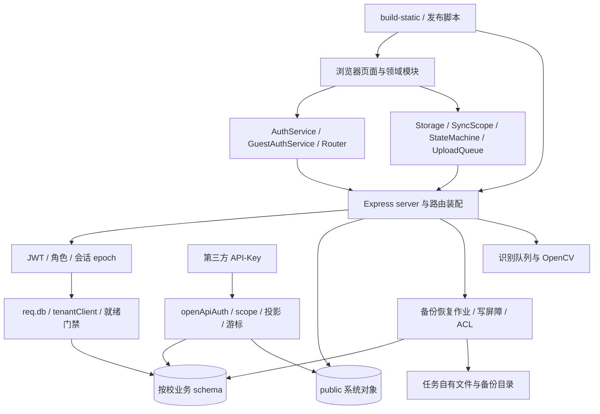

# 全仓库代码审查详细计划

日期：2026-10-08（Asia/Shanghai）。基线：`d708db8718906db3c71b9364a6a719237ecf0a3e`，分支 `Product_tencent_CVM`。

## 1. 目标、交付与当前状态

目标是在一个可追溯的当前版本上，审查全部自研代码、模板、数据库结构与迁移、测试、运维脚本、部署配置，以及第三方依赖边界；形成能独立复核的问题清单、架构与数据流地图、覆盖记录和分阶段修复建议。

本次任务交付的是**计划**。已完成当前版本与目录核对、关键入口调查、历史审查衔接和逐文件工作包分配；没有完成计划中的全仓代码审查，也未确认新的漏洞清单。产品源码、数据库、服务和既有报告未被修改。

本轮新增六份规划资料：入口说明、主计划、工作包、执行提示词、覆盖底账、基线清单。实际执行将另建结果目录，保留本包作为起始计划。

最终审查交付至少包括以下文件：

| 产物 | 必需内容 |
|---|---|
| `REPOSITORY_MAP.md` / `.json` | 文件角色、入口、调用关系、信任边界、系统表/租户表、后台任务与副作用 |
| `ENDPOINT_MATRIX.tsv` | method + 完整挂载路径 + handler 行号；认证、角色、租户来源、读写/文件/后台副作用 |
| `MODEL_MIGRATION_MATRIX.tsv` | 23 个模型及模型外 SQL 对象；所属 schema、约束、迁移、回填、使用方 |
| `SCRIPT_ENTRY_MATRIX.tsv` | npm/CLI/shell/服务入口、实际 cwd、dotenv 来源、外部调用、写入/删除范围 |
| `COVERAGE.tsv` | 每个文件、函数/区段、阅读深度、审查者、证据路径与当前哈希 |
| `CHAIN_MATRIX.tsv` | 本文 C01–C12 的入口、正常/负向/故障/并发场景、静态与动态证据 |
| `HISTORY_RECONCILIATION.tsv` | AUD/SRV 历史 ID 与当前代码位置、证据、重复关系及当前状态 |
| `ISSUE_INVENTORY.md` / `issues.json` | 严重度、触发条件、影响路径、根因、证据级别、建议、验收与未验证项 |
| `VERIFICATION.md` + `evidence/` | 实际执行命令与脱敏日志、rc、测试清单/计数、同实例证明、失败及清理记录 |
| `INDEPENDENT_REVIEW.md` | 独立复算、争议裁决、抽查与复现、覆盖缺口、通过/返工结论 |
| `REPAIR_ROADMAP.md` | 依赖顺序、可实施工作包、数据兼容、验证/回退要求；保持修复未执行状态 |
| `HANDOFF.md` / `STATE.json` | 精确读取顺序、当前 SHA、已完成/未完成包、下一步动作、环境与证据位置 |

## 2. 依据与事实边界

### 2.1 本次本地核对

`git ls-files -z` 的基线分母是 **460 个跟踪文件**，由 `coverage-plan.tsv` 逐一列出；该分母不是“460 个生产源码”。

| 范围 | 跟踪文件数 | 本次核对说明 |
|---|---:|---|
| `backend/` | 204 | 含 79 个测试目录文件、包锁、说明、迁移与运维脚本 |
| `frontend/` | 111 | 含 JS、HTML、CSS、供应商 JS、字体和生成 CSS |
| `tests/` | 55 | 根用例、隔离工具、入口枚举和集成配置 |
| `scripts/` | 12 | 构建、导入、开校、KMS、监控和磁盘工具 |
| `deploy/` | 6 | 发布脚本、配置示例与操作说明 |
| `cypress/` | 4 | 3 个 E2E 文件 + 支持文件 |
| `.github/` | 1 | 现有 workflow |
| `docs/` | 52 | 当前说明、历史审查与运行规范 |
| 其余根级配置 | 15 | 包/包锁、Jest/Cypress/ESLint/Tailwind/Babel/环境示例等 |
| **合计** | **460** | 每个文件均须有归属与审查结论 |

后端子域：`lib/` 41、`middleware/` 6、`modules/` 2、`routes/` 18、`scripts/` 27、`prisma/` 25。前端：`core/` 8、`services/` 6、`modules/` 47、`utils/` 21。

本次路径核查还比较了 backend/frontend/scripts/deploy/tests/cypress/.github 内的文件系统与 Git 清单：排除依赖、构建、数据库、上传、备份与缓存目录后，未发现未跟踪的代码类文件。此结果仅覆盖上述目录和本次时点，不代表服务器或未来 checkout。

未找到适用的 `AGENTS.md`。已读取 `docs/PROJECT_CONVENTIONS.md`；将其当作项目约束来源，同时在 WP00 对照现行代码与较新审查裁决核对。不能据根 README 的服务器说明，声称本地 checkout 等于现网版本。

### 2.2 历史资产的使用方式

| 历史资产 | 用途 | 不能直接推出的结论 |
|---|---|---|
| `docs/reviews/global-audit-20260924/ISSUE_INVENTORY.md`、`issues.json`、`VERIFICATION.md` | 初始 AUD 问题、复現方向、旧代码基线与测试限制 | 当前缺陷仍存在、当前已修复或当前全部通过 |
| `phase3/REVIEW_LOG_MASTER.md` → `ORCHESTRATOR_STATE.md` → 最新任务包/裁决/证据 | 恢复审查过程、识别历史门禁与未关闭事项 | 文件早期字段就是当前 HEAD 状态 |
| `docs/AI_review/SERVER_CODEBUDDY_20260928/FINDINGS.md` 与 R6/R7 | SRV 根因、服务器事故与隔离验证准备 | 本地已重现生产事故、计划已实施、生产已收口 |
| R8 覆盖与全审报告、R8 文件清单 | 历史文件阅读标签、候选与需要验证的影响边界 | 308 的分母覆盖本轮所有 SQL/HTML/CSS/配置；文件部分区段复核等于全文深审 |

当前 R8 报告列出 37/308 的问题区段回读、266/308 的候选级阅读、5/308 的未触达标签；同时说明动态验证未运行。本计划把这些视为历史线索与证据入口，重新按当前 460 文件分母建账。

当前 `deploy/deploy.sh` 的迁移分支说明并实现失败保留现场、禁止自动 `db push`/`resolve` 的协议。历史报告中的自动 fallback 和配置示例不能直接当作现行运行行为。类似文档漂移必须在 WP00/WP14 中一项项对照。

历史问题复核必须保持原 ID 和原结论：新增当前状态列，允许 `STILL_PRESENT_STATIC`、`REPRODUCED_CURRENT`、`FIXED_STATIC_ONLY`、`FIXED_VERIFIED_CURRENT`、`NOT_APPLICABLE_CURRENT`、`NEEDS_REVIEW`、`ENV_BLOCKED`。代码位置漂移、证据失效、范围缩小、重复问题都须说明原因；不能改写旧报告以制造已通过历史。

## 3. 当前架构与关键数据流

### 3.1 本地代码确认的架构

- 前端为原生 ESM、HTML 和 CSS。`frontend/js/main.js` 初始化，`core/Router.js` 处理导航和身份相关界面；`AuthService`、`GuestAuthService`、`PermissionService`、`SessionManager` 管理客户端身份。
- 数据层以 `Storage.js`、`AdaptiveUploadQueue.js`、`SyncScope.js`、`SyncStateMachine.js` 支撑缓存、待上传、去重和冲突恢复。领域模块、看板与导出共同消费记录与结论。
- 后端为 Node ESM + Express；`backend/server.js` 装配全局中间件、健康与 readiness、18 个 route 文件及后台启动流程。
- PostgreSQL + Prisma 使用 schema-per-tenant：基础客户端处理 public 系统对象，`tenantClient.js` 派生按校客户端；数据库逻辑还包含原始 SQL、触发器、租户回放与模板投影，不能只看 Prisma model。
- 人类 JWT/访客认证与 `/api/open` 的 API-Key 认证是两条链。API-Key 业务读取仍可写 usage/SystemLog；HTTP GET 不能作为无副作用证明。
- 备份恢复涉及 pg_dump、KMS/加密、元数据、目录、作业状态、临时 schema、写屏障、rename、ACL 与清理。
- `recognitionQueue.js` 当前实现为主线程串行识别队列，复用前端 `opencv/recognizer.js`；不能直接沿用“Worker”说明推断资源隔离。
- 静态构建与部署涉及 `scripts/build-static.js`、Tailwind、`deploy/deploy.sh`，以及生成的 Caddy/systemd/定时任务配置。现网拓扑和配置仍需单独获取证据。

图展示代码职责关系；不是现网部署验证图。实审须在 `REPOSITORY_MAP` 中加入真实调用位置、前置条件、错误出口与副作用。

### 3.2 全链路覆盖矩阵

每条链至少追踪：入口与输入 → 身份/租户 → 规范化与授权 → 状态/事务 → 持久化 → 响应 → 浏览器/导出/第三方消费 → 审计与失败清理。相关文件的单独阅读不能代替这项检查。

| ID | 业务链 | 正向与负向/故障检查 | 唯一牵头包 | 协同包 |
|---|---|---|---|---|
| C01 | 登录 → refresh → verify → 登出/撤销 → 多标签页 | 学校/平台/guest 分支、同秒/并发撤销、DB 故障、旧 token 与不同主体会话 | WP02 | WP01、WP13 |
| C02 | 学校 URL/参数/JWT → req.db → 实际 schema | A/B 两校同 ID、缺校码/非法校码、请求体伪造、停用/回收状态、连接淘汰 | WP03 | WP02、WP12 |
| C03 | 表单 → 离线暂存 → 队列 → record API → 审计 | 身份切换、刷新恢复、重复请求、409/429/503、提交未知结果、部分批次失败 | WP04 | WP05、WP10 |
| C04 | 记录列表/看板 → 统计 → PDF/导出 → OpenAPI | 多页完整性、时区/周月边界、判定一致、未知值、权限投影、输出编码 | WP05 | WP06、WP12 |
| C05 | 创建学校 → 模板/迁移/种子 → 首个账号 → readiness | 空库/旧库、对象缺失与漂移、重复创建/归一冲突、失败残留、公共对象保护 | WP03 | WP08、WP14 |
| C06 | 停用/回收/恢复/彻底清理 → token/grant/缓存失效 | 生效时点、部分失败、关联 grant、保留策略、不同身份入口一致 | WP03 | WP02、WP06、WP07 |
| C07 | 备份 → 校验 → 恢复 → rename → ACL/客户端重连 | 同校互斥、A/B 隔离、写屏障、缺文件/损坏、故障注入、恢复点归属 | WP07 | WP03、WP08 |
| C08 | 迁移/public → 租户回放 → 台账 → readiness → 发布 | 锁/CAS/清锁竞态、checksum、迁移失败、重启、中断、回退条件 | WP08 | WP03、WP14 |
| C09 | API-Key → client/credential/grant → 游标/快照/分页 | 撤销/过期/IP/限流、投影变更、跨校游标、页首尾 manifest、usage/log 副作用 | WP06 | WP02、WP13 |
| C10 | 超管切校 → 请求返回 → 定制/用户/grant 保存 | 响应乱序、异校 state、版本冲突、重复点击、所见身份与后端真实授权 | WP09 | WP03、WP12 |
| C11 | 测试任务/反馈 → 证据文件 → 归档/管理面板 | case/学校/主体绑定、重复 DOM id、路径归属、审计追加、归档后不可变 | WP10 | WP09、WP07 |
| C12 | 图片 → 上传校验 → 识别队列 → 判定展示 | 尺寸/格式、并发/超时、任务归属、内存/CPU、低置信度与人工确认 | WP11 | WP01、WP13 |

动态用例须由本次风险与历史证据缺口驱动。不得为低影响细节堆砌镜像实现的测试。

## 4. 范围、分母和审查深度

### 4.1 全仓定义

基线内 460 个文件全部登记；按类别分别公布分母和完成率：自研可执行代码/HTML/CSS/SQL、测试与夹具、配置/脚本、文档、第三方/生成资源、包锁。不能把文档与依赖字体计入自研深审百分比，也不能用 JS 文件数代表整个仓库。

逐文件底账包含 `path`、`sha256`、`category`、`primary_package`、`shared_packages`、`planned_depth`、`review_state`、`dynamic_requirement`、`dynamic_state`、`reviewer`、`evidence_ref`、`exclusion_reason`。一个文件只有一个主工作包；协同包可读同一文件，发现统一归并。

| 阅读状态 | 定义 | 能否计入完整深审 |
|---|---|---|
| `UNREVIEWED` | 仅纳入清单/计算哈希；或规划阶段看过部分入口 | 否 |
| `SCANNED` | 搜索/模式匹配/摘要阅读 | 否 |
| `READ_PARTIAL` | 指定函数或区段及调用方已读 | 否，须列剩余区段 |
| `READ_COMPLETE` | 全文理解，登记职责、输入/输出、状态、副作用和错误分支 | 可计入阅读完成；仍非复核完成 |
| `CROSSCHECKED` | 调用方/消费方/契约/测试交叉核对，独立审查者接受 | 可计入包深审完成 |
| `SPECIALIZED_REVIEW_COMPLETE` | 第三方、生成资源、包锁完成本类专门检查 | 仅计入本类分母 |
| `EXCLUDED_WITH_REASON` | 明确范围外、路径/依据/影响和负责人已登记 | 不算完成；单列 |

深审要求覆盖全文的语义与控制流；不要求逐行产出文字。但必须给出函数/区段清单、职责与分支说明，不能只写“读过/无问题”。高风险位置要注明精确行号。

### 4.2 特殊对象

- `frontend/vendor/**`、`frontend/css/vendor/**`：来源、版本、hash、许可证、加载方式、使用边界、公开漏洞公告与修复版本核对；动态执行前验证供应商来源。版本与公告在实审时查官方来源，不在本计划宣称漏洞状态。
- `frontend/css/tailwind.css`：生成物与输入/构建链一致性；不把压缩生成行数算作自研源码深读。
- `package-lock.json`、`backend/package-lock.json`：直接/传递依赖、来源 URL、integrity、安装脚本、版本漂移与运行/开发边界；审查锁文件不等于安装依赖。
- `docs/archive/**` 和历史报告：引用/命令是否会误导现行操作、是否含敏感材料；记录历史身份，保持正文与证据不改写。
- `.env`、真实部署适配/密钥、备份、uploads、数据库目录、日志、dist、node_modules、.git：不作为当前自研源文件分母。源码对它们的访问、生成、边界、权限、生命周期须审查；运行态数据、真实配置核对属于另行授权阶段，不能直接读取或打包。
- ignored 的历史工作底稿可作为本地引用；不得把本地存在当成 Git/服务器可取。对换机交付须登记其可获得性、hash 与脱敏状态。

## 5. 执行边界与隔离门槛

### 5.1 当前授权与下一轮授权区分

本次授权是编制计划和资料。实审启动后默认只读：读当前源码与合成历史资料、生成审查报告和最小复现资料，不修复、不格式化、不改既有迁移、不提交/推送、不发布、不对他人发消息。

动态验证需要明确审查执行指令，并通过 G0；生产访问/生产写入/服务重启/部署必须另有对应授权。本计划中的步骤描述不构成这些动作的执行授权。可以先完成独立静态审查，动态条件不具备时记录 `NOT_RUN` 或 `ENV_BLOCKED` 并继续其他包。

### 5.2 G0：任何动态步骤前的预检

G0 分为通用项与能力相关项。基线、import 副作用、环境/路径/外联边界对所有动态步骤适用；PG/TEST_*、HTTP、浏览器、系统权限要求按该步骤实际能力选择。未触达的能力标 `N/A_WITH_EVIDENCE`，附源码/import/配置证据，不能写成 PASS。WP13 纯离线门禁负例可在通用隔离通过后先执行，用于建立 DB 准入证据；不以完整 DB G0 已通过为其前提。

| 动态类型 | 必需能力门禁 | 可不适用项的条件 |
|---|---|---|
| 纯函数/解析/离线 jsdom、门禁负例 | 通用基线、环境、import、文件与外联检查 | 已证明 0 DB/真实网络能力，可不创建 PG；DB 拒绝用例用连接替身和有效观察正对照 |
| PG/Prisma/迁移/DB-backed HTTP | 通用项 + 独占 PG、TEST_*、真实身份/事务、受限/管理分离、实例清理 | 不允许因测试名字含 unit 而跳过 DB 门禁 |
| 不带 DB 的本地 HTTP | 通用项 + 实际 listener/网络可达边界 | 全链及后台任务均不连库时 DB 项可 N/A |
| 浏览器/E2E | 通用项 + profile/origin/server/网络与数据写入归属；接 DB 时加 DB 门禁 | 仅静态合成 DOM 且无真实 API/后台时 DB 项可 N/A |
| 文件 CLI/备份/部署/系统动作 | 通用项 + 自有路径/外部命令/权限与系统沙盒；按实际能力追加 PG/HTTP | 纯文件动作可不创建 PG；系统服务/数据目录动作仍需 VM/container 或等效隔离 |

1. 冻结被审 SHA、dirty 状态、realpath、符号链接、依赖来源和工具版本；在本任务独占副本中工作，保持原 checkout 可复核。
2. 检查所有 import、dotenv、文件路径、spawn、shell、KMS、webhook、SMTP、定时任务和自动 pump。`server.js`/识别队列 import 与启动不是纯读取；禁止先启动再检查副作用。Prisma 生成客户端可能内嵌源目录/环境搜索路径，不能直接复制生产 node_modules 作为隔离证明；获准准备依赖后，应在独占副本内生成并复核真实解析路径、符号链接和内嵌路径。
3. 环境从白名单构造，不继承真实 `DATABASE_URL`、PG service/.pgpass、KMS/备份主密钥、云凭据、webhook 或业务 `.env`。使用合成 secret 与任务自有目录；日志不输出值。
4. 数据库为本轮独占、只监听回环、非默认端口的实例；runId、库、角色、datadir、端口、PID、owner marker、sentinel 与 context 必须相互绑定。
5. 按 `TEST_DATABASE_URL` / `TEST_DB_CONTEXT_FILE` 协议核验配置与实际数据库/身份；Prisma 与 pg 的消费链各自验证，不能以一条连接给另一条作担保。
6. 业务 DML 使用受限测试身份；DDL/迁移、受控权限负例通过隔离 controller 的单独权限阶段完成。不得把管理凭据传给普通测试进程。需要 readiness 的真实 HTTP 场景先证明 fixture 迁移链和租户结构就绪，不通过关闭检测或旁路就绪门禁让功能测试变绿。
7. 证明缺配置、冲突配置、危险 URL、过期 context 会在模块加载/业务写入前拒绝，拒绝用例连接次数为 0；用回环正对照确认观察工具有效。
8. 备份/恢复/磁盘/部署/KMS/告警验证仅访问自有目录、假服务或专属测试数据库。真实部署脚本先在一次性容器/VM 中核查系统调用，不允许直接对宿主 systemd、PG 数据目录或 Caddy 执行。
9. 浏览器隔离 profile、自有 origin 与合成账号；Cypress 改用独占测试副本的配置，不沿用默认 localhost:8080，也不沿用文档账号。
10. 保留 up→fixture→门禁→用例→after-check→down 的 runId/PID/context/rc 链。仅回收归属已证明的任务实例；stop/端口/进程状态未知时保留现场。

现有工具也需准入：`backend/tests/report-auth/_report-auth-harness.mjs:91–111` 将 `adminUrl` 交给待测 server，不满足本计划的普通运行身份分离要求，不能只因 TEST_* 合法便直接复用。应提出任务自有 controller/harness 的管理准备与受限运行分离方案，或将确需管理权限的动作列为单独受控场景；条件无法建立记 `ENV_BLOCKED`。这是计划门槛与工具现状的差异，本次不改造工具或定性为产品漏洞。

HTTP 边界另验：当前 `backend/server.js:598` 使用 `app.listen(PORT, ...)`，未指定 host；客户端访问 127.0.0.1 不证明服务只监听回环。实际读取 listener 地址，并使用任务专属 network namespace/container/VM 或等效网络隔离防止非任务主体访问；不能安全限制时阻断该真实 HTTP 场景。DB 与 HTTP 的监听验收分别记录。

满足 G0 是允许隔离验证的前提，不是待测产品逻辑通过。隔离工具本身必须经 WP13 独立复核，不可因为旧报告 PASS 而跳过。

### 5.3 停止条件

遇到当前基线漂移、未知生产连接、任务目录越界、真实凭据进入日志、其他窗口同实例写入、cleanup 所有权不明、出现真实通知/系统操作、输出日志丢失或高风险步骤前置不足，停止该动态动作并留痕。可以继续不依赖它的静态工作。

项目规范存在审计保留相关历史说明，磁盘归档清理代码又有操作逻辑；WP00/WP07/WP10 须核对较新裁决与真实目标策略。策略不清时登记 `BUSINESS_DECISION_PENDING`，不自行执行清理或用审查计划替代业务批准。

## 6. 工作包与优先级

完整执行要求见 [WORK_PACKAGES.md](WORK_PACKAGES.md)。排序依据是触达权限、数据不可逆影响、跨校传播和历史证据缺口；优先级是审查顺序，不代表已确认该域有相应严重度漏洞。

| 包 | 主题 | 优先级 | 深审 + 定点验证估算（人日） |
|---|---|---|---:|
| WP00 | 基线、规范、历史衔接与覆盖治理 | 首先 | 0.5–1 |
| WP01 | 服务装配、全局中间件、就绪/错误/资源边界 | 最高 | 0.5–1 |
| WP02 | 身份、会话、撤销、JWT/guest 与角色 | 最高 | 1.5–2.5 |
| WP03 | 多租户、学校生命周期、初始化/同步引擎 | 最高 | 2–3 |
| WP04 | CRUD、离线同步、幂等与并发一致性 | 最高 | 2–3 |
| WP05 | 五类业务、结论、统计与日期口径 | 高 | 1.5–2.5 |
| WP06 | OpenAPI、grant/投影/游标、导出与数据暴露 | 高 | 1.5–2.5 |
| WP07 | 备份、恢复、加密、磁盘与破坏性清理 | 最高 | 2–3 |
| WP08 | 模型、全部迁移、原始 SQL/触发器与升级 | 最高 | 1.5–2.5 |
| WP09 | 管理前端、定制、跨校异步状态与外链 | 高 | 1.5–2.5 |
| WP10 | 审计、报告/证据、反馈与归档 | 高 | 1–1.5 |
| WP11 | 图像识别、OpenCV、队列与资源预算 | 中高 | 0.75–1.25 |
| WP12 | 页面/路由/公共工具、输出安全与界面契约 | 高 | 1–1.5 |
| WP13 | 测试入口、隔离、夹具与测试可信度 | 首轮并行 | 4–6 |
| WP14 | 构建、部署、运维脚本、CI 与失败协议 | 最高 | 1.5–2.5 |
| WP15 | 依赖、第三方/生成资源与供应链 | 首轮并行 | 0.5–1 |

各包合计约 **23–38 人日**；增加约 2 人日的环境/高风险复现缓冲，首轮预算取 **25–40 人日**，另预留总控与独立裁决 **2–4 人日**。按每人日约 6 小时有效审查、3 名审查者并行、1 名总控复核，计划约 **12–18 个工作日**；这是容量估算，不是完成承诺。P0 后根据真实代码量、历史证据复用程度、环境与动态失败数更新。不以缩减审查深度换取固定日期。

当前计划全文审读的文本约 105,734 行；WP13 单包含 143 个文件、29,000 行，已增加该包预算。其余文档/包锁/第三方/生成物使用专项容量，不把行数混入自研深审速度。各包文件数、全文行数、专项文件数见 baseline-manifest 的 `package_capacity`；动态场景数在 P0 按风险登记。P1–P4 的示例日序仅表达依赖，实际用本次容量复算排期，并按包负荷调配协同审查者。

## 7. 分阶段安排与依赖

### P0 · 启动与基线（约 0.5–1 个工作日）

完成 WP00；核对所有跟踪/未跟踪/ignored 可执行文件、历史最新状态；冻结 460 分母及之后增量；生成端点/模型/脚本初表和问题复核对照；WP13 提交 G0 隔离方案。每个文件与每条 C 链有负责人。

出口 G1：基线可复算、范围没有无主文件、历史与当前状态分开、未取得授权的动作标明。P0 不要求启动服务。

### P1 · 高风险静态深审（示例第 2–5 工作日）

三条流并行：

- A 后端：WP01 → WP02/WP03；先确认挂载、认证、租户与 readiness 的真实顺序。
- B 前端/业务：WP12 → WP04/WP05；从表单、离线状态、渲染与数据消费追到 API。
- C 测试/运行：WP13 → WP14/WP15；先证明测试收集、隔离、发布及第三方范围。

总控每日复核新 P0/P1 候选、关键引用和历史归并，不等到最后统一读。跨包证据写各自目录；总账与文件覆盖表只有总控写入。

出口 G2a：最高风险入口已有完整调用链；候选与确认问题区分；所有危险运行步骤均已有预检设计。

### P2 · 其余完整覆盖与契约交叉检查（示例第 5–9 工作日）

A 完成 WP08/WP06；B 完成 WP09/WP11 及剩余 WP05/WP12；C 完成 WP07/WP10 和测试关联。以覆盖表核对所有剩余函数/模板/迁移/脚本，不能只追发现问题的区段。

跨包结论：WP02×WP03 身份与租户；WP04×WP05×WP06 记录/结论/投影；WP03×WP07×WP08 迁移/恢复/ACL；WP09×WP10×WP12 管理状态/证据/输出；WP13×所有包测试可信度。

出口 G2b：自研源码和配置逐文件阅读完成、脚本副作用表完成、历史 ID 当前状态完成；剩余动态项有明确条件和场景。

### P3 · 隔离动态验证与基线回归（示例第 9–12 工作日）

仅在相应执行授权与 G0 通过后开展。先重跑原缺陷触发的正/负向证据，再做必要集成/并发/浏览器/迁移验证，最后执行覆盖已登记风险的回归入口。

每个独立动态流使用独立实例、端口、角色、profile、文件与证据目录。数据库 DDL、迁移、restore、故障注入和全量回归，在同一实例内严格串行；不同自有实例方可并行。全量回归窗口禁止产品编辑，不能混用不同 SHA 的日志。

出口 G3：已执行项有原始日志、断言、响应及最终状态证据；未执行项如实列出；测试收集、实际执行、pass/fail/skip/todo 和终止状态可独立复算。

### P4 · 独立复核、裁决与移交（示例第 12–15 工作日）

总控回读全部 P0/P1、跨租户/删除/认证/迁移候选及已确认项；每个工作包至少独立复核一条正向和一条负向/故障证据。P2/P3 按根因族与包分层抽查至少 20%，发现错引、范围漏读或证据失效时扩展到该包全部同类结论。

合并重复 issue，保留受影响出口清单；确认问题按安全、数据一致性、业务规则、可靠性、测试/运维、文档分别统计。形成修复建议和回退/验收要求；此阶段仍不实施修复。

出口 G4：独立裁决、完成状态、残余风险、未验证项、下一步任务与证据读取顺序齐备。

## 8. 测试与验证计划

以下仅为未来候选入口；本次未运行。入口可执行性须先由 WP13 读源码核对，不能把命令名当安全证明。

| 层 | 候选入口/方法 | 前置条件和证据 |
|---|---|---|
| 元数据与收集 | `test:backend:list`、静态核对 `entry-sets.cjs` | 确认只枚举、不 import 测试；清单覆盖所有已登记入口文件 |
| 无 DB 的纯函数/隔离工具 | `test:unit`、`test:isolation` | 无网络/真实 dotenv；实际收集及执行计数、禁止静默 skip |
| 入口审计 | `test:entry-audit` | 先读 runner：是否会调用别的命令；不能预设它是纯 listing |
| 后端 / root DB / integration | `test:backend`、`test:db`、`test:integration` | 独占 PG + TEST_* + 真身份/事务边界核验 + before/after-check |
| 真实 HTTP | `test:backend:fixture` / `test:live-api` 与定点 HTTP | 先核对 fixture/harness 副作用；同实例真实中间件链、合成主体和 A/B 两校 |
| 前端 DOM/存储 | root 前端相关用例 + 必要定点 jsdom/浏览器 | mock 层级标明；localStorage、DOM 内容/事件和队列最终状态；代码实际使用其他存储时再增加相应检查 |
| 真实浏览器 | Cypress 或隔离浏览器定点场景 | 自有 origin/profile/server；Cypress 现有配置与写入必须先审查 |
| 迁移/恢复/部署 | 专属 fixture + disposable VM/container | 空库、旧库、租户/public 漂移、失败保留、数据/权限守恒、回退场景 |
| 长时/资源 | 并发连接、导出、识别队列、限流/缓存 | 资源阈值先写入场景；有限负载、到阈值停止、无业务外联 |

现有 `npm test` 为 `test:db && test:unit`，缺 DB 预条件时 unit 不会启动；现有 `test:frontend` 配置无套件时 fail-closed。两者应登记为入口行为与覆盖限制，不能泛称“全量前端已测”。唯一 `.github` workflow 的职责是 deploy 分支范围检查；质量 CI 是否完整需单列评估。

测试结果必须证明待测行为：关键字段断言不能被 `if (field)` 跳过；mock 掉认证/数据库/整个领域库的测试不能证实真实链。并发复现使用真实更新/锁/ORM 边界的确定性屏障，避免以 sleep 推断竞态。

旧 probes 中“通过”可能代表不安全行为已出现。实审如复用，应保留原语义；后续修复验收另写安全行为断言，不以旧缺陷 probe PASS 作为修复通过。

## 9. 问题、证据与严重度

### 9.1 每项问题的必填字段

`id`、`legacy_ids`、`root_cause_id`、`title`、`package`、`severity`、`severity_reason`、`baseline_sha`、`path:line`、`reviewed_ranges`、`entrypoint`、`preconditions`、`trigger`、`observed_behavior`、`expected_behavior`、`impact_path`、`tenant/role/data_scope`、`evidence_level`、`evidence_refs`、`verification_status`、`unknowns`、`recommendation`、`acceptance`、`compatibility_and_rollback`、`reviewer_verdict`。

历史同根因沿用关联 ID；新问题可用 `FCR-20261008-001` 起。冻结 AUD/SRV 原结论和严重度，另给当前评估；跨出口重复项归并根因，但保留所有位置/角色/消费方。无问题文件也须有职责、边界与检查记录。

### 9.2 证据等级与状态分离

| 证据等级 | 能说明什么 |
|---|---|
| `CANDIDATE_STATIC` | 有风险线索，尚未完成代码与调用链复核 |
| `CONFIRMED_STATIC` | 当前源码与可达调用链确认缺陷本体；未证明运行量级/现网条件 |
| `REPRODUCED_UNIT` | 替身/纯函数/DOM 层复现；须写 mock 边界 |
| `REPRODUCED_ISOLATED` | 隔离实例真实 HTTP/PG/浏览器/文件系统行为已观察 |
| `OBSERVED_PRODUCTION_READONLY` | 另有授权的现网观测，只证明所观测事实；可能有应用日志副作用 |
| `PRODUCTION_WRITE_VALIDATED` | 单独授权的生产动作与验收；本计划默认范围外 |

验证状态使用 `PASS / FAIL / NOT_RUN / ENV_BLOCKED`；业务规则裁决另用 `BUSINESS_DECISION_PENDING`。证据等级、严重度、验证状态、问题是否已修复是四个不同字段。

候选不能因为措辞严重而变成 confirmed；静态已证实的缺陷也不能因动态未跑被降为“仅猜测”。静态本体、可达性、部署前提、爆炸半径分别登记。

### 9.3 严重度尺度

- P0：可验证的灾难性全平台/跨租户影响，如大范围不可逆数据破坏、认证全面失守或高权限代码执行链；必须说明入口、能力和证据，不按关键词自动赋级。
- P1：重要租户/身份/数据边界破坏、数据丢失或关键功能系统性失效；单独说明普通权限可触达性及前提。
- P2：范围受限但有实际数据/业务/可靠性影响，存在可行绕开或较强前提。
- P3：较低影响的健壮性、维护、文档与测试质量项；若削弱高风险路径验收，应在相关 P0/P1 中关联。

缺失夹具、旧断言/业务规则冲突、部署环境缺失，分别标成环境问题、测试契约问题、待业务裁决；不得直接写成产品漏洞。

## 10. 完成门槛与报告口径

### 文件/接口/模型/脚本覆盖

1. 基线及所有执行期增量都有记录；每个文件有主责任与类别，0 个未登记/无主文件。
2. 自研代码、模板、SQL、配置、脚本 100% `READ_COMPLETE` 并经 `CROSSCHECKED`；仅扫描或部分区段不算完成。
3. 测试/夹具逐文件审读，入口文件与收集文件逐项对账；已知非入口脚本给理由和人工验证设计。
4. 18 route 文件及 server 内联路由全部展开成 endpoint 表；23 model 和模型外 SQL 对象全部登记；17 个迁移逐项给出 schema/锁/数据/失败/回退判断。
5. 第三方/生成/文档/包锁各自完成对应检查，不能用自研覆盖率吞掉它们，也不能用排除掩盖业务入口。

### 调用链与问题证据

6. C01–C12 正向、越权/越校、失效/异常、必要并发场景都有静态链；适用动态项有结果或明确未跑原因。
7. 历史 AUD/SRV 项全部关联当前状态；候选完成确认/证伪/待决分流；P0/P1 全部独立复核。重复计数、错行号、缺证据引用为返工项。
8. 所有动态结果有同 SHA/同 runId/同实例与响应+持久状态证明；rc=0、聚合测试通过或执行者自述单独不能作为验收。
9. 问题建议可执行：验证条件、兼容/迁移影响、必要回退、验收标准明确；该步骤不等于实施完成。

### 最终状态

| 字段 | 允许口径 |
|---|---|
| `PLAN_STATUS` | 本次 `PLAN_READY` |
| `STATIC_REVIEW_STATUS` | `COMPLETE` / `INCOMPLETE`；只依据静态覆盖与复核 |
| `DYNAMIC_VERIFICATION_STATUS` | `COMPLETE` / `PARTIAL` / `NOT_RUN` / `ENV_BLOCKED` |
| `AUDIT_DELIVERY_STATUS` | `COMPLETE` / `COMPLETE_WITH_PENDING` / `INCOMPLETE`；存在必需动态/业务待决只能 pending 或 incomplete |
| `REPAIR_STATUS` | 本次 `NOT_STARTED`；审查完成不代表问题已修复 |
| `CI_STATUS` / `DEPLOYMENT_STATUS` / `RELEASE_ACCEPTANCE` | 本次 `NOT_RUN` / `NOT_EVALUATED`；须另有真实证据 |

报告允许“静态审查完整、动态仍有待办”，但必须列全部待办、原因、风险与下一步。禁止把 `COMPLETE_WITH_PENDING`、设计 PASS 或测试局部 PASS 写成系统安全/上线通过。

## 11. 移交与审查后的修复规划

修复路线按根因依赖组织：先确定身份/租户/状态与业务契约，再处理迁移/生命周期/恢复互相依赖的基础能力，随后处理各业务出口、前端输出与异步状态、测试门禁/CI。发现已确认严重项可先交付专题报告与最小修复工作包，不需要等待整个审查完成。

每个修复建议包必须写明：精确允许文件、禁止操作、旧行为与目标行为、存量数据兼容、迁移是否需要、前置业务决策、测试/证据、失败恢复与停止条件、独立复核入口。审查者与执行者分离；不把执行者“完成”当独立验收。

续审时先读本包 README，再读最新 `HANDOFF.md` / `STATE.json`、基线、覆盖增量、当前包、独立裁决、原始证据。开始任何动作前重新确认 HEAD/工作区及实例归属；不从中断上下文猜测已完成事项。
