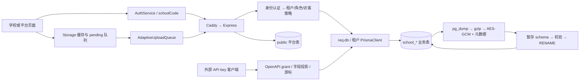

# 第一遍全局审计：Issue inventory

日期：2026-09-24。基线：`f08e72e3e74d188b4555e0bee16280b3dd0d622b`。范围：本地仓库，审计与验证，不修改应用实现、不部署、不访问生产数据库。

本轮形成 **49 项问题：P1 23 项，P2 26 项**。其中 15 个无破坏性最小复现断言通过，另有空库 migration 失败、令牌时间比较及测试/构建结果的独立环境证据。未宣告 P0 现网事故；风险优先级基于可达代码路径和影响，实际暴露范围需结合部署确认。

最先处理的是跨校浏览器状态、幂等权限边界、存储型 XSS、恢复 schema 碰撞、会话撤销和备份一致性。现有测试通过不能证明这些边界已经被覆盖。

## 范围、方法与覆盖边界

- 对基线全部 **310 个 Git 跟踪文件**建立路径、大小、行数、SHA-256 清单；对自有文本提取路由、导入、Prisma 模型及危险模式。参见 [coverage.tsv](coverage.tsv)、[repository-map.json](repository-map.json)。未纳入 node_modules、dist、临时日志及未跟踪本轮交付。
- 重点追踪后端路由/中间件/租户工厂/用户管理/备份恢复、前端认证/缓存/队列/检测渲染/导出、数据库 schema/迁移、部署与测试入口。清单中的 targeted tracing 表示文件参与重点调用链复核，不代表每一行均经过同等深度形式化证明。
- 第三方压缩库、字体、生成 CSS 和锁文件做资产/依赖边界盘点，未逐行审计供应商算法，也未进行在线漏洞库/SBOM CVE 核查。文档作为预期行为参考，历史“已修复”标记不替代代码证据。
- 在独立本机 PostgreSQL 的两个临时数据库执行迁移和数据库测试；HTTP 复现使用本地 supertest、假数据库，前端使用 JSDOM。未连接仓库 .env 指向的业务库，未执行生产备份/恢复、清理或部署。
- 未跑完整浏览器 Cypress、真实摄像头/OpenCV 图片准确率、生产反向代理/云 KMS 集成和长时间压测。涉及这些条件的条目明确标注。此清单是第一遍审计的完整交付，并非“全仓不存在其他问题”的保证。

P1：可能泄露数据、破坏数据/可信状态、绕过授权或阻断可靠发布/恢复，应在相关能力继续扩展前修复。P2：确定的正确性、运维、边界或门禁缺口，按影响安排。证据分“最小复现”“独立数据库实测”“代码确认”“部署条件型”；后两类不伪装成现网利用成功。

## 仓库与系统结构

| 区域 | 主要职责 | 关键边界 |
|---|---|---|
| `frontend/pages`、`frontend/js/main.js` | 原生 ES module 页面与模块初始化 | 路径提取 schoolCode，前端权限仅决定展示 |
| `frontend/js/core`、`services` | 路由、身份、localStorage 缓存、离线任务、渐进上传、导出 | 身份和学校切换、临时 ID、版本冲突、分页完整性 |
| `frontend/js/modules` | 餐具/农残/油脂/肉蛋/病原体、学校及平台管理 | 不可信检测字段进入 HTML 的上下文 |
| `backend/server.js`、`middleware` | Express 4、body parser、租户、JWT/API key、授权、限流/只读 | 挂载顺序决定认证和幂等缓存的实际覆盖范围 |
| `backend/routes`、`modules/UserManager.js` | 内部 API、用户/访客/申请/会话、记录、同步、OpenAPI | 多套写入口、不同主体能力、公共表与租户表 |
| `backend/lib` | 租户客户端、规范化、审计、备份/KMS/恢复、字段配置 | schema 名、事务、快照、失败传播 |
| `backend/prisma` | PostgreSQL schema、迁移、种子、独立 SQL 约束/触发器 | public 与 school_*；migration 与 db push 双轨 |
| `deploy`、`scripts` | Caddy + systemd 单实例、静态复制、迁移/同步、备份告警 | 发布次序、请求大小、健康检查、持久化目录 |
| `tests`、`backend/tests`、`cypress` | Jest、node:test、PG 集成、浏览器 E2E | 默认脚本未统一、部分旧测试缺乏隔离 |

### 数据库与权限模型

public 主要承载 School、SchoolCustomization、平台用户/系统日志、BackupRun、测试报告、OpenApiClient/Credential/Grant，以及运行期 SQL 创建的 revoked_tokens、回收站等基础设施。学校 schema 承载 User、TestRecord/TestItem/Attachment、AuditLog、Guest、Session、AccountApplication、FieldOption、检测频次/日历等业务数据。实际 provision 使用同一 schema.prisma 推表，因此物理存在某模型并不代表所有代码均按同一归属访问。

租户工厂通过连接串 `?schema=...` 生成 PrismaClient，缓存最多 25 个租户客户端、每租户默认连接上限 3；不是依靠对 Prisma 设置 search_path。平台 admin 要求无 schoolCode；学校 manager/operator/viewer 与 guest 有不同权限。OpenAPI 使用独立凭证与 active grant，限制学校、类型、日期、字段投影，并有学校状态检查。这条较新的数据边界不能自动覆盖内部接口、缓存或旧写入口。

| API 面 | 身份/范围设计 | 本轮主要问题 |
|---|---|---|
| 用户登录、refresh、logout、sessions | JWT + DB 当前用户/吊销回查 | AUD-010～016 |
| records / test-records / sync | 租户 req.db + 编辑/访客守卫 | AUD-002、019、023～026 |
| schools / admin 管理 | 平台 admin；部分学校经理入口 | AUD-028～034、043、047 |
| guest quick access / stats | 配置允许签发只读访客 | AUD-011、019、025 |
| test-results / evidence | 全局报告表，但当前仅要求登录 | AUD-017、018 |
| OpenAPI | API key + client + grant + 投影 | AUD-045、047；分页规模见待验证风险 |
| backup / restore | 平台或有权限学校经理 | AUD-004～007、036、046、048 |
| recognition | JWT；全局内存队列 | AUD-037 |

### 关键状态流

1. **记录**：表单→本地 temp/dirty→pending create/update/delete→HTTP→服务端 version CAS→本地同步。当前跨身份归属、temp ID 转换、409 合并和全量加载均有缺口（001、020～024）。
2. **身份**：登录签发 access/refresh→服务端 DB 回查→轮转/吊销→退出。Session 展示状态与实际 JWT 能力脱节；学校停用、访客开关和 DB 故障处理也没有形成统一状态机（010～016）。
3. **申请/管理**：pending→approved 或 rejected；批准创建 viewer；经理数量约束用于停用/降级/删除。检查与提交缺少共同原子边界（028～030）。
4. **备份/恢复**：计数/结构元数据→dump→加密→文件/BackupRun→暂存 schema→结构对齐→行数检查→双 RENAME。文件命名、快照、schema 所有权、写屏障和数据字符串保真分别有缺口（004～007、048）。
5. **部署**：安装→public 迁移/回退 push→租户同步→复制前端→启动服务→HTTP health。迁移失败、静态 CSS 次序和 readiness 缺口使“命令成功”不等于“业务就绪”（008、009、038、042）。

## 验证结果

| 检查 | 最终结果 | 解释 |
|---|---|---|
| 根 Jest，显式隔离 DATABASE_URL | 27 suites：26 通过 / 1 失败；251 tests：249 通过 / 2 失败 | authSession 的锁定阈值和登录错误文案断言过时 |
| backend node:test `.test.mjs` | 178 通过，0 失败，0 跳过 | 提前在隔离库创建 public 与 school_reviewtest；初次缺 fixture 的失败不计作产品缺陷 |
| PG integration | 2 suites / 13 tests 全通过 | 显式 TEST_SCHEMA/TEST_ROLE_USER，并手动安装角色触发器；初次缺 fixture 的失败已排除 |
| 审计最小复现 | 15 个断言通过 | 通过表示当前缺陷行为被观测到，不是修复后的验收通过 |
| 空库 prisma migrate deploy | 失败：P3018 / PG 42703 | visible_menu_items 不存在；AUD-008 |
| npm run build | 成功 | AUD-042 的产物时序问题仍存在；被生成改写的源码 CSS 已恢复 |
| npm run lint（构建后） | 214 errors，0 warnings | 含 dist/vendor 与环境/目录误报；AUD-041 |
| 完整浏览器 E2E、真实部署恢复 | 未运行 | 不把未执行的检查写成通过 |

命令、前置条件与可重复复现见 [VERIFICATION.md](VERIFICATION.md)。机器可读问题清单见 [issues.json](issues.json)。

## Issue 索引

| ID | 优先级 | 问题 | 证据类型 |
|---|---|---|---|
| AUD-001 | P1 | [浏览器记录缓存和离线队列未按学校、账号隔离](#aud-001) | 最小复现通过 |
| AUD-002 | P1 | [幂等缓存跨租户、跨主体命中，且先于写权限检查](#aud-002) | 真实路由最小复现通过 |
| AUD-003 | P1 | [检测记录字段进入 innerHTML，存在存储型 XSS](#aud-003) | 真实渲染方法的 DOM 复现通过；未执行恶意脚本 |
| AUD-004 | P1 | [恢复暂存 schema 可与另一所合法学校重名并被 DROP](#aud-004) | 名称碰撞纯函数复现通过；未执行破坏性恢复 |
| AUD-005 | P1 | [在线恢复缺少同校互斥和写入暂停机制](#aud-005) | 代码确认 |
| AUD-006 | P1 | [备份元数据行数与 pg_dump 不共享数据库快照](#aud-006) | 代码确认 |
| AUD-007 | P1 | [同秒同范围备份共享文件名，存在覆盖和互相清理竞态](#aud-007) | 代码确认 |
| AUD-008 | P1 | [全新数据库无法从已提交 migration 链部署](#aud-008) | 独立临时 PostgreSQL 实测失败 |
| AUD-009 | P1 | [启动自愈默认执行可丢数据的 schema push，且租户失败仍汇总成功](#aud-009) | 代码确认 |
| AUD-010 | P1 | [停用学校未阻断内部登录和已签发 token](#aud-010) | 代码确认 |
| AUD-011 | P2 | [关闭访客入口只影响新 token，现有访客继续有效](#aud-011) | 代码确认 |
| AUD-012 | P1 | [退出及远程会话撤销没有绑定 JWT 有效性](#aud-012) | logout 无任何吊销接口仍返回成功的最小复现通过；其余链路代码确认 |
| AUD-013 | P2 | [会话注册 upsert 可更新另一用户的 Session](#aud-013) | 真实会话路由最小复现通过 |
| AUD-014 | P1 | [认证数据库故障时默认先放行两次请求](#aud-014) | 最小复现实测 HTTP 200 / 200 / 503 |
| AUD-015 | P1 | [iat + 1 比较永久漏吊销同秒签发的旧 token](#aud-015) | 代码确认及临时 PostgreSQL 比较表达式验证 |
| AUD-016 | P1 | [密码变更与会话吊销非原子，吊销失败仍返回成功](#aud-016) | 代码确认 |
| AUD-017 | P1 | [全局测试报告接口对任意已登录身份开放读写](#aud-017) | 代码确认 |
| AUD-018 | P2 | [测试证据上传 case_id 可使写入目录逃逸](#aud-018) | 路径运算最小复现通过；未向越界目录写文件 |
| AUD-019 | P2 | [访客限制未覆盖频次和同步状态聚合接口](#aud-019) | 代码确认 |
| AUD-020 | P1 | [列表缓存与报告导出静默截断历史记录](#aud-020) | 代码确认 |
| AUD-021 | P1 | [离线临时记录在创建、编辑、删除转换中丢失变更](#aud-021) | 真实 Storage 方法最小复现通过 |
| AUD-022 | P1 | [版本冲突重试只换 version，可能覆盖他人的新内容](#aud-022) | 真实队列 409 分支最小复现通过；覆盖后果由 PUT 契约确认 |
| AUD-023 | P2 | [内部写入接受不存在的业务日期，统计转换可能报 500](#aud-023) | normalizeWriteJson 接受非法日期的最小复现通过 |
| AUD-024 | P2 | [更新未传 status 时重置为 completed](#aud-024) | 真实构造函数最小复现通过 |
| AUD-025 | P1 | [内部油脂统计把任意非“不合格”颜色当作合格](#aud-025) | 代码确认 |
| AUD-026 | P2 | [旧记录与同步写入口绕过服务端记录审计](#aud-026) | 代码确认 |
| AUD-027 | P1 | [删除无检测记录用户会级联删除其审计历史](#aud-027) | 代码确认 |
| AUD-028 | P2 | [最后一位经理保护存在并发检查与写入竞态](#aud-028) | 代码确认 |
| AUD-029 | P2 | [已拒绝的账号申请不能按现有流程重新提交](#aud-029) | 代码确认 |
| AUD-030 | P2 | [账号申请审批不是原子状态转换](#aud-030) | 代码确认 |
| AUD-031 | P2 | [字段选项允许自引用、环和跨模块父节点](#aud-031) | 自引用更新最小复现通过 |
| AUD-032 | P2 | [根字段选项的 nullable 联合唯一约束不能防重](#aud-032) | 代码确认 |
| AUD-033 | P2 | [学校删除和磁盘工具未使用统一 schema 名称归一](#aud-033) | 代码确认 |
| AUD-034 | P2 | [检测日历清空后被 GET 自动重新填充默认值](#aud-034) | 代码确认 |
| AUD-035 | P2 | [全局异常处理把请求解析 400/413 统一改成 500](#aud-035) | 代码确认 |
| AUD-036 | P2 | [上传界面、Express 与 Caddy 的大小限制互相矛盾](#aud-036) | 代码确认 |
| AUD-037 | P2 | [识别队列无容量/结果回收且状态查询缺少任务归属](#aud-037) | 代码确认 |
| AUD-038 | P2 | [健康检查不能反映数据库和租户结构就绪状态](#aud-038) | 代码确认 |
| AUD-039 | P1 | [旧测试使用普通 DATABASE_URL 并执行跨范围破坏性清理](#aud-039) | 代码确认；本轮所有数据库测试仅指向自建临时实例 |
| AUD-040 | P2 | [默认测试和 CI 未覆盖主要后端套件，基线仍有失败](#aud-040) | 根 Jest 249/251 通过；后端 178/178 通过；集成 13/13 通过 |
| AUD-041 | P2 | [lint 配置路径陈旧且扫描生成/第三方文件，当前不能作为门禁](#aud-041) | 构建后实测 214 errors / 0 warnings |
| AUD-042 | P2 | [CSS 在复制到 dist 后才构建，发布可包含旧样式](#aud-042) | 构建成功及执行顺序确认；生成的源码 CSS 已还原 |
| AUD-043 | P2 | [学校基本信息先写库再验证定制字段，失败返回仍有部分变更](#aud-043) | 代码确认 |
| AUD-044 | P1 | [示例 JWT_SECRET 是已知固定字符串，却未被启动保护拒绝](#aud-044) | 代码确认；部署条件型问题 |
| AUD-045 | P2 | [服务监听全部网卡，却固定信任一跳代理](#aud-045) | 代码确认；利用依赖部署可达性 |
| AUD-046 | P2 | [KMS 备份依赖未声明，标准安装无法运行已配置的 KMS 模式](#aud-046) | 依赖清单与 import 代码确认；未调用云 KMS |
| AUD-047 | P1 | [学校删除后 OpenAPI 授权残留，可重新附着到同代码新学校](#aud-047) | 代码确认 |
| AUD-048 | P2 | [恢复 schema 名替换同时改写业务字符串](#aud-048) | 真实 rewriteSchemaNames 最小复现通过 |
| AUD-049 | P2 | [安全告警仅用时间戳游标，批次边界会漏事件](#aud-049) | 201 条同时间戳事件的最小复现通过 |

## 逐项详情

### AUD-001 · P1 · 浏览器记录缓存和离线队列未按学校、账号隔离

证据：[frontend/js/core/Storage.js:61](../../../frontend/js/core/Storage.js#L61)；[frontend/js/core/Storage.js:225](../../../frontend/js/core/Storage.js#L225)；[frontend/js/services/AuthService.js:880](../../../frontend/js/services/AuthService.js#L880)。验证：最小复现通过。

**触发条件**：同一浏览器同源访问 A 校后切换 B 校，或退出后换账号；cache_<table>、pending_<table> 等键保持不变，发送时才读取当前 token。

**影响**：新账号可看到旧账号缓存；A 校待提交的记录可能被以 B 校凭据写入 B 校。服务器 schema 隔离无法补救客户端选错归属。

**修复方向**：缓存与队列键包含不可变租户及主体标识；任务保存创建时的归属，身份切换暂停不匹配任务，明确处理旧缓存迁移。

**验收**：A 离线创建→切 B→恢复网络：B 不显示、不上传 A 数据；同校换账号及退出重登也覆盖。

### AUD-002 · P1 · 幂等缓存跨租户、跨主体命中，且先于写权限检查

证据：[backend/middleware/idempotencyMiddleware.js:39](../../../backend/middleware/idempotencyMiddleware.js#L39)；[backend/routes/recordRoutes.js:20](../../../backend/routes/recordRoutes.js#L20)；[backend/server.js:338](../../../backend/server.js#L338)。验证：真实路由最小复现通过。

**触发条件**：已认证用户知道或复用相同 Idempotency-Key 和请求体；全局缓存键仅由 key 与 body hash 组成，不含主体、租户、method、path。

**影响**：B 校 guest 可命中 A 校写请求的原始成功响应，跳过编辑权限检查并得到未脱敏字段。生产前置 /api 认证仍存在，因此不将其描述为匿名绕过。

**修复方向**：先认证、授权和解析租户，再查缓存；键绑定租户、主体、方法、规范化路由及请求摘要；缓存脱敏后的主体专属响应。

**验收**：相同 key/body 的跨校、跨账号、跨路由请求不能共享响应；guest 重放 operator 写请求应 403。

### AUD-003 · P1 · 检测记录字段进入 innerHTML，存在存储型 XSS

证据：[frontend/js/modules/GenericTest.js:1332](../../../frontend/js/modules/GenericTest.js#L1332)；[frontend/js/modules/GenericTest.js:1347](../../../frontend/js/modules/GenericTest.js#L1347)；[frontend/js/modules/GenericTest.js:350](../../../frontend/js/modules/GenericTest.js#L350)；[frontend/js/modules/Pathogen.js:1181](../../../frontend/js/modules/Pathogen.js#L1181)。验证：真实渲染方法的 DOM 复现通过；未执行恶意脚本。

**触发条件**：有写入权限的账号保存 HTML/属性闭合字符串到 vegetableType、remark、inspector 等业务字段，其他用户打开列表或详情。

**影响**：字段被解析为元素和事件属性；可在查看者同源上下文运行脚本，影响会话及跨页面操作。后端去除危险 JSON 键不等于 HTML 输出转义。

**修复方向**：文本使用 textContent；属性用 DOM 属性赋值；必须保留富文本时使用明确白名单净化，并统一复核各模块表格、详情、导出预览的输出上下文。

**验收**：保存带 img/onerror、引号和 textarea 闭合的字段，列表、详情均仅显示文本，不产生攻击节点。

### AUD-004 · P1 · 恢复暂存 schema 可与另一所合法学校重名并被 DROP

证据：[backend/lib/restoreService.js:85](../../../backend/lib/restoreService.js#L85)；[backend/lib/restoreService.js:110](../../../backend/lib/restoreService.js#L110)；[backend/lib/restoreService.js:242](../../../backend/lib/restoreService.js#L242)；[backend/lib/tenantClient.js:58](../../../backend/lib/tenantClient.js#L58)。验证：名称碰撞纯函数复现通过；未执行破坏性恢复。

**触发条件**：合法学校 alpha 与 alpha-restore 共存；恢复 alpha 时暂存名固定为 school_alpha_restore。

**影响**：准备阶段及失败清理中的 DROP SCHEMA ... CASCADE 会作用于另一学校真实 schema。学校经理恢复入口也调用该服务。

**修复方向**：使用不属于租户命名空间的随机工作 schema，校验所有权；绝不对未由本次任务创建的对象执行清理。

**验收**：两校共存时恢复及故意失败均不得更改另一校；工作 schema 必须唯一并可追溯任务归属。

### AUD-005 · P1 · 在线恢复缺少同校互斥和写入暂停机制

证据：[backend/lib/restoreService.js:81](../../../backend/lib/restoreService.js#L81)；[backend/lib/restoreService.js:110](../../../backend/lib/restoreService.js#L110)；[backend/lib/restoreService.js:196](../../../backend/lib/restoreService.js#L196)；[backend/middleware/readOnlyMiddleware.js:19](../../../backend/middleware/readOnlyMiddleware.js#L19)。验证：代码确认。

**触发条件**：同校两个恢复请求并行，或正常业务在备份恢复准备期间继续写入；服务没有 per-school 锁、请求排空或写入屏障。

**影响**：恢复任务会清理彼此同名暂存 schema；切换到旧备份时，期间已返回成功的新写入不在当前 schema 中。原子 RENAME 只保证名称切换，不保证业务一致性。

**修复方向**：持久化恢复状态、同校排他锁和服务端写屏障；排空在途写入后切换并重建租户连接；失败恢复明确状态。

**验收**：并发恢复只有一个获得执行权；维护期间所有写入口（包括同步）一致拒绝；切换前后无已确认写入静默丢失。

### AUD-006 · P1 · 备份元数据行数与 pg_dump 不共享数据库快照

证据：[backend/lib/backupService.js:357](../../../backend/lib/backupService.js#L357)；[backend/lib/backupService.js:375](../../../backend/lib/backupService.js#L375)；[backend/lib/restoreService.js:175](../../../backend/lib/restoreService.js#L175)。验证：代码确认。

**触发条件**：先 collectTableCounts，再采集结构，最后启动 pg_dump；两阶段之间发生记录、会话或审计写入。

**影响**：备份可以生成成功，但恢复按旧 tableCounts 严格校验新 dump，产生行数不一致并拒绝恢复。

**修复方向**：在同一可重复读快照下收集计数并向 pg_dump 传递 snapshot，或从实际 dump 生成可信计数。

**验收**：持续写入期间连续备份，再隔离恢复，每个备份的计数均与其内容一致。

### AUD-007 · P1 · 同秒同范围备份共享文件名，存在覆盖和互相清理竞态

证据：[backend/lib/backupService.js:364](../../../backend/lib/backupService.js#L364)；[backend/lib/backupService.js:392](../../../backend/lib/backupService.js#L392)；[backend/lib/backupService.js:397](../../../backend/lib/backupService.js#L397)。验证：代码确认。

**触发条件**：管理员、学校经理或定时任务在同一秒备份相同 scope；文件名只有 scope/schema 与秒级时间。

**影响**：两个任务写同一个 .tmp/.aes/.meta，可能覆盖已生成内容；任一失败清理会删除另一个任务的产物。

**修复方向**：每任务使用随机 ID 与专属临时目录，独占创建文件，完成后原子发布；必要时加同范围任务锁。

**验收**：固定时钟并发执行两个同范围任务，产物互不覆盖；一个失败不能删除另一个成功备份。

### AUD-008 · P1 · 全新数据库无法从已提交 migration 链部署

证据：[backend/prisma/migrations/20260726000000_baseline/migration.sql:1](../../../backend/prisma/migrations/20260726000000_baseline/migration.sql#L1)；[backend/prisma/migrations/20260814020000_unify_school_customization_text/migration.sql:15](../../../backend/prisma/migrations/20260814020000_unify_school_customization_text/migration.sql#L15)；[deploy/deploy.sh:512](../../../deploy/deploy.sh#L512)。验证：独立临时 PostgreSQL 实测失败。

**触发条件**：对空 PostgreSQL 执行 prisma migrate deploy。baseline 尚未创建 visible_menu_items，后续 migration 直接 ALTER 该列。

**影响**：实测 P3018 / PostgreSQL 42703 中断；db push 回退不能证明 migration 链正确，也不会自动解决失败 migration 的历史状态。

**修复方向**：设计兼容已有实例的迁移修复方案，补齐缺失对象与状态处理；把空库升级、已有库升级和全部租户升级纳入部署门禁。角色触发器/约束也应进入自动安装路径。

**验收**：空库 migrate deploy 全通过；从受支持旧版数据库升级全通过；检查 public 与租户实际结构和约束。

### AUD-009 · P1 · 启动自愈默认执行可丢数据的 schema push，且租户失败仍汇总成功

证据：[backend/server.js:372](../../../backend/server.js#L372)；[backend/lib/tenantProvisioner.js:150](../../../backend/lib/tenantProvisioner.js#L150)；[backend/lib/tenantProvisioner.js:272](../../../backend/lib/tenantProvisioner.js#L272)；[backend/lib/tenantSync.js:183](../../../backend/lib/tenantSync.js#L183)。验证：代码确认。

**触发条件**：启动时 AUTO_SYNC_TENANTS 未置 false，或部署调用租户同步；模型有破坏性差异或某校同步失败。

**影响**：--accept-data-loss 允许未审批的列/类型变更在运行中执行；单校异常被吞掉，函数最后宣告全体对齐，部署调用方可能继续发布。

**修复方向**：将结构变更移到显式迁移阶段，启动只检查；为租户返回成功/失败汇总，任何必需租户失败令发布失败；对破坏性迁移单独设计数据转换。

**验收**：删列差异不能由普通启动自动应用；注入一校失败时进程/部署检查明确失败且健康状态不冒充就绪。

### AUD-010 · P1 · 停用学校未阻断内部登录和已签发 token

证据：[backend/routes/schoolRoutes.js:404](../../../backend/routes/schoolRoutes.js#L404)；[backend/modules/UserManager.js:313](../../../backend/modules/UserManager.js#L313)；[backend/middleware/authMiddleware.js:367](../../../backend/middleware/authMiddleware.js#L367)；[backend/routes/guestRoutes.js:88](../../../backend/routes/guestRoutes.js#L88)。验证：代码确认。

**触发条件**：将 public.School.status 改为非 active；该校 User/Guest 仍 active。内部登录和认证回查主要检查主体，不检查 School.status。

**影响**：停校后仍可登录或继续访问、修改该校数据；与 OpenAPI 已实施的学校状态检查不一致。

**修复方向**：所有学校身份签发、刷新、受保护请求集中检查学校状态，停用时失效相关访问能力。

**验收**：停用前后的用户、访客、refresh token 和 OpenAPI 一致拒绝访问；重新启用策略明确。

### AUD-011 · P2 · 关闭访客入口只影响新 token，现有访客继续有效

证据：[backend/routes/schoolRoutes.js:386](../../../backend/routes/schoolRoutes.js#L386)；[backend/routes/guestRoutes.js:93](../../../backend/routes/guestRoutes.js#L93)；[backend/middleware/authMiddleware.js:330](../../../backend/middleware/authMiddleware.js#L330)。验证：代码确认。

**触发条件**：访客获得 token 后，管理员将 guest_enabled 设为 false；认证仅核验 Guest.status/valid_until。

**影响**：关闭访客访问无法即时停止已有访客读取，直到其凭据到期或另行吊销。

**修复方向**：认证同时检查学校访客开关，或关闭时增加学校访客会话版本/吊销已有访客。

**验收**：已有访客 token 在关闭后下一次请求即失效；再开启是否需要重领凭据由明确策略控制。

### AUD-012 · P1 · 退出及远程会话撤销没有绑定 JWT 有效性

证据：[backend/routes/userRoutes.js:192](../../../backend/routes/userRoutes.js#L192)；[backend/routes/sessionRoutes.js:70](../../../backend/routes/sessionRoutes.js#L70)；[backend/middleware/authMiddleware.js:367](../../../backend/middleware/authMiddleware.js#L367)；[frontend/js/services/SessionManager.js:1](../../../frontend/js/services/SessionManager.js#L1)。验证：logout 无任何吊销接口仍返回成功的最小复现通过；其余链路代码确认。

**触发条件**：调用 logout，或在会话界面把 Session.status 改为 revoked；JWT 没有用于认证回查的 sessionId 绑定。

**影响**：界面显示已退出/撤销，但保存的 access token 仍可使用；会话表状态也不会阻断相应 refresh 能力。

**修复方向**：令牌绑定服务端会话 ID/版本；logout 原子撤销 access/refresh 会话族；认证和刷新都核验会话。

**验收**：保留退出前 token，logout/远程撤销后读取与刷新均被拒绝，其他会话按所选策略保留。

### AUD-013 · P2 · 会话注册 upsert 可更新另一用户的 Session

证据：[backend/routes/sessionRoutes.js:30](../../../backend/routes/sessionRoutes.js#L30)。验证：真实会话路由最小复现通过。

**触发条件**：已登录用户提交其已知的另一用户 sessionId；upsert where 仅使用 id，update 未限定 user_id。

**影响**：可恢复/修改受害者会话记录并读取返回的会话元数据。此项不等同于直接取得受害者 JWT；需已知目标 ID。

**修复方向**：由服务端生成会话 ID，更新绑定当前主体；返回字段最小化；跨主体 ID 使用统一拒绝响应。

**验收**：A 提交 B 的 sessionId 返回 403/404，不改变 B 的状态、地址或时间。

### AUD-014 · P1 · 认证数据库故障时默认先放行两次请求

证据：[backend/middleware/authMiddleware.js:367](../../../backend/middleware/authMiddleware.js#L367)；[backend/middleware/authMiddleware.js:417](../../../backend/middleware/authMiddleware.js#L417)。验证：最小复现实测 HTTP 200 / 200 / 503。

**触发条件**：JWT 签名有效，但当前角色、状态或吊销信息的数据库回查失败；进程级失败阈值默认 3。

**影响**：前两次请求使用 token 中旧权限继续执行；成功请求会影响全局失败计数，不能保证故障账号及时进入拒绝状态。

**修复方向**：无法确认当前授权即返回 503；如确有离线容错需求，必须设计明确时限、只读能力和已验证状态，不回退高权限旧声明。

**验收**：第一笔数据库认证失败请求即不可执行受保护业务；多用户交错请求不能重新打开失败主体的访问。

### AUD-015 · P1 · iat + 1 比较永久漏吊销同秒签发的旧 token

证据：[backend/middleware/authMiddleware.js:82](../../../backend/middleware/authMiddleware.js#L82)；[backend/middleware/authMiddleware.js:111](../../../backend/middleware/authMiddleware.js#L111)。验证：代码确认及临时 PostgreSQL 比较表达式验证。

**触发条件**：token 在某秒前段签发，同一秒后段写入 user_all 吊销；判断条件为 revoked_at >= to_timestamp(iat + 1)。

**影响**：这枚旧 token 不匹配该条吊销记录，等待一秒也不会改变判断；直到 token 到期或后续新的吊销才失效。refresh token 也受此逻辑影响。

**修复方向**：使用事务化 session/token epoch 或精确签发序号；不要用扩大旧 token 豁免区间解决改密后重新登录问题。

**验收**：固定时钟覆盖同秒先签发后吊销、先吊销后签发两种顺序，前者失效、后者按策略有效。

### AUD-016 · P1 · 密码变更与会话吊销非原子，吊销失败仍返回成功

证据：[backend/modules/UserManager.js:195](../../../backend/modules/UserManager.js#L195)；[backend/modules/UserManager.js:458](../../../backend/modules/UserManager.js#L458)；[backend/modules/UserManager.js:472](../../../backend/modules/UserManager.js#L472)；[backend/modules/UserManager.js:678](../../../backend/modules/UserManager.js#L678)。验证：代码确认。

**触发条件**：修改/重置密码提交后，写 revoked_tokens 失败；revokeUserSessions 捕获并记录错误但不向调用方抛出。

**影响**：密码操作成功返回，旧凭据能力未可靠撤销；故障恢复后旧 token 仍可能继续使用。告警不能代替安全状态更新。

**修复方向**：在同一数据库事务更新密码和会话版本/吊销状态；不能原子完成时返回明确失败并提供可靠补偿。

**验收**：注入吊销写失败：不能得到密码已变更且旧凭据仍有效的成功状态；恢复后结果可追溯。

### AUD-017 · P1 · 全局测试报告接口对任意已登录身份开放读写

证据：[backend/routes/testResultRoutes.js:71](../../../backend/routes/testResultRoutes.js#L71)；[backend/routes/testResultRoutes.js:183](../../../backend/routes/testResultRoutes.js#L183)；[backend/routes/testResultRoutes.js:301](../../../backend/routes/testResultRoutes.js#L301)；[backend/server.js:334](../../../backend/server.js#L334)。验证：代码确认。

**触发条件**：普通 operator/viewer/guest 直接调用 /api/test-results；路由只使用 authenticateUser，数据使用 public 全局 Prisma。

**影响**：可访问全局测试执行/证据，并调用关闭问题、标记修复等管理操作；学校开启快速访客时获取这种身份门槛更低。

**修复方向**：生产测试报告后台限制为平台角色；如确需学校测试协作，建立显式参与者授权和租户/任务范围，按读写能力拆分。

**验收**：guest/viewer/无任务授权用户不能读写全局报告；授权测试员只能操作分配范围。

### AUD-018 · P2 · 测试证据上传 case_id 可使写入目录逃逸

证据：[backend/routes/testResultRoutes.js:400](../../../backend/routes/testResultRoutes.js#L400)；[backend/routes/testResultRoutes.js:425](../../../backend/routes/testResultRoutes.js#L425)。验证：路径运算最小复现通过；未向越界目录写文件。

**触发条件**：有接口访问权限的用户将 case_id 设为 ../../scripts；验证只有字符串/长度，path.join 未检查根目录包含关系和用例归属。

**影响**：图片会写到证据根目录之外。文件名仍由服务端随机生成且为图片后缀，本轮未证明任意文件名覆盖或 RCE。

**修复方向**：case_id 按受控 ID 格式且必须对应可访问用例；resolve 后检查目录包含关系；验证实际图片内容及配额。

**验收**：../、绝对路径、编码变体及不存在/无权用例全部拒绝；合法证据只能落在指定目录。

### AUD-019 · P2 · 访客限制未覆盖频次和同步状态聚合接口

证据：[backend/routes/frequencyRoutes.js:107](../../../backend/routes/frequencyRoutes.js#L107)；[backend/routes/syncRoutes.js:330](../../../backend/routes/syncRoutes.js#L330)；[backend/server.js:343](../../../backend/server.js#L343)。验证：代码确认。

**触发条件**：guest 访问频次 overview 或 sync/status；这些路径未套用记录路由的 guest 类型过滤。

**影响**：可获取包含 pathogen 等未开放模块的统计数量；主记录接口的过滤不能阻止聚合侧信道。

**修复方向**：在服务端复用同一可见类型策略，应用于聚合、计数、状态和导出，而非仅列表。

**验收**：访客配置不含 pathogen 时，所有列表及聚合响应均不包含其存在性/数量信息。

### AUD-020 · P1 · 列表缓存与报告导出静默截断历史记录

证据：[frontend/js/core/Storage.js:15](../../../frontend/js/core/Storage.js#L15)；[frontend/js/core/Storage.js:255](../../../frontend/js/core/Storage.js#L255)；[frontend/js/services/ExportService.js:353](../../../frontend/js/services/ExportService.js#L353)；[backend/routes/recordRoutes.js:251](../../../backend/routes/recordRoutes.js#L251)。验证：代码确认。

**触发条件**：某类型记录超过 1000/2000：Storage 单次取前 1000 条；导出请求 limit=10000，但后端最多 2000，均未按 total 翻页。

**影响**：历史记录从本地完整视图中消失；较早日期报告可能为空或不完整，却仍按正常报告导出。导出的本地行数保护无法识别服务器已截断的数据。

**修复方向**：列表明确分页和总数；导出按筛选条件在服务端分页/流式获取完整集合，或明确拒绝超限而不宣称完整。

**验收**：准备 2501 条跨日期数据，导出旧日期范围及全量，数量、总数与数据库一致；网络失败明确标注失败/不完整。

### AUD-021 · P1 · 离线临时记录在创建、编辑、删除转换中丢失变更

证据：[frontend/js/core/Storage.js:159](../../../frontend/js/core/Storage.js#L159)；[frontend/js/core/Storage.js:176](../../../frontend/js/core/Storage.js#L176)；[frontend/js/core/Storage.js:693](../../../frontend/js/core/Storage.js#L693)；[frontend/js/core/Storage.js:725](../../../frontend/js/core/Storage.js#L725)。验证：真实 Storage 方法最小复现通过。

**触发条件**：临时记录尚未上传即编辑；创建任务应答先替换临时 ID 并出队，后续 updateTemp 只尝试合并已不存在的 create。删除临时记录又被 dirty cache 合并保留。

**影响**：修改被静默丢弃；删除后出现无上传任务的幽灵记录。用户所见和实际持久化状态不一致。

**修复方向**：对每条本地记录建立明确状态机和 temp→server ID 映射；创建期间的编辑合并或在获 ID 后发送，删除取消创建或随后删除服务器行。

**验收**：离线创建→多次修改→联网、创建在途→修改/删除、失败重试等时序最终与用户最后操作一致。

### AUD-022 · P1 · 版本冲突重试只换 version，可能覆盖他人的新内容

证据：[frontend/js/core/AdaptiveUploadQueue.js:166](../../../frontend/js/core/AdaptiveUploadQueue.js#L166)；[backend/routes/recordRoutes.js:535](../../../backend/routes/recordRoutes.js#L535)。验证：真实队列 409 分支最小复现通过；覆盖后果由 PUT 契约确认。

**触发条件**：两人从 v1 编辑同一记录；A 写成 v2，B 收到 409，队列把旧完整 payload 的 version 改成服务端版本再提交。

**影响**：乐观锁被客户端自动绕过；B 的旧字段可能覆盖 A 的新值，且没有冲突提示或合并过程。

**修复方向**：409 后保留双方版本，按字段基线进行合并或请用户确认；仅对可证明交换安全的操作自动重试。

**验收**：A 改字段 X、B 改字段 Y 后两者保留；同时改 X 必须呈现冲突，不得静默覆盖。

### AUD-023 · P2 · 内部写入接受不存在的业务日期，统计转换可能报 500

证据：[backend/lib/recordNormalize.js:124](../../../backend/lib/recordNormalize.js#L124)；[backend/lib/recordNormalize.js:299](../../../backend/lib/recordNormalize.js#L299)；[backend/routes/recordRoutes.js:175](../../../backend/routes/recordRoutes.js#L175)。验证：normalizeWriteJson 接受非法日期的最小复现通过。

**触发条件**：内部写入 testDate=2026-02-30 等正则合法但日历非法值；内部统计再将文本 cast 为 PostgreSQL date。

**影响**：脏记录能够持久化，并使相关统计失败；OpenAPI 的安全日期处理与内部接口口径不同。

**修复方向**：所有写入入口调用同一严格日历校验；历史坏值有清理和统计兼容策略。

**验收**：各写入口拒绝非真实日期；历史脏日期不拖垮统计；闰年边界与正确日期通过。

### AUD-024 · P2 · 更新未传 status 时重置为 completed

证据：[backend/lib/recordNormalize.js:322](../../../backend/lib/recordNormalize.js#L322)；[backend/routes/recordRoutes.js:429](../../../backend/routes/recordRoutes.js#L429)；[backend/routes/recordRoutes.js:543](../../../backend/routes/recordRoutes.js#L543)。验证：真实构造函数最小复现通过。

**触发条件**：更新 archived/pending 记录的普通字段，请求省略 status；共享构造函数使用创建默认值 completed。

**影响**：状态被无意推进或重新打开，破坏状态保持语义；局部更新调用方尤其容易触发。

**修复方向**：创建时应用默认状态；更新时只有显式且合法的 status 才写入，必要时校验状态转换。

**验收**：每种旧状态省略 status 更新后均不变；显式合法/非法状态分别成功/拒绝。

### AUD-025 · P1 · 内部油脂统计把任意非“不合格”颜色当作合格

证据：[backend/routes/recordRoutes.js:177](../../../backend/routes/recordRoutes.js#L177)；[backend/routes/guestRoutes.js:221](../../../backend/routes/guestRoutes.js#L221)；[backend/lib/openApiScope.js:245](../../../backend/lib/openApiScope.js#L245)。验证：代码确认。

**触发条件**：油脂结果含未识别的非空 colorLevel（例如 foo），同时 result 为不合格；内部统计优先用 colorLevel NOT LIKE 不合格。

**影响**：记录可能在内部/访客统计中计为合格，和明细及 OpenAPI 显式颜色映射不一致，影响检测报告可信度。

**修复方向**：所有视图复用一个经过业务确认的结论归一函数；未知值不推定合格，明确回退或返回待判定。

**验收**：合法颜色、未知颜色、冲突 result、空值逐项对照，列表、内部统计、访客统计、OpenAPI 与导出保持一致。

### AUD-026 · P2 · 旧记录与同步写入口绕过服务端记录审计

证据：[backend/routes/recordRoutes.js:57](../../../backend/routes/recordRoutes.js#L57)；[backend/routes/recordRoutes.js:824](../../../backend/routes/recordRoutes.js#L824)；[backend/routes/syncRoutes.js:1](../../../backend/routes/syncRoutes.js#L1)。验证：代码确认。

**触发条件**：直接使用仍挂载的 /api/test-records 或同步写接口，而非有 writeTenantAuditLog 的主记录路径。

**影响**：同一业务数据可被修改却不产生等价服务端审计；前端自报日志可省略，不能作为可信替代。

**修复方向**：将写入与审计放入共同服务/事务，覆盖所有入口；不再使用的接口显式退役。

**验收**：逐一调用所有写路由，每笔成功变更恰有可关联审计，失败事务不留下伪成功审计。

### AUD-027 · P1 · 删除无检测记录用户会级联删除其审计历史

证据：[backend/prisma/schema.prisma:82](../../../backend/prisma/schema.prisma#L82)；[backend/modules/UserManager.js:950](../../../backend/modules/UserManager.js#L950)。验证：代码确认。

**触发条件**：用户没有阻止删除的 TestRecord，但有登录、用户管理等 AuditLog；User 删除触发 onDelete: Cascade。

**影响**：审计历史随主体物理删除，违反仓库约定的审计保留目标，破坏事后追溯。

**修复方向**：用户软删除或审计主体保留不可变快照；去掉审计外键级联删除并设计历史兼容迁移。

**验收**：删除/停用一个只有审计历史的用户，其历史数量、操作者快照和可查询性保持不变。

### AUD-028 · P2 · 最后一位经理保护存在并发检查与写入竞态

证据：[backend/modules/UserManager.js:1116](../../../backend/modules/UserManager.js#L1116)；[backend/modules/UserManager.js:822](../../../backend/modules/UserManager.js#L822)；[backend/modules/UserManager.js:902](../../../backend/modules/UserManager.js#L902)；[backend/modules/UserManager.js:950](../../../backend/modules/UserManager.js#L950)。验证：代码确认。

**触发条件**：两位活跃 manager 被并行停用/降级/删除；每个请求先独立 count，再在非共同串行事务中修改。

**影响**：两个请求都看到仍有另一位经理，最终可能剩零位，学校失去本地管理能力。

**修复方向**：在同校排他锁或可串行化事务内完成检查及变更，并对 serialization failure 重试。

**验收**：并发删除/降级最后两位经理，只能成功一个；覆盖混合操作入口。

### AUD-029 · P2 · 已拒绝的账号申请不能按现有流程重新提交

证据：[backend/modules/UserManager.js:1371](../../../backend/modules/UserManager.js#L1371)；[backend/modules/UserManager.js:1380](../../../backend/modules/UserManager.js#L1380)；[backend/prisma/schema.prisma:52](../../../backend/prisma/schema.prisma#L52)。验证：代码确认。

**触发条件**：同一 username 的 rejected 申请仍在表内；检查仅阻止 pending/approved，随后却 create 新行。

**影响**：username 唯一约束触发 P2002，允许重申请的前置逻辑与存储约束矛盾。

**修复方向**：明确重申请状态转换，更新同一申请或采用申请历史表与独立用户名约束；不要先放行后撞唯一键。

**验收**：拒绝→修改资料→重新申请成功进入 pending，同时旧审核历史可追溯。

### AUD-030 · P2 · 账号申请审批不是原子状态转换

证据：[backend/modules/UserManager.js:1432](../../../backend/modules/UserManager.js#L1432)；[backend/modules/UserManager.js:1462](../../../backend/modules/UserManager.js#L1462)；[backend/modules/UserManager.js:1476](../../../backend/modules/UserManager.js#L1476)；[backend/modules/UserManager.js:1488](../../../backend/modules/UserManager.js#L1488)。验证：代码确认。

**触发条件**：approve 先创建 User，再更新申请；中间失败，或 approve 与 reject 并行读取同一 pending。

**影响**：可能出现账号已可用但申请仍 pending/最终 rejected；重复审批也可能产生不一致错误。

**修复方向**：在同一事务中以 pending 条件原子认领申请，再创建账号和记录审计；冲突返回已处理。

**验收**：在两写之间注入失败不留下账号；并发批准/拒绝只完成一次合法终态。

### AUD-031 · P2 · 字段选项允许自引用、环和跨模块父节点

证据：[backend/lib/fieldOptionService.js:279](../../../backend/lib/fieldOptionService.js#L279)；[backend/prisma/schema.prisma:330](../../../backend/prisma/schema.prisma#L330)。验证：自引用更新最小复现通过。

**触发条件**：更新 parent_option_id 为自身、后代或其他模块选项；服务只更新外键，没有树结构不变量校验。

**影响**：闭环节点从根树视图消失，自引用也会干扰子项删除检查；字段级联配置失真。

**修复方向**：校验父子模块/字段关系并拒绝自身和后代；树修改在事务内保证一致。

**验收**：自引用、二节点环、深层环及跨模块父节点全部拒绝；合法移动正常显示和删除。

### AUD-032 · P2 · 根字段选项的 nullable 联合唯一约束不能防重

证据：[backend/prisma/schema.prisma:339](../../../backend/prisma/schema.prisma#L339)；[backend/lib/fieldOptionService.js:193](../../../backend/lib/fieldOptionService.js#L193)；[backend/lib/fieldOptionService.js:251](../../../backend/lib/fieldOptionService.js#L251)。验证：代码确认。

**触发条件**：parent_option_id 为 NULL 的根选项重复导入或并行创建；PostgreSQL 普通 UNIQUE 允许多个含 NULL 的同值组合。

**影响**：先查询后创建的应用检查无法保护并发；字段选项产生同值根节点和不稳定级联。

**修复方向**：针对根节点建立部分唯一索引，或采用合适的 NULLS NOT DISTINCT 约束；批量替换也应校验重复。

**验收**：两连接同时创建同值根节点最终只有一个；批量输入重复值返回可理解的冲突。

### AUD-033 · P2 · 学校删除和磁盘工具未使用统一 schema 名称归一

证据：[backend/routes/schoolRoutes.js:495](../../../backend/routes/schoolRoutes.js#L495)；[backend/routes/schoolRoutes.js:502](../../../backend/routes/schoolRoutes.js#L502)；[backend/routes/adminDiskRoutes.js:296](../../../backend/routes/adminDiskRoutes.js#L296)；[backend/lib/tenantClient.js:58](../../../backend/lib/tenantClient.js#L58)。验证：代码确认。

**触发条件**：学校代码包含连字符或历史 school- 前缀；真实 schema 经 schemaNameOf 归一，但这些路径直接拼 school_${code}。

**影响**：合法学校的硬删除/恢复元数据或磁盘统计、日志处理操作指向不存在/错误的 schema，返回失败或错误结果。

**修复方向**：所有 schema 使用同一规范函数；持久化原始 schema 也从规范函数生成，迁移检查历史回收记录。

**验收**：对 alpha-beta、school-alpha 及普通代码完成创建→统计→删除→恢复的闭环。

### AUD-034 · P2 · 检测日历清空后被 GET 自动重新填充默认值

证据：[backend/routes/frequencyRoutes.js:95](../../../backend/routes/frequencyRoutes.js#L95)；[backend/routes/frequencyRoutes.js:245](../../../backend/routes/frequencyRoutes.js#L245)。验证：代码确认。

**触发条件**：PUT calendar 传 items=[] 删除所有日程；下一次读取发现零行，ensureSeed 再次插入默认值。

**影响**：空日历无法持久保存，关闭检测安排后默认任务再次出现；读接口同时承担无明确版本的写入职责。

**修复方向**：将首次初始化和合法空配置区分，种子只在明确迁移/首次配置阶段运行。

**验收**：清空后反复读取、重启仍为空；全新学校只初始化一次，多个首次请求不产生冲突。

### AUD-035 · P2 · 全局异常处理把请求解析 400/413 统一改成 500

证据：[backend/server.js:183](../../../backend/server.js#L183)；[backend/server.js:357](../../../backend/server.js#L357)。验证：代码确认。

**触发条件**：发送损坏 JSON 或超过 express.json 限制的请求；body parser 携带 status/statusCode 的错误进入最后处理器。

**影响**：客户端错误被标为服务故障，错误恢复、监控告警与限额反馈均失真。

**修复方向**：统一错误映射保留可信 4xx，分别处理解析失败、大小限制、业务冲突与未知 5xx，并返回稳定错误码。

**验收**：损坏 JSON 得 400、超限得 413、未知内部异常得脱敏 500，均符合接口契约。

### AUD-036 · P2 · 上传界面、Express 与 Caddy 的大小限制互相矛盾

证据：[backend/server.js:183](../../../backend/server.js#L183)；[backend/routes/adminBackupRoutes.js:1](../../../backend/routes/adminBackupRoutes.js#L1)；[deploy/deploy.sh:878](../../../deploy/deploy.sh#L878)。验证：代码确认。

**触发条件**：反馈/证据允许 25/30 MB 请求，备份导入允许更大文件，但普通 Express JSON 和部署 Caddy 均有 8 MB 限制；base64 还增加约三分之一体积。

**影响**：合法界面输入到代理或解析器就被拒绝，较大备份无法通过提供的导入入口。

**修复方向**：统一各路径的原始文件/编码请求限额，优先流式 multipart 上传；代理、后端、UI 同步配置并一致提示。

**验收**：逐路径通过略小于限制的文件并拒绝略大文件；通过真实 Caddy 链路验证而非只测 Express。

### AUD-037 · P2 · 识别队列无容量/结果回收且状态查询缺少任务归属

证据：[backend/modules/recognitionQueue.js:34](../../../backend/modules/recognitionQueue.js#L34)；[backend/modules/recognitionQueue.js:112](../../../backend/modules/recognitionQueue.js#L112)；[backend/modules/recognitionQueue.js:129](../../../backend/modules/recognitionQueue.js#L129)；[backend/routes/recognitionRoutes.js:53](../../../backend/routes/recognitionRoutes.js#L53)。验证：代码确认。

**触发条件**：持续提交识别任务或查询其他 jobId；全局 queue/jobs 无容量、TTL 清理，ID 为时间和递增序号，status 不核验学校/用户。

**影响**：积压图片与永久结果导致内存增长；超时只改变查询结果，不取消任务；已知/猜中的其他任务结果可能跨主体读取。

**修复方向**：任务保存主体并授权查询，随机 ID；队列按租户/全局限额，完成与失败结果有 TTL，超时取消；将重 CPU 解码/识别隔离到可终止的工作进程。

**验收**：A 不能读取 B 任务；持续压测内存有界；超时任务实际停止或被丢弃，不在后台无限排队。

### AUD-038 · P2 · 健康检查不能反映数据库和租户结构就绪状态

证据：[backend/server.js:246](../../../backend/server.js#L246)；[backend/server.js:387](../../../backend/server.js#L387)；[deploy/deploy.sh:908](../../../deploy/deploy.sh#L908)。验证：代码确认。

**触发条件**：数据库不可用或租户自愈尚未完成/失败；HTTP 已监听，health 固定返回正常。

**影响**：部署健康门禁仍可能通过，而业务请求持续失败；不能用该接口证明发布可用。

**修复方向**：分离 liveness 与 readiness；就绪检查数据库连通、必需版本/租户迁移完成状态，发布使用 readiness。

**验收**：切断数据库或注入迁移失败时 readiness 非 2xx；进程存活检查保持其独立含义。

### AUD-039 · P1 · 旧测试使用普通 DATABASE_URL 并执行跨范围破坏性清理

证据：[tests/integration/pg-bootstrap.js:14](../../../tests/integration/pg-bootstrap.js#L14)；[tests/integration/pg-bootstrap.js:22](../../../tests/integration/pg-bootstrap.js#L22)；[tests/integration/pg-bootstrap.js:79](../../../tests/integration/pg-bootstrap.js#L79)；[tests/p0ProvNoAdminInSchool.test.js:143](../../../tests/p0ProvNoAdminInSchool.test.js#L143)；[tests/integration/roleAuditTrigger.test.js:24](../../../tests/integration/roleAuditTrigger.test.js#L24)。验证：代码确认；本轮所有数据库测试仅指向自建临时实例。

**触发条件**：在已有业务环境直接运行 npm test/test:integration；旧测试没有统一强制隔离门禁，接收普通 DATABASE_URL，部分使用固定 schema/用户名。

**影响**：可 DROP 固定 school_a/b/c schema、修改默认 school_tjb/test 角色，或通过 purgeInvalidAdminInSchools 修改连接库所有学校的 admin。随机测试学校不能限制全库 purge 的作用范围。

**修复方向**：全部数据库测试使用独立显式测试 URL 与唯一 namespace，启动时拒绝非测试数据库；所有清理限于本次拥有对象，禁止全库 purge 指向业务实例。

**验收**：生产样式 URL 和固定业务 schema 在任何 DDL 前被拒绝；测试失败后的清理也不会影响外部对象。

### AUD-040 · P2 · 默认测试和 CI 未覆盖主要后端套件，基线仍有失败

证据：[package.json:10](../../../package.json#L10)；[jest.config.cjs:11](../../../jest.config.cjs#L11)；[jest.config.cjs:30](../../../jest.config.cjs#L30)；[backend/package.json:20](../../../backend/package.json#L20)；[.github/workflows/guard-client-branch.yml:1](../../../.github/workflows/guard-client-branch.yml#L1)。验证：根 Jest 249/251 通过；后端 178/178 通过；集成 13/13 通过。

**触发条件**：默认 Jest 只匹配 .test.js，不执行 backend 的 .test.mjs；test:backend 指向不存在的另一种扩展，backend test 脚本直接失败；唯一 workflow 只检查 deploy/** 分支范围。

**影响**：178 项后端测试不在默认发布保护内；覆盖率只采集一个实际存在的业务文件和一个不存在路径，不能代表全仓。根测试在准备好数据库后仍有两项陈旧断言失败。

**修复方向**：建立明确 unit/http/db/e2e 脚本与 PR/发布门禁；纳入 mjs 套件并修复陈旧断言；覆盖率聚焦真正关键路径而非误导总百分比。

**验收**：单一文档化命令能运行所需套件；故意破坏后端授权测试能阻断 CI；已知断言失败全部解决。

### AUD-041 · P2 · lint 配置路径陈旧且扫描生成/第三方文件，当前不能作为门禁

证据：[package.json:25](../../../package.json#L25)；[.eslintrc.cjs:85](../../../.eslintrc.cjs#L85)；[.eslintrc.cjs:119](../../../.eslintrc.cjs#L119)。验证：构建后实测 214 errors / 0 warnings。

**触发条件**：运行 npm run lint；旧 overrides 仍指向 lib/tenantClient.js、prisma/**，实际代码已位于 backend；eslint . 也包含 dist/vendor。

**影响**：实测 214 errors，含合法租户工厂、Node crypto API 和第三方/构建代码误报；大量噪声掩盖真实问题。不能把 214 条自动输出等同 214 个产品缺陷。

**修复方向**：按实际目录修正规则和环境，忽略生成/第三方内容，保留必要安全规则并逐项处理真正违规。

**验收**：干净 checkout 构建前后 lint 均通过；加入真实禁止模式能精确失败，Node 合法 API 不误报。

### AUD-042 · P2 · CSS 在复制到 dist 后才构建，发布可包含旧样式

证据：[package.json:29](../../../package.json#L29)；[scripts/build-static.js:1](../../../scripts/build-static.js#L1)；[deploy/deploy.sh:606](../../../deploy/deploy.sh#L606)。验证：构建成功及执行顺序确认；生成的源码 CSS 已还原。

**触发条件**：npm run build 先复制静态目录，再 build:css 更新源码；deploy 仅调用 build-static。新 UI 依赖新 Tailwind 类时触发。

**影响**：构建显示成功，dist 的 CSS 仍是旧文件；源码目录还被构建改写，发布结果不完全由构建过程生成。

**修复方向**：先生成 CSS 再组装 dist，或直接输出到 dist；部署统一调用同一个完整构建命令。

**验收**：加入只在新页面出现的 utility 类，单次干净构建后的 dist 包含它；部署产物与本地构建一致。

### AUD-043 · P2 · 学校基本信息先写库再验证定制字段，失败返回仍有部分变更

证据：[backend/routes/schoolRoutes.js:305](../../../backend/routes/schoolRoutes.js#L305)；[backend/routes/schoolRoutes.js:323](../../../backend/routes/schoolRoutes.js#L323)；[backend/routes/schoolRoutes.js:359](../../../backend/routes/schoolRoutes.js#L359)；[backend/routes/schoolRoutes.js:386](../../../backend/routes/schoolRoutes.js#L386)。验证：代码确认。

**触发条件**：同一更新请求提交合法 name 与非法 logoStyle/canteens/guestEnabled；School 更新发生在后续字段验证之前。

**影响**：请求返回 400，但名称等基础资料已经持久化；用户重试和跨标签页状态产生歧义。

**修复方向**：先完整验证所有字段，再在同一事务提交 School 与 SchoolCustomization。

**验收**：混合合法/非法字段的失败请求使所有字段保持原值；成功请求一次性更新并记录审计。

### AUD-044 · P1 · 示例 JWT_SECRET 是已知固定字符串，却未被启动保护拒绝

证据：[.env.example:33](../../../.env.example#L33)；[backend/server.js:76](../../../backend/server.js#L76)。验证：代码确认；部署条件型问题。

**触发条件**：复制示例环境后配置数据库但未替换 JWT_SECRET；示例值不在 KNOWN_WEAK_SECRETS 列表，也没有足够强度校验。

**影响**：服务接受公开可知的签名密钥，攻击者可构造签名有效的凭据；实际影响仍取决于数据库主体/权限回查。未声称现网使用此配置。

**修复方向**：示例留空并在初始化生成随机密钥；启动拒绝全部占位值，部署验证足够长度/格式且不打印秘密。

**验收**：原样示例密钥必定启动失败；安全生成值启动成功；刷新令牌密钥也检查占位值。

### AUD-045 · P2 · 服务监听全部网卡，却固定信任一跳代理

证据：[backend/server.js:150](../../../backend/server.js#L150)；[backend/server.js:387](../../../backend/server.js#L387)；[.env.example:15](../../../.env.example#L15)。验证：代码确认；利用依赖部署可达性。

**触发条件**：后端端口因主机/云防火墙配置可被直接访问；app.listen 未指定回环 host，trust proxy=1 接受最近一跳转发头。

**影响**：直连者可自设 X-Forwarded-For，影响基于 req.ip 的白名单、限流及审计。是否可达需要检查真实网络，本轮未验证现网暴露。

**修复方向**：按部署拓扑显式绑定回环地址或可信接口，并精确配置可信代理来源；同时限制后端网络入口。

**验收**：外部无法直连 API 端口，或直连伪造头不能改变安全决策 IP；代理路径仍识别真实来源。

### AUD-046 · P2 · KMS 备份依赖未声明，标准安装无法运行已配置的 KMS 模式

证据：[backend/lib/backupKms.js:41](../../../backend/lib/backupKms.js#L41)；[backend/package.json:33](../../../backend/package.json#L33)；[scripts/setup-backup-kms.sh:1](../../../scripts/setup-backup-kms.sh#L1)。验证：依赖清单与 import 代码确认；未调用云 KMS。

**触发条件**：通过提供的配置脚本启用腾讯 KMS 后，在标准 npm ci 安装上创建备份；代码动态 import 未列入依赖的 SDK。

**影响**：ERR_MODULE_NOT_FOUND 阻断备份；手工安装到 node_modules 的临时补救无法可靠跨部署复现。

**修复方向**：将支持的 SDK 及版本纳入依赖/锁文件，或把可选后端作为明确安装包并在启用时做 readiness 检查。

**验收**：全新 checkout 按文档安装配置后，KMS 客户端可初始化；缺依赖在部署检查阶段明确失败。

### AUD-047 · P1 · 学校删除后 OpenAPI 授权残留，可重新附着到同代码新学校

证据：[backend/routes/schoolRoutes.js:495](../../../backend/routes/schoolRoutes.js#L495)；[backend/prisma/schema.prisma:412](../../../backend/prisma/schema.prisma#L412)；[backend/routes/openApiRoutes.js:150](../../../backend/routes/openApiRoutes.js#L150)。验证：代码确认。

**触发条件**：平台删除学校，之后以同 code 创建新的学校；OpenApiGrant 以 school_code 文本关联，没有学校外键/生命周期处理，删除路径未撤销这些 grant。

**影响**：旧对接方仍持有 active grant，学校重新 active 后可读取新学校在相同代码下的数据。需要发生代码复用，删除后立即访问仍会被 school 检查拒绝。

**修复方向**：授权关联不可复用的学校 ID/世代；删除时撤销并递增范围版本，重建必须重新授权；明确回收站恢复与新建的区别。

**验收**：授权→删除→同 code 新建后旧 key 无权读取；合法回收站恢复是否保留授权按显式策略测试。

### AUD-048 · P2 · 恢复 schema 名替换同时改写业务字符串

证据：[backend/lib/restoreSqlUtils.js:14](../../../backend/lib/restoreSqlUtils.js#L14)；[backend/lib/restoreService.js:124](../../../backend/lib/restoreService.js#L124)。验证：真实 rewriteSchemaNames 最小复现通过。

**触发条件**：dump 中 COPY/JSON/文本值包含 school_alpha. 或带引号的 schema 前缀；rewriteSchemaNames 对整段 SQL 执行 replaceAll。

**影响**：恢复把原始业务字符串改成暂存 schema 前缀，内容校验仅比行数无法发现；最终 schema 改名也不会修正数据值。

**修复方向**：使用 pg_restore 等结构化 schema 处理或词法解析，只改 SQL 标识符，不改字符串、COPY 数据和函数体中的非标识符内容。

**验收**：备份包含 schema 前缀的备注/JSON、引号、换行，恢复后逐字段哈希一致，仅对象归属变化。

### AUD-049 · P2 · 安全告警仅用时间戳游标，批次边界会漏事件

证据：[backend/lib/securityAlerts.js:78](../../../backend/lib/securityAlerts.js#L78)；[backend/lib/securityAlerts.js:88](../../../backend/lib/securityAlerts.js#L88)；[backend/lib/securityAlerts.js:118](../../../backend/lib/securityAlerts.js#L118)。验证：201 条同时间戳事件的最小复现通过。

**触发条件**：超过 200 条事件具有相同 created_at；首批取 200 条后，下一轮 created_at > lastScanAt 排除剩余同时间戳事件。低于一批时推进到 now 也存在查询期间新写入窗口。

**影响**：安全事件仍在数据库，但不会进入该进程后续告警；此外 webhook HTTP 错误状态未检查，投递失败不会重试。

**修复方向**：使用 (created_at,id) 稳定复合游标，基于已确认处理记录推进；投递失败与扫描状态分离并进行有限重试。

**验收**：201 条同时间戳事件均被处理一次；扫描中插入和 webhook 500/超时不会静默丢告警。

## 尚需第二遍验证的风险（未计入 49 项）

| 编号 | 线索 | 仍需验证什么 |
|---|---|---|
| R-01 | tenantClient / provisioner 等用 `DATABASE_URL.split('?')[0]` 重建 URL | 远程 PostgreSQL 的 sslmode、证书、连接代理等参数是否因此丢失；本轮临时库为本机连接 |
| R-02 | 租户 PrismaClient LRU 淘汰时直接 disconnect | 超过 25 个活跃租户、有在途事务时的等待/重连行为及连接峰值，需压力测试 |
| R-03 | 全库备份包含 public，但在线恢复主要选择单校片段 | 平台授权、吊销、配置和租户业务一致恢复的离线 runbook 能否完成；需真实灾备演练 |
| R-04 | OpenAPI manifest 有数量上限，且部分路径先读全量再检查；索引侧主要偏 created_at | 生产级数据量下内存、查询时延、updated_at/id 增量扫描与客户端重对账行为 |
| R-05 | pathogenRisk 对缺失 CT 使用较大默认数值、缺省输入可能落入低风险描述 | 需产品/检验业务明确“未知”与“阴性/低风险”的语义，并补缺测数据契约；本轮不评判临床阈值 |
| R-06 | 多模块前端自行归一日期、复检结论和显示状态 | 时间区间、跨日、重复复检和旧数据迁移的完整跨视图对照矩阵；现有问题已列入 023～025，其他组合未穷尽 |

## 建议修复顺序与复核门禁

1. **隔离与授权**：001～003、010～018、047；先阻断跨主体能力，再处理前端体验。每项用两校、两账号、guest/manager 的真实 HTTP/浏览器回归锁定。
2. **数据与灾备**：004～009、020～027、048；先保证恢复不会触碰其他学校，再验证并发写入期间的可恢复性。用隔离数据库做真实备份→恢复→字段比对。
3. **发布与测试基础**：039、040、041、042、038；先统一测试隔离，随后才能把数据库测试安全纳入 CI；空库和旧库升级都作为发布门禁。
4. **业务状态及运维边界**：其余条目按接口使用频率安排，补事务、分页、树结构约束、限额和告警游标。

复核应先让现有最小复现成为“期望安全行为”的回归断言，再逐项关闭 issue。不要把当前 probes 的全部通过当作修复完成：它们刻意断言的是缺陷行为。此轮只新增审计资料与复现脚本，没有修改应用实现。
