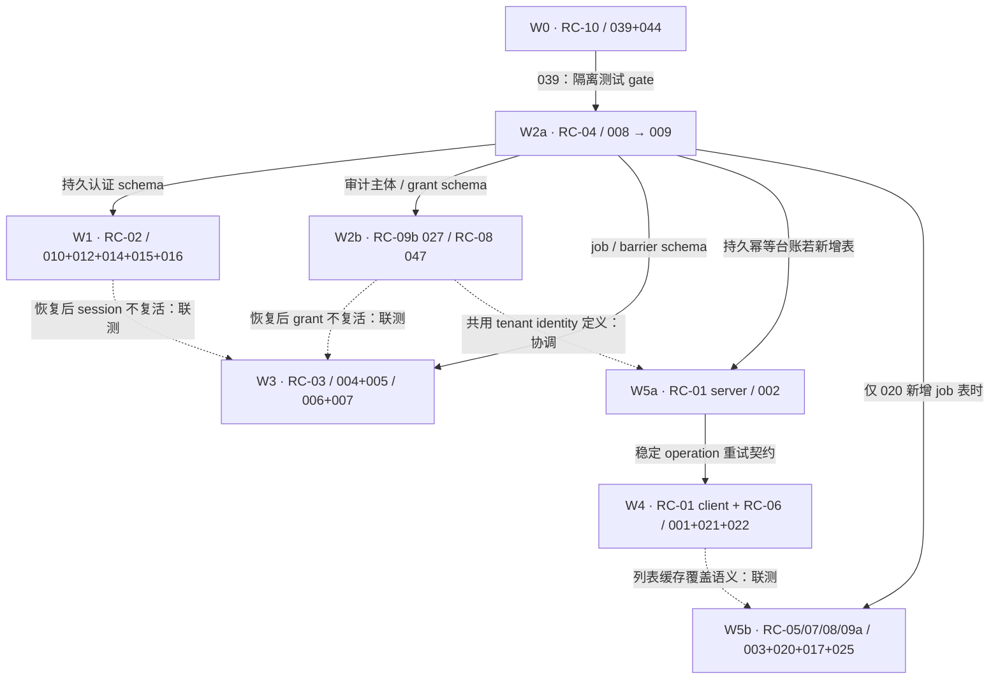

# PHASE 2 — FINAL REMEDIATION WAVES

日期：2026-09-24。固定基线：`f08e72e3e74d188b4555e0bee16280b3dd0d622b`。

这是对 [REMEDIATION_DEPENDENCY_GRAPH](REMEDIATION_DEPENDENCY_GRAPH.md) 的最终裁决，沿用 W0–W5 主题和 issue 归属，细分 W2a/W2b、W5a/W5b 以表达依赖，不从零重建规划。所有实施、测试、migration 和上线动作均是未来工作，**本轮未执行，亦未开始实现**。

依据：[最终严重度](FINAL_SEVERITY_ARBITRATION.md)、[最终架构](FINAL_ARCHITECTURE_DECISIONS.md)。本计划覆盖原 23 个 P1 的架构修复（最终 21 P1 + 2 P2），原 26 个 P2 只保留 inventory 级别，不擅自纳入本轮交付关闭标准。

## 1. 对原图的确认和修改

| 原规划 | 最终裁决 | 原因/实际边界 |
|---|---|---|
| W0：039、044 | 保留，独立交付 | 测试隔离门禁先于有破坏能力的回归；secret 拒绝无其他 issue 依赖 |
| W1 优先于 W2（建议） | **W2a schema 基础先于 W1 的 schema enforcement**；设计与兼容代码可并行 | RC-02 已选择持久化 epoch/session/family，真实存在 schema 前置，不再声称“通常无 schema” |
| 008 → 009 硬依赖 | **完整功能替代/升级兼容意义上的硬依赖成立** | migration 链及存量升级路径完成后，009 才能以检查型启动替代自愈；提前禁止破坏性 push/fail-closed 可单独止损，不算全部交付 |
| 010/012/014/015/016 同批 | **必须同一 architectural wave** | 同一权威状态、故障语义和 token 切换；可分 expand/回填/enforce 步骤，不要求一个 commit/一次部署 |
| 021/022 同批 | **必须同一协议发布及退出验收批次** | temp ID/在途编辑和 CAS/409 是一条 durable mutation 链；仅增加 409 字段不能兼容旧覆盖算法 |
| 004+005、006+007 同批 | 保留两个同批单元，同属 W3 | 前者恢复切换，后者完整产物；007 降 P2 不拆出引擎可靠性修复 |
| W3 无依赖 | 修正为台账/屏障 schema 的生产启用依赖 W2a | 可先做隔离引擎开发，但持久模型不能绕过迁移纪律 |
| W4 无依赖 | 增加 W5a 的稳定幂等重试契约为生产切换前置 | create 超时/响应丢失必须查明同一 operation，不能重复创建；非所有 W5 都前置 |
| W5 互相独立可并行 | 保留；把 002 拆为 W5a 先提供契约，其余为 W5b | 003/017 等无需等长链改造；仅新导出 job 若加表依赖 W2a |
| 027 → 044 弱关联 | 删除此边 | 审计保留与 JWT 密钥拒绝没有实际先后依赖；审计需备份策略应指向迁移前可恢复副本门禁 |
| 003↔025 “统一 helper” | 保留可并行，取消共用 helper 要求 | safe rendering 和领域结论是不同职责，仅联测输出一致性 |
| 002↔020 同文件 | 只作合并协调，无逻辑依赖 | 幂等写路径与导出读取契约独立 |
| 旧 token 双读、旧 client 忽略响应字段 | 收紧兼容定义 | 双读是准备阶段；缺少可验证新语义的 token 最终重登，旧写算法必须受协议门禁阻断 |

同批表示共同不变量和关闭 gate，不禁止安全、独立、可逆的止损先交付。任何止损都不能借此把整个 RC 标记修复完成。

## 2. Wave order 与依赖图

推荐推进：**W0 → W2a → W1 / W2b / W3（分支并行）**。W5a、W5b 可在依赖满足后提前穿插；**W5a 契约就绪 → W4**。编号保留历史含义，不代表严格数值串行。

箭头标签限定依赖的部分；实线为对应能力上线前置，虚线为集成契约/联测，不要求整波先完成。039 的隔离测试 gate 适用于所有波次，并非仅 W2a，图中省略重复边。不能把 044 误解为所有设计工作的前置。同理 W2a 不阻塞无 schema 的 003/017/025 或 002 的临时授权收紧。

## 3. 分波次交付标准

### W0 — 环境与配置入口保护

- **Issues / root causes：**AUD-039、AUD-044 / RC-10，保持原分组，可分别发布。
- **Dependencies：**无 issue 硬依赖；后续数据库回归必须已有可证明隔离的执行环境。
- **Entry criteria：**列明所有已有测试启动入口和受支持服务启动方式（限定已知问题路径）；测试夹具显式连接隔离实例，门禁自身的拒绝用例不能连接业务库。
- **交付/compatibility：**测试禁止回退业务 DATABASE_URL；production startup 拒绝固定示例及弱值，deploy 非空复用也校验。强密钥合法配置不无故失效；弱值迁移通过安全生成与凭据失效完成，不保留弱值验签兼容。
- **Exit criteria：**任一破坏性测试入口在身份未确认前均拒绝；原样示例密钥所有受支持入口启动必失败，合法配置成功。文档、CI 变量、secret 校验规则一致。
- **Rollback boundary：**可调整误拒规则并重新部署，但不能恢复业务库 fallback 或允许公开密钥；配置错误宁可停止启动。已轮换密钥不得回退到旧弱值。
- **Required tests：**危险 URL/角色/schema 的无 DDL 拒绝；隔离环境正例；间接 npm test；空/示例/短弱值及正常 secret；deploy 复用分支；无日志泄密。此门禁不是重新运行全仓旧测试的许可。

### W2a — schema 演进基础（原 W2 的前半）

- **Issues / root causes：**AUD-008、AUD-009 / RC-04；008 与部署脚本诊断/failed-state runbook 同批。
- **Dependencies：**W0 的 039 或等价已证明的隔离测试环境。008 完整迁移能力 → 009 最终检查型启动。
- **Entry criteria：**受支持旧版本/结构/迁移历史状态矩阵、离线或测试副本、列/约束差异清单；未来实际升级前必须在另行授权实施阶段确定目标 `_prisma_migrations` 状态。本轮不取生产数据。迁移前恢复副本须在隔离环境验证可恢复，不能只相信原 BackupRun 的 passed。
- **交付/compatibility：**保留已应用迁移 checksum；针对空库、正常旧库、db-push 演进、failed、resolved 和停用租户分别设计 bridge/repair。不能无条件插入旧时间戳补丁或自动 resolve。public/tenant migration 均版本化；迁移执行与服务 readiness 分离；失败保留 stderr，禁止回退 db push。先 expand 再 enforcement，不预先删除旧字段。
- **Exit criteria：**全新库可回放；全部受支持历史可无数据丢失升级；停用学校与重新启用通过 drift gate；任一失败返回非零且不开放受影响能力；启动不执行 schema 写入。单独关自愈但升级仍失败，不算退出。
- **Rollback boundary：**发布新 schema 前可回退应用；additive schema 后只允许兼容旧版本应用回退，不能自动 drop 新字段/删历史。部分失败先保持维护状态，依据实际执行结果前向 repair； destructive contract migration 延至后续单独变更窗口。不能将恢复整个旧数据库作为丢弃新写入的普通回滚。
- **Required tests：**六类历史升级矩阵；空库回放；active/disabled 租户；部分失败/中断重跑/并发 migration；实际类型/默认值/约束不漂移；单校失败不汇总成功；旧应用兼容 additive schema。008 与 009 在同一候选版本按顺序验证。

### W1 — 统一身份/会话失效模型

- **Issues / root causes：**AUD-010、012、014、015、016 / RC-02，必须同一 architectural wave。
- **Dependencies：**W2a 的 migration 能力先于状态表/字段启用，W0 隔离测试门禁。设计及不接流量的新代码可与 W2a 并行。
- **Entry criteria：**school/user/session/family 身份与事务边界定义完成；password 与 epoch 可同事务更新的技术路径已证明；新旧 token 切换点、混合节点淘汰和重登提示已明确。
- **交付/compatibility：**expand schema → 回填/发布新语义代码 → 验证 → 摘除旧认证节点 → enforcement；缺 sid/epoch 的旧 token 不默认赋最新版本，旧 refresh 不无条件升级。准备期双读不算已修复；最终强制重登是有意安全切换。DB 不可查时 fail-closed，客户端可以保留未上传本地变更。
- **Exit criteria：**停校/退出/远程撤销/改密/DB 失败/同秒次序/refresh family 使用同一规则；撤销提交后的新请求不再通过；所有在线服务实例已 enforce，旧 token 不绕过；密码变更失败不会留下“已改密未撤销”的成功结果。
- **Rollback boundary：**enforcement 前可回退兼容准备代码；之后不得回退到只验签、不查版本的旧服务。故障回退只能使用已具备新认证语义的版本，或停止受保护功能；保留 epoch/撤销台账，不递减版本，不复活旧 family。新字段保留待后续 contract。
- **Required tests：**固定时钟、并发签发/改密/退出、两实例、首个 DB 故障请求、停校后重启与启用、family 并发/重放、密码及 epoch 写入故障注入、旧 token/旧节点负例、恢复历史库后凭据失效联测。

### W2b — 审计保留与学校授权生命周期（原 W2 的后半）

- **Issues / root causes：**AUD-027 / RC-09b、AUD-047 / RC-08。两项同列于 W2b 是 schema 治理归组，**彼此不构成硬依赖，可分开发布**。
- **Dependencies：**W2a；tenant identity 契约与 RC-01 协调。027 迁移前须有已验证恢复副本，不依赖 044。
- **Entry criteria：**027 已采纳不可变 principal + snapshot、常规 soft delete；grant 删除/恢复策略已明确为默认不自动复活；回填映射、歧义隔离规则和有界暂停窗口已设计。
- **交付/compatibility：**027 先禁止破坏性删除，再 expand/backfill/双写/验证/切换 FK，防回填时继续丢历史。历史身份无法还原部分标注 provenance，不虚构快照。047 添加不可复用学校关联/世代，存量 grant 仅按可证明身份迁移；孤儿不得绑定同 code 新主体。API 兼容旧查询参数，返回明确授权失败；第三方影响清单随发布交付。
- **Exit criteria：**删除仅有 AuditLog 的账号不减历史行数，快照可查；重名新账号不继承历史身份；删校/同 code 重建/恢复均不使旧 grant 自动有效；新旧读取接口一致，所有目标租户完成迁移并 enforce。
- **Rollback boundary：**不可回装 CASCADE 或按 code 自动授权逻辑。回退读取可使用适配层，保留新增 principal/snapshot/grant generation。映射不明保持隔离，不能为恢复可用性猜测授权。回填撤销须保留原数据和迁移记录，禁止删已生成的权威历史。
- **Required tests：**有历史无 TestRecord 用户删除；actor/target/SystemLog 三类记录独立验证；soft/hard delete、改名、回填中断；学校三种生命周期与对接方 key 矩阵；迁移前后 row count/身份可检索性及授权隔离。

### W3 — 备份/恢复状态机

- **Issues / root causes：**AUD-004+005、AUD-006+007 / RC-03；两对在同一引擎下共用任务/owner 契约。
- **Dependencies：**W2a 的持久 job/barrier schema；W0 测试隔离。与 W1/W2b 的恢复后身份和授权世代是联测 gate；不是必须等待其所有 UI 完工。
- **Entry criteria：**任务 owner/锁/fencing、保留命名空间、全写通道屏障与排空清单、产物格式、旧包验证策略、恢复密钥/引导方案确定；明确受支持恢复版本。测试源数据全部来自隔离夹具。
- **交付/compatibility：**先任务与产物版本支持，后新建备份切换，再恢复引擎切换；保留旧包只读验证，不自动重写其元数据。新恢复独占锁覆盖多实例/CLI，屏障安装并排空后才 staging，校验后原子切换并重连 tenant clients。all-scope 按稳定锁顺序覆盖 public 和目标学校。新任务依赖完整 package 发布标志，不依赖文件名/单个 aes 出现。
- **Exit criteria：**同秒竞争互不覆盖/误删；持续写入时成功备份在隔离恢复中内容/计数一致；失败只清理本 job；恢复期间没有已确认新写入丢失；所有实例旧池退出；崩溃续跑可判定；恢复旧数据不会回退 session/grant 世代。两个单元都通过才关闭整 RC。
- **Rollback boundary：**新格式 writer 可停用但保留 reader；不能将新包交给不识别版本的旧恢复器。cutover 前可删本 job staging；cutover 后且屏障未解除可验证切回旧 schema；开放写入后只能走有数据协调的恢复事件，禁止直接 rename 丢弃新写。未知任务归属一律保留待处理，不盲删。
- **Required tests：**合法租户撞名、两恢复进程、锁丢失/进程崩溃、在途写事务、后台/CLI 写阻断、定时+手动同秒、失败清理竞争、磁盘满、半发布、密钥不可用、pool reconnect、持续写入备份回放、旧包/新包、恢复后身份/授权联测。

### W5a — 服务端作用域与幂等契约（原 W5 的 002）

- **Issues / root causes：**AUD-002 / RC-01 server；001 保留在 W4。
- **Dependencies：**scope/tenant identity 定义就绪；若新增持久幂等表，生产启用依赖 W2a。认证/授权先于 cache 的止损可提前交付，不冒充最终持久幂等实现。
- **Entry criteria：**稳定 operationId、同键异 body 行为、并发占位和业务提交原子性、响应丢失恢复、授权撤回后命中行为均有契约；不得只写“换 Redis”。
- **交付/compatibility：**新 namespace 不读旧全局 Map；原 HTTP 响应形状可保持，同键异 body 明确冲突。重试身份/结果保留期覆盖受支持离线期限；到期后未知 operation 不盲目重复创建。明确旧请求去重过渡边界与重试指引。
- **Exit criteria：**当前认证授权必经；跨校/跨主体不能命中，降权后不能回放越权响应；多实例同操作至多一次业务提交，丢响应可查明/重试原结果。该契约作为 W4 create 状态机入口 gate。
- **Rollback boundary：**不能重新启用无 scope cache；不能清掉已提交操作记录后允许相同操作再次执行。故障时禁用相关写功能或用已验证安全版本，保留 operation ledger。
- **Required tests：**相同 key/body 跨主体矩阵；同主体异 payload；降权/停校后命中；并发双实例；提交前/提交后崩溃；事务回滚与 response lost；旧 key 和过期 operation 的明确处理。

### W4 — 客户端隔离与离线 mutation 语义

- **Issues / root causes：**AUD-001 / RC-01 client，AUD-021+022 / RC-06，沿用原同文件面协作关系。021/022 必须同批协议切换；001 的隔离止损可先行。
- **Dependencies：**W5a 的幂等/create 重试契约、服务端 CAS/v2 写协议和旧客户端 gate 先就绪；有支持新 token 的认证适配即可，不硬等 W1 全部完成。
- **Entry criteria：**九态及终态、原子 temp/server 映射、base/local/latest 数据结构、create 在途编辑/删除、队列版本和归属迁移计划确定；旧无归属未提交任务有隔离保留方案。
- **交付/compatibility：**服务端 v2 协议先部署但不放开旧覆盖路径；客户端迁移分区与 durable queue，分阶段切流；最终服务端拒绝旧 unsafe mutation 请求并提示升级。新增 409 字段并不能保证旧客户端安全，不能仅凭“向后兼容”跳过 gate。只读旧客户端可保留。浏览器账号切换不得把旧任务展示/上传给当前主体。
- **Exit criteria：**LOCAL_NEW、CREATE_PENDING、CREATE_IN_FLIGHT、SERVER_CREATED、UPDATE_PENDING、DELETE_PENDING、CONFLICT、SYNCED、FAILED 均有持久转换；create 编辑不丢失，delete 不出幽灵行；409 不自动换版本覆盖；用户未同步修改有可见状态且不因刷新/切号静默丢失。
- **Rollback boundary：**本地结构迁移前保留受控可恢复副本；迁移后只回退兼容读取/新协议客户端，或冻结上传。不能让旧 JS 重读新队列，不能把未知归属任务重新塞进全局旧键，也不能恢复旧 409 自动重试。
- **Required tests：**断网建改删；所有在途窗口及映射前后崩溃；双标签页/双主体；POST 已提交未收到响应；不同字段自动合并与同字段显式冲突；删除对修改；连续 409；旧写客户端强制失败；长离线期/operation 过期；迁移失败重试不丢队列。

### W5b — 读取、输出和模块授权（原 W5 其余项）

| Issues / RC | Entry criteria / dependencies | Exit criteria / required tests | Rollback boundary / compatibility |
|---|---|---|---|
| AUD-003 / RC-05 | 安全渲染 API 和已确认列表/详情/预览 sink 清单；无 schema 前置 | 文本/HTML/attribute/URL/rich text 上下文用例通过，合法显示/事件/打印不回归 | 保留安全文本降级；不能回退到原不可信 innerHTML。无历史内容破坏性清理 |
| AUD-017 / RC-08 | 默认平台权限矩阵与全部报告/evidence 端点范围；无 W2b 前置 | 普通身份/guest 全端点负例、平台正例、批量资源检查；不能只测 UI 隐藏 | 故障可关闭模块；不能恢复任意登录读写。学校协作扩展另有显式 grant 后才能开放 |
| AUD-020 / RC-07 | 专用 job/快照/manifest、资源限额和完整性规则；新增 job 表时依赖 W2a | 2501/10000+ 全量，跨页并发、部分失败/取消、count/ID 完整；旧导出明确适配或拒绝；列表标示部分缓存 | 可暂停导出，不回退静默 limit；已发布完整包保持可验证，旧客户端不得收到假完整响应 |
| AUD-025 / RC-09a | 颜色/result precedence、unknown 和统计分母规则、出口契约；无 schema 必要依赖 | 合法/未知/空/冲突输入跨内部、guest、OpenAPI、前端和导出一致；原始数据不变 | 可显示 unknown/暂停相关统计，不能退回未知即合格；历史报告更正带版本 |

W5b 各项可单独发布，003、017 应优先穿插，无需为了编号等到 W4 后。020 与 W4 的缓存覆盖/列表分页变化需合并集成测试；025 与 020 的结论版本和统计分母需统一契约，不要求合为一个 RC。

## 4. 横向 schema / API compatibility 门禁

| 变更 | 准备阶段 | 最终 enforcement | 禁止的“兼容” |
|---|---|---|---|
| schema | expand、明确回填 provenance、旧应用兼容检查 | 数据/约束一致后才切新读取，contract 延后 | 启动 self-heal、改 applied checksum、自动 resolve 未知失败 |
| access/refresh | 发布识别新模型的节点并验证，安排重登切换 | 所有受保护入口校验 sid/epoch/family；旧节点退出 | 给旧 token 默认最新版本、无限旧 refresh 换新 |
| offline mutation | 服务端安全 v2 契约、分区队列原子迁移 | 旧 unsafe 写入口明确拒绝，新 CAS/冲突流程生效 | 认为旧客户端忽略新 409 字段后自然安全 |
| backup format | reader/version/manifest 就绪，旧包验证分类 | 完整校验后原子发布，恢复用 owner/lock/barrier | 新包交旧恢复器、改 meta 绕过校验 |
| audit | 删除止损→新 principal/snapshot 回填双写 | FK 去 cascade、所有目标行可检索 | 空 snapshot 冒充历史事实、只留删除事件 |
| grants / tenant identity | 唯一 schoolId/generation 映射，歧义隔离 | 删除/恢复不复活旧授权；显式重授 | 按学校 code 复用授权、为兼容直接全放开 |
| reads/exports | job API/分页覆盖元数据，消费者适配 | 成功=完整且可验证；部分结果标注/拒绝 | 增大 limit 后继续宣称完整 |

Schema/API 回滚能力必须在每个 wave entry 时列出具体安全版本。安全 enforcement 后的 rollback 不是回装存在已知越权/丢数据语义的基线；优先前向修复或短时禁用受影响能力。

## 5. 必须同批、可并行与关闭 gate

**必须同批：**RC-02 五项；RC-06 的 021/022；RC-03 恢复对 004/005 和备份对 006/007；008 与其部署诊断/failed-state 处理。008→009 是能力前置，不强制拆成两次发布。027/047、039/044、003/025 不是必须同批。

**可并行：**W1/W2b/W3 在 W2a 合格后分别开发和验收；W3 与 W4 独立执行隔离回归；W5b 各项可提前穿插；W5a 与 W4 协议设计可并行，但客户端最终上传切换必须等待服务端契约通过。共享文件冲突只需指定合并顺序，不伪装逻辑依赖。

**共同 test gate：**先证明隔离环境，再做与变更有关的真实回归；沿用 A/B/C 探针作为依据但不能把源码断言/语义替身替代必要的数据库并发、事务、崩溃恢复测试。所有新增 schema 要通过空库与旧库矩阵。出现新变更/失败才扩大测试范围，不重启全仓审计。

**关闭证据：**issue 的修复 diff、适用 contract/migration 版本、成功与负例结果、兼容切换记录和回滚演练结果对应到 issue ID。必须区分“设计通过”“已实现”“已在隔离环境验证”“已部署”；本轮只达到设计裁决，不将任何 issue 标为已修复。原审计曾验证 23/23 有效，不能当作未来修复测试已通过。

## 6. 覆盖对账与停止条件

| Wave | Issue 数 | Issue IDs |
|---|---:|---|
| W0 | 2 | 039, 044 |
| W2a | 2 | 008, 009 |
| W1 | 5 | 010, 012, 014, 015, 016 |
| W2b | 2 | 027, 047 |
| W3 | 4 | 004, 005, 006, 007 |
| W5a | 1 | 002 |
| W4 | 3 | 001, 021, 022 |
| W5b | 4 | 003, 017, 020, 025 |
| **合计（无重复）** | **23** | **最终 21 P1 + 2 P2** |

候选及原 26 个 P2 没有被静默升格为本计划交付事项。相关边界联测不表示承诺关闭范围外 issue。本轮完成三份 FINAL 文件并核对完整性后停止，不开始实现、数据库变更或生产操作。
