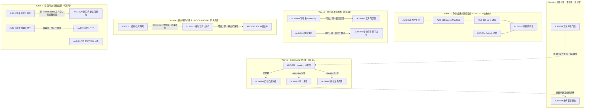

# REMEDIATION DEPENDENCY GRAPH — 修复依赖与波次规划（规划性文档，不含实施）

- **基线**：`f08e72e3e74d188b4555e0bee16280b3dd0d622b`
- **范围**：23 个 P1（Phase 2 全部 CONFIRMED）
- **性质**：仅规划依赖与顺序，不修改代码、不代表已批准的修复方案；severity 分歧（PENDING/P1_REVIEW）不影响本文件的顺序判断

## 1. Mermaid 依赖图

**图例**：实线箭头 = 顺序/前置依赖；`---` = 必须同批（同一模型/路径）；虚线 = 同文件面或弱耦合（建议同波次以避免合并冲突，非逻辑依赖）。

## 2. Recommended remediation waves

| Wave | 主题 | Issues | 进入条件 | 退出判据（验收要点） |
|---|---|---|---|---|
| **W0** | 低成本前置防护 | AUD-044, AUD-039 | 无 | 原样示例密钥启动必失败；测试在业务样式 URL 上于任何 DDL 前拒绝 |
| **W1** | 身份/会话失效模型统一重构 | AUD-010, 012, 014, 015, 016 | 完成 W0 中的 039（避免测试误连生产干扰改造验证） | 停校/登出/改密/降权/删除的失效矩阵全通过；固定时钟同秒用例；DB 故障窗口状态可解释且不再沿用旧权限 |
| **W2** | Schema 演进纪律 | AUD-008 → AUD-009；随后 AUD-027、AUD-047（若需 schema 变更） | W1 不阻塞；但 W2 内部严格排序 | 空库 migrate deploy 全通过 + 已有库升级通过 + 租户结构一致性；启动自愈仅检查告警；db:sync 退出码语义正确 |
| **W3** | 备份/恢复状态机 | AUD-004+005（恢复引擎）；AUD-006+007（备份产物） | 无（可与 W4 并行） | 并发恢复唯一执行权 + 失败清理不触碰他人；并发备份产物互不覆盖/误删；计数与 dump 一致 |
| **W4** | 客户端同步语义 | AUD-001 + AUD-021 + AUD-022 | 无（可与 W3 并行） | 跨主体缓存不可读且旧任务不跨校上传；状态机时序矩阵全通过；409 不得自动全量重放 |
| **W5** | 读取/输出/授权边界 | AUD-002, AUD-003, AUD-017, AUD-020, AUD-025 | 无（各项互相独立，可并行） | 幂等命中不跨主体；截断可证（分页/流式/拒绝三选一）；列表/详情/导出的注入回归；报告模块权限收敛；四出口结论一致 |

**为什么 W2 在 W1 之后而非更早**：W1 的重构可能触及 `UserManager` 的吊销路径与认证中间件，而 W2 的 migration 修复需要验证覆盖这些代码路径；先完成 W1 可避免"migration 修复验证"与"会话模型改造"同时进行导致回归归因困难。（此为顺序建议，非硬依赖；若资源允许，W2 的空库回放修复可先行。）

## 3. 必须同批的 issue

| 组合 | 原因 | 拆分的后果 |
|---|---|---|
| **AUD-004 + AUD-005** | 同一恢复引擎：随机暂存名（004）与互斥/写屏障（005）共享"任务归属 + 独占命名空间"设计 | 只做 004：并发恢复仍互删；只做 005：DROP 仍可能命中他人 schema |
| **AUD-006 + AUD-007** | 同一备份产物链：共享快照计数与文件名/发布语义共同决定"备份是否可信" | 只做 006：产物仍可能被并发覆盖/误删；只做 007：计数与内容仍可能不一致 |
| **AUD-021 + AUD-022** | 同一 `Storage`/`AdaptiveUploadQueue` 路径 + 同一 temp ID 映射 | 只做 021：409 仍覆盖他人；只做 022：create 出队后的编辑仍丢失 |
| **AUD-010 + AUD-012 + AUD-014 + AUD-015 + AUD-016** | 同一 session/token invalidation 模型（RC-02）；五项共享认证中间件与吊销表语义 | 逐项修补会反复改同一批文件并互相推翻假设（例如 016 的原子化改变 014 的失败路径；015 的 epoch 方案取代 iat+1） |
| **AUD-008 → AUD-009**（顺序，非同批） | 008 建立演进纪律，009 才能安全降级为检查型 | 先做 009 会让租户 P2022 漂移回归（该自愈的存在理由） |
| **AUD-008 与 deploy.sh 修复**（同批交付） | migration 补丁、stderr 保留、failed 记录处理共同构成"可部署性修复" | 分开交付会出现"补丁已加但部署仍因 failed 记录阻断"的中间态 |

## 4. 可并行实施的组合

| 并行组 | 说明 |
|---|---|
| W3（备份恢复） ↔ W4（客户端同步） | 无共享文件/契约；两条链的验证互不干扰 |
| W5 内部各项（002 / 003 / 017 / 020 / 025） | 除 002↔020（同文件面，建议同波次）外互不依赖 |
| W0 的两项 | 044（服务启动）与 039（测试门禁）互不影响 |
| W1 ↔ W2 | 若资源充足可并行，但需注意 W1 会改 `UserManager`/认证中间件，与 W2 的验证覆盖面重叠（见上节说明，建议 W1 先行或错开一次发布） |
| AUD-003 ↔ AUD-025 | 弱耦合（出口一致性），可并行但其"统一 helper"应只做一次，避免双份实现（NF-C-02） |

## 5. 修改 schema / API contract 的 issue

| Issue | 变更类型 | 具体内容 |
|---|---|---|
| AUD-008 | **Schema/migration** | 在 baseline 与 unify 之间插入补丁 migration（`ADD COLUMN IF NOT EXISTS`）；不改 baseline 文件 |
| AUD-009 | 无 schema；**部署契约** | 移除 `--accept-data-loss`、自愈降级、db:sync 退出码语义 |
| AUD-027 | **Schema** | 去 CASCADE / 软删除 / 审计主体快照字段（需保留存量审计） |
| AUD-047 | **Schema（条件性）** | 若引入学校世代/不可复用 ID；否则仅逻辑校验（无 schema） |
| AUD-012 / AUD-015 / AUD-016 | **Token payload/认证契约** | 若采用 session/epoch 方案，token 需携带新声明（旧 token 兼容窗口） |
| AUD-022 | **API contract（响应扩展）** | 409 响应体可能新增 latest/字段基线信息（需向后兼容：旧客户端忽略即安全失败） |
| AUD-020 | **API contract（读取）** | 分页参数消费、导出契约（流式/上限语义）明确化 |
| AUD-001 | **客户端存储契约** | 本地缓存/队列键与结构变更（需迁移或丢弃旧缓存） |
| AUD-002 | 无 API 变更 | 幂等键与中间件顺序（服务端内部语义） |
| AUD-003 | 无数据契约 | 渲染层改造（可能影响导出预览/打印样式） |
| AUD-017 | **授权契约** | 报告模块的角色/参与者模型（若保留协作需新增显式授权） |
| AUD-025 | 无 schema；**输出口径** | 判定函数统一（历史统计口径变化需业务确认） |
| AUD-006 / AUD-007 | 无 schema | 备份产物命名/发布/快照（文件系统与进程语义） |

## 6. 修改 deployment 的 issue

| Issue | 部署影响 |
|---|---|
| AUD-008 / AUD-009 | `deploy.sh`（stderr 保留、failed 记录处理、首部署回退语义）、`AUTO_SYNC_TENANTS` 默认值、`npm run db:sync` 退出码、部署门禁 |
| AUD-039 | 测试环境变量规范（显式隔离 URL）、CI 前置校验 |
| AUD-044 | `.env.example` 文案与弱密钥列表；`deploy.sh` 已自动生成（保持） |
| AUD-005 | 恢复期写屏障需 **Caddy + `READONLY_MODE` 联动**（人工流程代码化）；维护窗口流程 |
| AUD-006 / AUD-007 | 备份目录/磁盘水位、定时任务与手动触发的并发策略、`RESTORE_DROP_OLD` 语义 |
| AUD-014 | `AUTH_DB_RECHECK_FAIL_THRESHOLD` 从默认值变为显式运维策略（若无共享缓存则需评估 503 雪崩风险） |
| AUD-003 | 可选：页面级 CSP（需先移除内联事件处理器，属较大改造，不建议与本项绑定） |

## 7. 需要 backward compatibility 的 issue

| Issue | 兼容对象 | 兼容要求 |
|---|---|---|
| AUD-001 | 既有用户浏览器缓存 | 键变更后旧缓存要么迁移要么明确丢弃（用户会看到一次本地历史变化），不得静默读旧键造成跨主体残留 |
| AUD-012 / AUD-015 / AUD-016 | 已签发 access/refresh token | 引入 session/epoch 需两阶段：先兼容旧 token 验证，再强制；避免全量强制重登造成业务中断（除非安全优先且已通知） |
| AUD-022 | 旧版本客户端 | 409 响应体扩展不得让旧客户端误解为可重试成功；旧客户端在服务端收紧后应明确失败而非静默覆盖 |
| AUD-027 | 存量 AuditLog | schema 迁移不得删除历史；保留策略需覆盖历史行 |
| AUD-047 | 存量 OpenApiGrant + 第三方对接 | 若引入学校世代，需迁移方案与逐对接方影响清单（业务决策），不得静默失效或静默继承 |
| AUD-020 | 前端各消费方（列表/看板/导出） | 分页契约变更需同时更新所有消费方；报告"完整性"声明口径需业务确认 |
| AUD-003 | UI 交互与打印/导出预览 | 转义改造需回归导出与打印样式（富文本字段若存在需白名单方案） |
| AUD-025 | 已发布的统计/报告 | 口径变更需对外说明；历史数据重算结果与旧报告可能不一致 |
| AUD-008 | 已 resolve 的生产库 | 补丁 migration 必须幂等（`IF NOT EXISTS`），不得因历史状态差异而失败 |
| AUD-002 | 无（此前无跨主体命中依赖的合法场景） | 幂等键变更仅影响攻击/误用路径；需确认无业务依赖旧键语义 |

## 8. 两项专项判断（用户指定分析）

### 8.1 AUD-020 与 AUD-002 是否存在接口依赖？

**结论：无逻辑依赖，存在同文件面的并发修改冲突面。**

- **AUD-002** 的修复面是**写路径的中间件顺序与幂等键**（`recordRoutes.js:20-21` 的 `router.use` 位置；`idempotencyMiddleware.js:40` 的键）——它改变"缓存命中在授权之前/之后"。
- **AUD-020** 的修复面是**读路径的分页契约**（`recordRoutes.js:243-278` 的 GET handler 与 `Storage.js:255` 的拉取策略；`ExportService.js:353` 的导出取数）。
- 两者都落在 `recordRoutes.js` 同一文件但**不同函数**，无共享变量或调用顺序依赖；可分别设计。**建议同波次（W5）交付**，理由仅是减少合并冲突与一次回归验证成本，避免两轮触碰同一文件造成测试矩阵重复搭建。
- 唯一需要注意的交叉点：若 AUD-002 选择"把幂等中间件移到认证/授权之后"，`router.use` 的调整会改变该文件顶部的中间件布局，AUD-020 的分页改造若同时改动路由定义顺序，需在评审中明确合并顺序。

### 8.2 AUD-010/012/014/015/016 是否应该一次重构 session/token invalidation model？

**结论：应该一次重构，不建议逐项修复。**

理由（逐项列举其耦合）：

1. **共享同一批代码与存储**：五项的修复点集中在 `authMiddleware.js`（认证回查/fail-soft/吊销比较）、`UserManager.js`（吊销写入路径）、`schoolRoutes.js`（停校）、`userRoutes.js`（logout/refresh）与 `public.revoked_tokens` 语义。逐项修会反复修改同一批文件。
2. **方案互相取代**：若采用 session/token epoch（AUD-012 的推荐方向），AUD-015 的 `iat+1` 比较与 AUD-016 的"吊销写入原子性"会被新的失效模型整体替代；先单独修 015/016 会产生"将被废弃的实现再维护一轮"的浪费。
3. **失败语义必须一起决定**：AUD-014 的 fail-soft 阈值与 AUD-016 的"吊销失败仍返回成功"共同决定"故障窗口内的有效权限"。分开修会出现"018 已原子但 014 仍放行"或"014 已收紧但 016 仍吞错"的不一致状态。
4. **AUD-010 的停校批量失效**需要与 AUD-012 的会话模型共同设计（学校级 epoch），否则会引入一次性批量吊销的高成本路径。
5. **验收矩阵重叠**：停校/登出/改密/降权/删除 × DB 故障，这一矩阵必须在同一模型下一次性验证（Batch A 已提供 `200/200/503`、logout、同秒边界等基础证据可复用）。

**建议的重构边界**：统一"授权态收敛"入口 —— 用户级与学校级 epoch；认证单点校验；吊销写入与业务变更同事务；fail-soft 仅允许"可证明只读"或明确时限；配套兼容窗口与灰度方案。此项与 RC-02 完全对应，是 23 项中收益面最大的单次重构。

## 9. 与 Severity Pending 的关系

本文件的顺序建议**不依赖** severity 裁决：无论 AUD-006/007/015/017/025/044 最终定为 P1 或 P2，其技术修复位置与依赖关系不变；AUD-027（P1_REVIEW）的**实施时点**可能受保留策略决策影响（若选择软删除，需要 schema 变更 → 归入 W2 之后）。因此 **W2 中的 AUD-027 需等待 Astra 对保留策略的裁决后再进入实施**，其余波次不受 severity 分歧阻塞。
