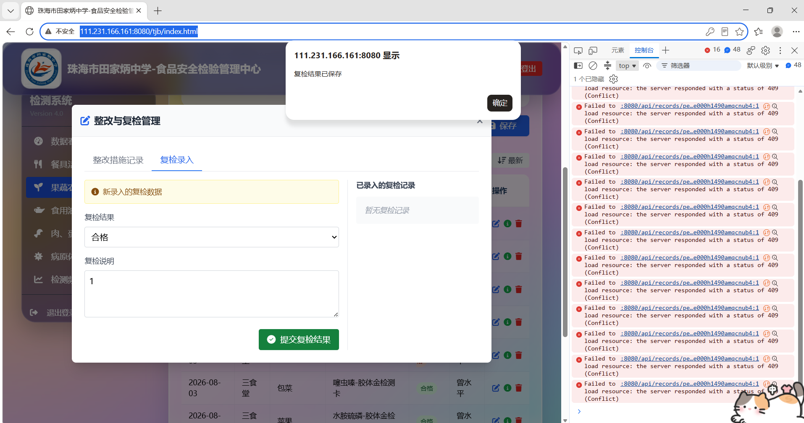
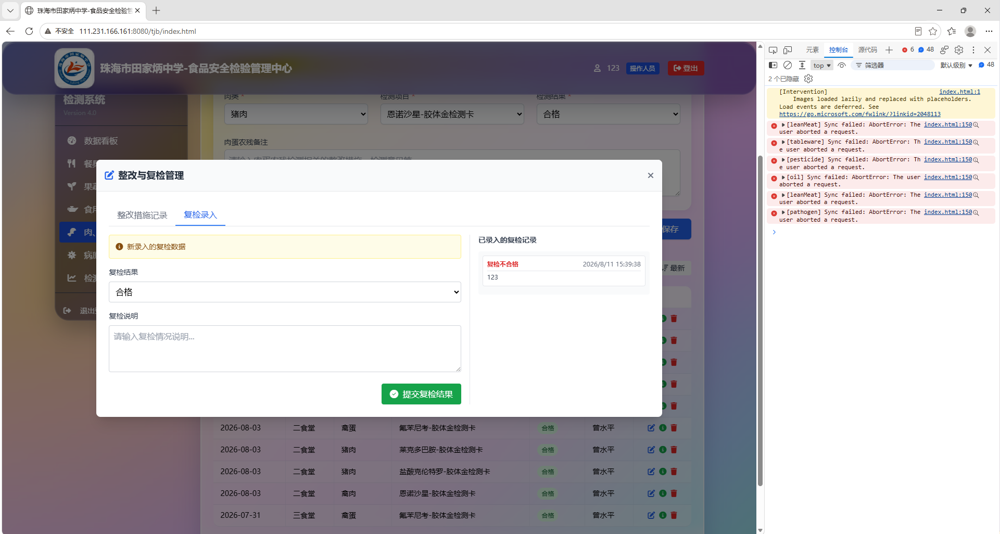
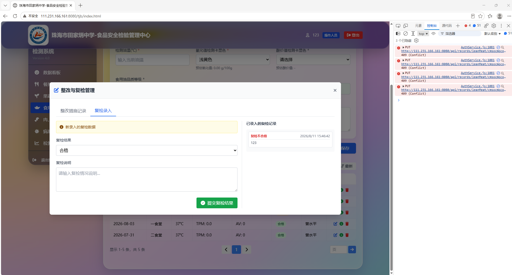
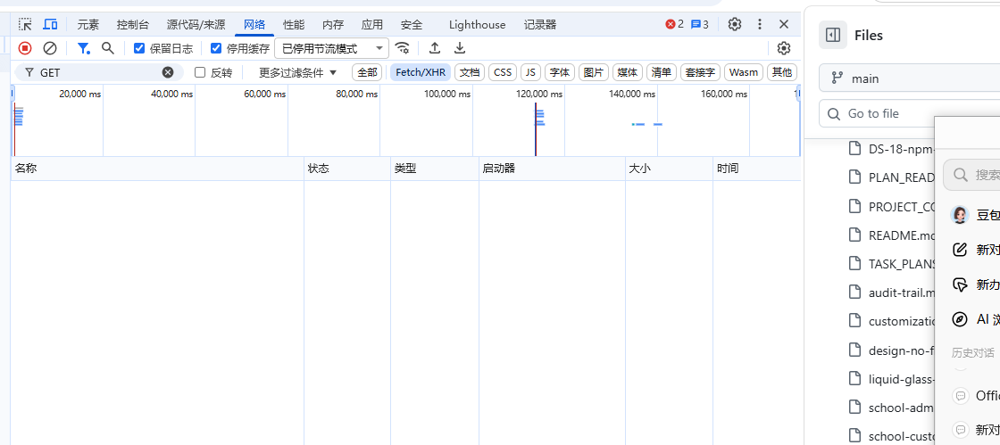
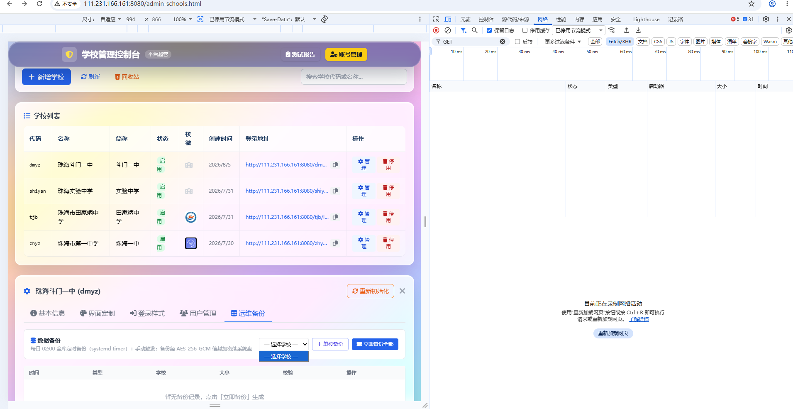

# 浏览器测试结果汇总

> 生成时间：2026-08-11 15:48（数据源：数据库 `public."TestResult"`）
> 报告目录：`docs/test-results/latest/`；证据图片：`docs/test-results/latest/evidence/`

## 一、总体统计

| 分组 | 通过 | 失败 | 跳过 | 待测 | 已测/总数 | 完成度 |
|---|---:|---:|---:|---:|---:|---:|
| 吴翠楠 · 业务功能复测（第一部分~第三部分 + 回归） | 0 | 4 | 0 | 13 | 4/17 | 24% |
| 曾水平 · 备份与恢复模块（第四部分 B1-B9） | 1 | 3 | 1 | 6 | 5/11 | 45% |
| **合计** | **1** | **7** | **1** | **19** | **9/28** | **32%** |

## 二、用例明细

### 吴翠楠 · 业务功能复测（第一部分~第三部分 + 回归）

| 用例 | 结果 | 提交人 | 最近更新 |
|---|---:|---|---|
| **Q1-果蔬阶段A** Q1 复检显示·果蔬农残（阶段A 不刷新） | ❌ 失败 | 123 | 2026-08-11 15:33 |
| **Q1-果蔬阶段B** Q1 复检显示·果蔬农残（阶段B 刷新） | ⏳ 待测 | — | — |
| **Q1-果蔬阶段C** Q1 复检显示·果蔬农残（阶段C 切菜单） | ❌ 失败 | 123 | 2026-08-11 15:36 |
| **Q1-肉蛋** Q1 复检显示·肉蛋农残（三阶段） | ❌ 失败 | 123 | 2026-08-11 15:44 |
| **Q1-油** Q1 复检显示·食品油品质（三阶段） | ❌ 失败 | 123 | 2026-08-11 15:48 |
| **V8-基本信息** V8 基本信息「保存修改」无反应排查 | ⏳ 待测 | — | — |
| **V8-界面定制** V8 界面定制「保存定制」无反应排查 | ⏳ 待测 | — | — |
| **V1-肉蛋** V1 界面定制·肉蛋新增检测项目显示 | ⏳ 待测 | — | — |
| **V1-果蔬** V1 界面定制·果蔬新增检测项目显示 | ⏳ 待测 | — | — |
| **V6-帮助跳转** V6 登录页帮助中心跳转（子路径矛盾复现） | ⏳ 待测 | — | — |
| **V7-负向** V7 超管登录·学校代码非法输入负向 | ⏳ 待测 | — | — |
| **回归V2** 回归·停用/启用用户 | ⏳ 待测 | — | — |
| **回归V3** 回归·检测频率与月报页 | ⏳ 待测 | — | — |
| **回归V4** 回归·阈值/日历设置保存 | ⏳ 待测 | — | — |
| **回归V5** 回归·每日登录提示 | ⏳ 待测 | — | — |
| **回归V6地址** 回归·帮助链接子路径地址核对 | ⏳ 待测 | — | — |
| **回归V7正向** 回归·学校登录跳转正向 | ⏳ 待测 | — | — |

**详情与证据：**

- **Q1-果蔬阶段A**（失败）
  - 实际表现：选择合格但是显示不合格
  - 证据图：
- **Q1-果蔬阶段C**（失败）
  - 实际表现：没有显示复检合格
  - 证据图：
- **Q1-肉蛋**（失败）
  - 实际表现：复检结果选择合格后自动跳去不合格
  - 证据图：
- **Q1-油**（失败）
  - 实际表现：没有错误弹窗
  - 证据图：

### 曾水平 · 备份与恢复模块（第四部分 B1-B9）

| 用例 | 结果 | 提交人 | 最近更新 |
|---|---:|---|---|
| **B1** B1 运维备份 Tab 可见性（超管可见/非超管不可见） | ⏭️ 跳过 | wuxiangjun | 2026-08-11 15:45 |
| **B2** B2 备份列表显示 | ❌ 失败 | wuxiangjun | 2026-08-11 15:39 |
| **B3** B3 立即备份全部 | ✅ 通过 | wuxiangjun | 2026-08-11 15:47 |
| **B4** B4 单校备份（独立测试学校） | ❌ 失败 | wuxiangjun | 2026-08-11 15:45 |
| **B5** B5 离线验证（表数一致） | ❌ 失败 | wuxiangjun | 2026-08-11 15:47 |
| **B6** B6 下载（密文 .aes / 明文 403） | ⏳ 待测 | — | — |
| **B7-负向** B7 影子恢复·确认词错误不执行 | ⏳ 待测 | — | — |
| **B7-正向** B7 影子恢复·正向执行 + 数据回滚核对 | ⏳ 待测 | — | — |
| **B7-旧schema** B7 旧 schema 保留与清理（SSH psql） | ⏳ 待测 | — | — |
| **B8** B8 维护模式写阻断（可选） | ⏳ 待测 | — | — |
| **B9** B9 SSH 侧检查（定时任务/文件权限/失败告警） | ⏳ 待测 | — | — |

**详情与证据：**

- **B2**（失败）
  - 证据图：
- **B3**（通过）
  - 实际表现：无备份
- **B4**（失败）
  - 证据图：
- **B5**（失败）
  - 实际表现：无备份
