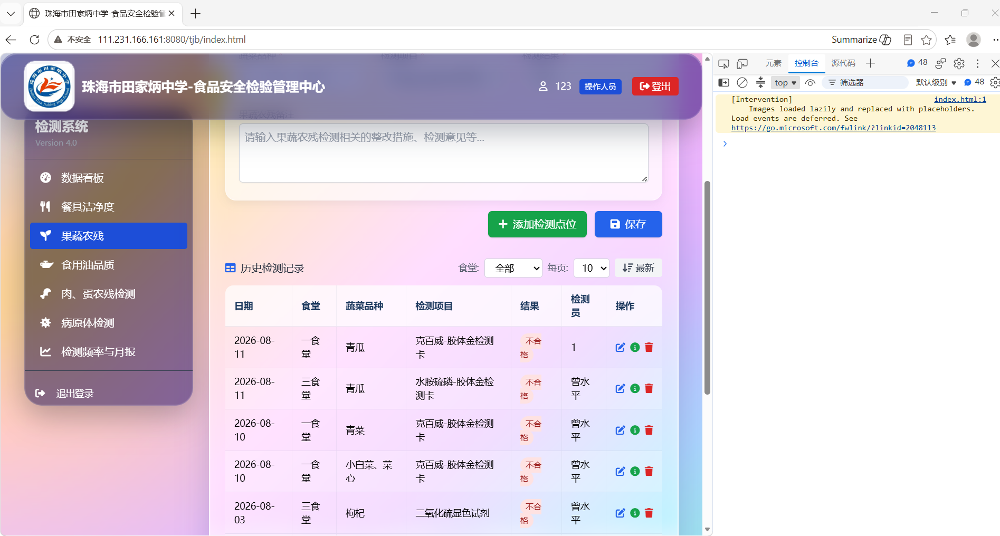
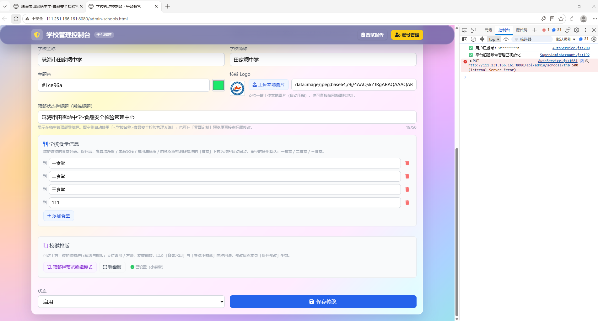
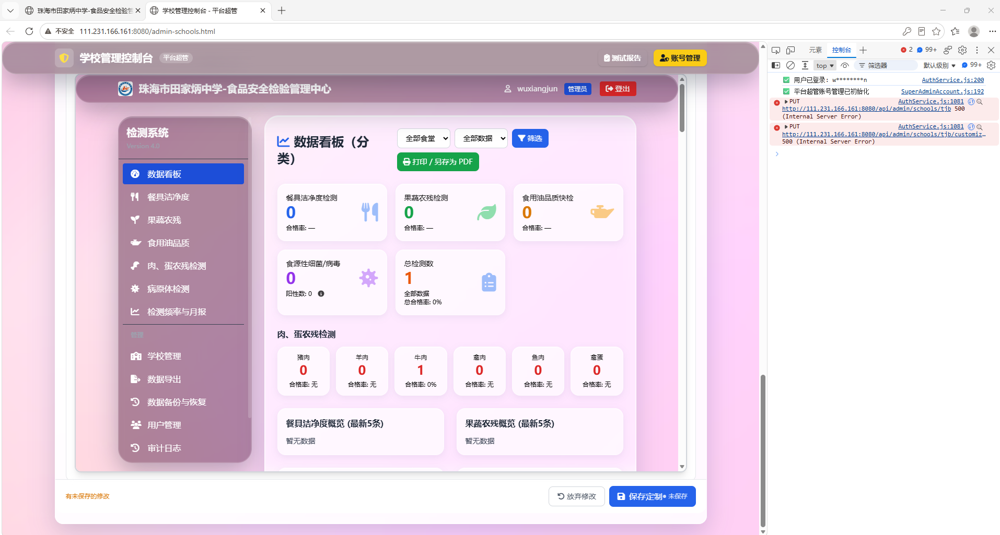
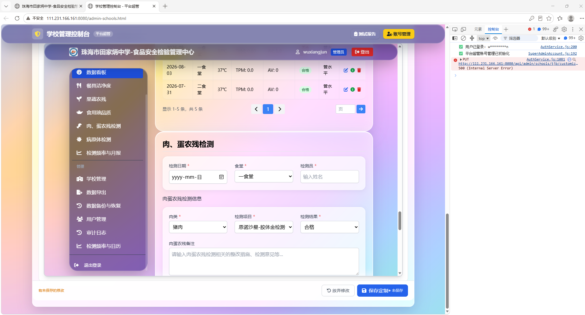
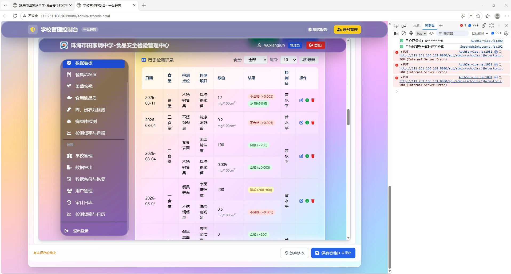
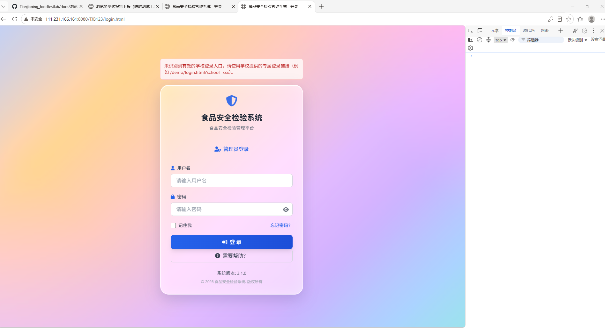
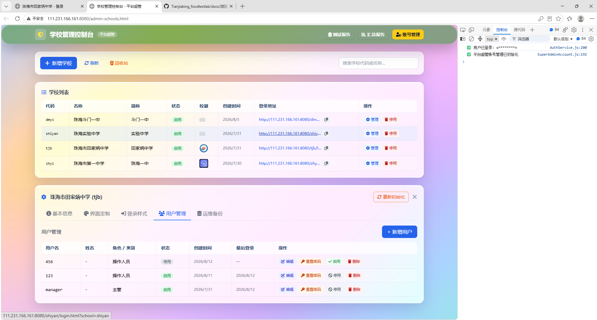
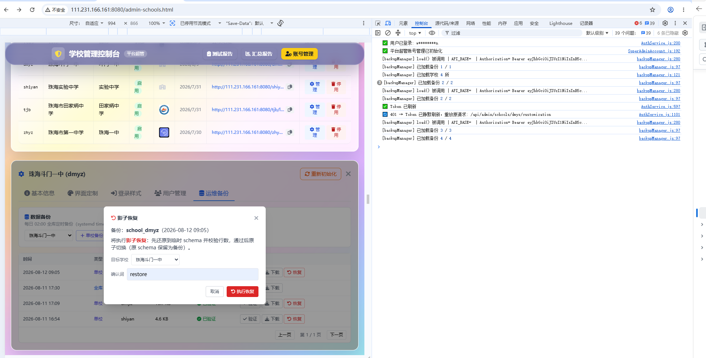
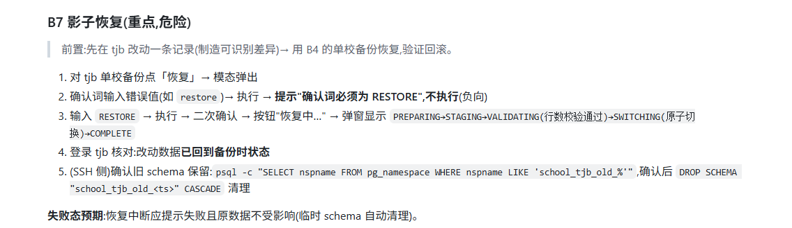

# 浏览器测试结果汇总

> 生成时间：2026-08-13 10:27（数据源：数据库 `public."TestResult"`）
> 报告目录：`docs/test-results/latest/`；证据图片：`docs/test-results/latest/evidence/`

## 一、总体统计

| 分组 | 通过 | 失败 | 跳过 | 待测 | 已测/总数 | 完成度 |
|---|---:|---:|---:|---:|---:|---:|
| 吴翠楠 · 业务功能复测（第一部分~第三部分 + 回归） | 9 | 8 | 0 | 0 | 17/17 | 100% |
| 曾水平 · 备份与恢复模块（第四部分 B1-B9） | 6 | 5 | 0 | 0 | 11/11 | 100% |
| 历史测试问题 | 0 | 0 | 0 | 28 | 0/28 | 0% |
| **合计** | **15** | **13** | **0** | **28** | **28/56** | **50%** |

## 二、用例明细

### 吴翠楠 · 业务功能复测（第一部分~第三部分 + 回归）

| 用例 | 结果 | 提交人 | 最近更新 |
|---|---:|---|---|
| **Q1-果蔬阶段A** Q1 复检显示·果蔬农残（阶段A 不刷新） | ❌ 失败 | 123 | 2026-08-11 15:33 |
| **Q1-果蔬阶段B** Q1 复检显示·果蔬农残（阶段B 刷新） | ✅ 通过 | renkang | 2026-08-12 16:17 |
| **Q1-果蔬阶段C** Q1 复检显示·果蔬农残（阶段C 切菜单） | ❌ 失败 | 123 | 2026-08-11 15:36 |
| **Q1-肉蛋** Q1 复检显示·肉蛋农残（三阶段） | ❌ 失败 | 123 | 2026-08-11 15:44 |
| **Q1-油** Q1 复检显示·食品油品质（三阶段） | ❌ 失败 | 123 | 2026-08-11 15:48 |
| **V8-基本信息** V8 基本信息「保存修改」无反应排查 | ❌ 失败 | 123 | 2026-08-11 16:03 |
| **V8-界面定制** V8 界面定制「保存定制」无反应排查 | ❌ 失败 | 123 | 2026-08-11 16:03 |
| **V1-肉蛋** V1 界面定制·肉蛋新增检测项目显示 | ❌ 失败 | 123 | 2026-08-11 16:20 |
| **V1-果蔬** V1 界面定制·果蔬新增检测项目显示 | ❌ 失败 | 123 | 2026-08-11 16:23 |
| **V6-帮助跳转** V6 登录页帮助中心跳转（子路径矛盾复现） | ✅ 通过 | wuxiangjun | 2026-08-12 17:21 |
| **V7-负向** V7 超管登录·学校代码非法输入负向 | ✅ 通过 | wuxiangjun | 2026-08-12 17:21 |
| **回归V2** 回归·停用/启用用户 | ✅ 通过 | wuxiangjun | 2026-08-12 17:21 |
| **回归V3** 回归·检测频率与月报页 | ✅ 通过 | wuxiangjun | 2026-08-12 17:21 |
| **回归V4** 回归·阈值/日历设置保存 | ✅ 通过 | wuxiangjun | 2026-08-12 17:21 |
| **回归V5** 回归·每日登录提示 | ✅ 通过 | wuxiangjun | 2026-08-12 17:21 |
| **回归V6地址** 回归·帮助链接子路径地址核对 | ✅ 通过 | wuxiangjun | 2026-08-12 17:21 |
| **回归V7正向** 回归·学校登录跳转正向 | ✅ 通过 | wuxiangjun | 2026-08-12 17:21 |

**详情与证据：**

- **Q1-果蔬阶段A**（失败）
  - 实际表现：选择合格但是显示不合格
  - 证据图：
- **Q1-果蔬阶段C**（失败）
  - 实际表现：没有显示复检合格
  - 证据图：
- **Q1-肉蛋**（失败）
  - 实际表现：复检结果选择合格后自动跳去不合格
  - 证据图：
- **Q1-油**（失败）
  - 实际表现：没有错误弹窗
  - 证据图：
- **V8-基本信息**（失败）
  - 实际表现：网页管理报错
  - 证据图：
- **V8-界面定制**（失败）
  - 实际表现：第2个报错
  - 证据图：
- **V1-肉蛋**（失败）
  - 实际表现：点击应用后弹窗报错，去到食安页面刷新项目还是没有新增
  - 证据图：
- **V1-果蔬**（失败）
  - 实际表现：点击应用后弹窗报错，去到食安页面刷新项目还是没有新增
  - 证据图：
- **V7-负向**（通过）
  - 实际表现：IP地址后面修改别的识别不出来学校
  - 证据图：
- **回归V2**（通过）
  - 实际表现：停用和启用都没有出现异常，停用登录不了账号
  - 证据图：

### 曾水平 · 备份与恢复模块（第四部分 B1-B9）

| 用例 | 结果 | 提交人 | 最近更新 |
|---|---:|---|---|
| **B1** B1 入口权限（超管可入+运维备份 Tab 可见 / 非超管整页拦截） | ✅ 通过 | wuxiangjun | 2026-08-12 17:21 |
| **B2** B2 备份列表显示 | ✅ 通过 | wuxiangjun | 2026-08-12 17:21 |
| **B3** B3 立即备份全部 | ✅ 通过 | wuxiangjun | 2026-08-12 17:21 |
| **B4** B4 单校备份（独立测试学校） | ✅ 通过 | wuxiangjun | 2026-08-12 17:21 |
| **B5** B5 离线验证（表数一致） | ✅ 通过 | wuxiangjun | 2026-08-12 17:21 |
| **B6** B6 下载（密文 .aes / 明文 403） | ✅ 通过 | wuxiangjun | 2026-08-12 17:21 |
| **B7-负向** B7 影子恢复·确认词错误不执行 | ❌ 失败 | wuxiangjun | 2026-08-12 17:21 |
| **B7-正向** B7 影子恢复·正向执行 + 数据回滚核对 | ❌ 失败 | wuxiangjun | 2026-08-12 17:21 |
| **B7-旧schema** B7 旧 schema 保留与清理（SSH psql） | ❌ 失败 | wuxiangjun | 2026-08-12 17:21 |
| **B8** B8 维护模式写阻断（可选） | ❌ 失败 | wuxiangjun | 2026-08-12 17:21 |
| **B9** B9 SSH 侧检查（定时任务/文件权限/失败告警） | ❌ 失败 | wuxiangjun | 2026-08-12 17:21 |

**详情与证据：**

- **B6**（通过）
  - 证据图：
- **B7-负向**（失败）
  - 实际表现：前面4步可以通过，目前停留至第5步还没执行。
  - 证据图：

### 历史测试问题

| 用例 | 结果 | 提交人 | 最近更新 |
|---|---:|---|---|
| **R-学校删除** R1 学校列表：无法删除已新增的学校（备注：只能停用不能删除） | ⏳ 待测 | — | — |
| **R-返回主界面** R2 主界面：返回主界面后无法用任何管理员/学校账号登录 | ⏳ 待测 | — | — |
| **R-同步取消** R3 数据同步：云端同步/暂停同步/清空本地缓存后无法点击取消 | ⏳ 待测 | — | — |
| **R-启用无效** R4 用户管理：停用后「启用」无效（停用可以但启用不行） | ⏳ 待测 | — | — |
| **R-恢复失败** R5 备份恢复：用户管理→恢复失败 | ⏳ 待测 | — | — |
| **R-下载模板** R6 病原体检测：下载模板打不开（考虑是否取消） | ⏳ 待测 | — | — |
| **R-无可删除** R7 界面定制：果蔬农残检测项目无可删除的项目 | ⏳ 待测 | — | — |
| **R-复检显示** R8 复检显示：复检填合格仍显示不合格（果蔬/肉蛋/油） | ⏳ 待测 | — | — |
| **R-新增项目** R9 界面定制：肉蛋/果蔬新增检测项目后无显示 | ⏳ 待测 | — | — |
| **R-保存无反应** R10 界面定制/基本信息：保存修改/保存定制无反应 | ⏳ 待测 | — | — |
| **R-复检存储** R11 复检数据存储：提交复检后核对 localStorage 的 result 字段是否同步为合格 | ⏳ 待测 | — | — |
| **R-默认选项** R12 界面定制：默认选项回归（新增项目后原有默认选项仍正常） | ⏳ 待测 | — | — |
| **R-帮助跳转** R13 登录页：帮助中心跳转无反应/子路径矛盾（V6 帮助中心跳转失败） | ⏳ 待测 | — | — |
| **R-登录负向** R14 学校登录：非法代码/非法输入负向拦截（V7 登录跳转负向失败） | ⏳ 待测 | — | — |
| **R-回收站恢复** R15 学校列表：回收站「恢复学校」报数据库错误（jsonb 类型不匹配，恢复失败） | ⏳ 待测 | — | — |
| **R-创建用户** R16 用户管理：创建新用户报「注册失败」（保存按钮被禁用/系统错误） | ⏳ 待测 | — | — |
| **R-审计空白** R17 审计日志：菜单选中但内容区空白无数据 | ⏳ 待测 | — | — |
| **R-定制500** R18 界面定制：打开字段管理 customization 接口返回 500（Network 记录） | ⏳ 待测 | — | — |
| **R-选项无法添加** R19 界面定制：新增检测项目时「下拉选项」无法添加（暂无选项） | ⏳ 待测 | — | — |
| **R-保存按钮文案** R20 界面定制：「保存定制·未保存」按钮文案组合混乱 | ⏳ 待测 | — | — |
| **R-主登录提示** R21 主登录页：未带 school 参数时报「未识别到有效的学校登录入口」提示不清晰 | ⏳ 待测 | — | — |
| **R-停用登录** R22 学校登录：已停用学校的登录链接报「学校不存在或未激活」 | ⏳ 待测 | — | — |
| **R-登录Logo** R23 登录页：学校 Logo 显示默认图标而非学校真实 Logo | ⏳ 待测 | — | — |
| **R-复检缺日期** R24 复检录入：弹窗无「复检日期」字段（只有结果/说明/复检人） | ⏳ 待测 | — | — |
| **R-菜单重复** R25 检测系统左侧菜单：「检测频率与月报」「检测频率与日历」重复出现 | ⏳ 待测 | — | — |
| **R-版本不一致** R26 版本号：检测系统显示 Version 4.0，登录页显示 3.1.0（版本号不一致） | ⏳ 待测 | — | — |
| **R-占位符** R27 检测项目下拉：默认显示占位符「验证设」而非「请选择」 | ⏳ 待测 | — | — |
| **R-记录不存在** R28 复检保存后：刷新列表时多个接口报 400 /「记录不存在」（复检记录未正确持久化） | ⏳ 待测 | — | — |
