# 浏览器测试结果汇总

> 生成时间：2026-08-13 14:31（数据源：数据库 `public."TestResult"`）
> 报告目录：`docs/test-results/latest/`；证据图片：`docs/test-results/latest/evidence/`

## 一、总体统计

| 分组 | 通过 | 失败 | 跳过 | 待测 | 已测/总数 | 完成度 |
|---|---:|---:|---:|---:|---:|---:|
| 吴翠楠 · 业务功能复测（第一部分~第三部分 + 回归） | 1 | 0 | 0 | 16 | 1/17 | 6% |
| 曾水平 · 备份与恢复模块（第四部分 B1-B9） | 0 | 0 | 0 | 11 | 0/11 | 0% |
| 历史测试问题 | 0 | 0 | 0 | 28 | 0/28 | 0% |
| 新问题 / 缺陷反馈 | 0 | 4 | 0 | 0 | 4/4 | 100% |
| **合计** | **1** | **4** | **0** | **55** | **5/60** | **8%** |

## 二、用例明细

### 吴翠楠 · 业务功能复测（第一部分~第三部分 + 回归）

| 用例 | 结果 | 提交人 | 最近更新 |
|---|---:|---|---|
| **Q1-果蔬阶段A** Q1 复检显示·果蔬农残（阶段A 不刷新） | ⏳ 待测 | renkang | 2026-08-13 19:44 |
| **Q1-果蔬阶段B** Q1 复检显示·果蔬农残（阶段B 刷新） | ✅ 通过 | wuxiangjun | 2026-08-13 14:31 |
| **Q1-果蔬阶段C** Q1 复检显示·果蔬农残（阶段C 切菜单） | ⏳ 待测 | renkang | 2026-08-13 19:44 |
| **Q1-肉蛋** Q1 复检显示·肉蛋农残（三阶段） | ⏳ 待测 | renkang | 2026-08-13 19:44 |
| **Q1-油** Q1 复检显示·食品油品质（三阶段） | ⏳ 待测 | renkang | 2026-08-13 19:44 |
| **V8-基本信息** V8 基本信息「保存修改」无反应排查 | ⏳ 待测 | renkang | 2026-08-13 19:44 |
| **V8-界面定制** V8 界面定制「保存定制」无反应排查 | ⏳ 待测 | renkang | 2026-08-13 19:44 |
| **V1-肉蛋** V1 界面定制·肉蛋新增检测项目显示 | ⏳ 待测 | renkang | 2026-08-13 19:44 |
| **V1-果蔬** V1 界面定制·果蔬新增检测项目显示 | ⏳ 待测 | renkang | 2026-08-13 19:44 |
| **V6-帮助跳转** V6 登录页帮助中心跳转（子路径矛盾复现） | ⏳ 待测 | renkang | 2026-08-13 19:44 |
| **V7-负向** V7 超管登录·学校代码非法输入负向 | ⏳ 待测 | renkang | 2026-08-13 19:44 |
| **回归V2** 回归·停用/启用用户 | ⏳ 待测 | renkang | 2026-08-13 19:44 |
| **回归V3** 回归·检测频率与月报页 | ⏳ 待测 | renkang | 2026-08-13 19:44 |
| **回归V4** 回归·阈值/日历设置保存 | ⏳ 待测 | renkang | 2026-08-13 19:44 |
| **回归V5** 回归·每日登录提示 | ⏳ 待测 | renkang | 2026-08-13 19:44 |
| **回归V6地址** 回归·帮助链接子路径地址核对 | ⏳ 待测 | renkang | 2026-08-13 19:44 |
| **回归V7正向** 回归·学校登录跳转正向 | ⏳ 待测 | renkang | 2026-08-13 19:44 |

### 曾水平 · 备份与恢复模块（第四部分 B1-B9）

| 用例 | 结果 | 提交人 | 最近更新 |
|---|---:|---|---|
| **B1** B1 入口权限（超管可入+运维备份 Tab 可见 / 非超管整页拦截） | ⏳ 待测 | renkang | 2026-08-13 19:44 |
| **B2** B2 备份列表显示 | ⏳ 待测 | renkang | 2026-08-13 19:44 |
| **B3** B3 立即备份全部 | ⏳ 待测 | renkang | 2026-08-13 19:44 |
| **B4** B4 单校备份（独立测试学校） | ⏳ 待测 | renkang | 2026-08-13 19:44 |
| **B5** B5 离线验证（表数一致） | ⏳ 待测 | renkang | 2026-08-13 19:44 |
| **B6** B6 下载（密文 .aes / 明文 403） | ⏳ 待测 | renkang | 2026-08-13 19:44 |
| **B7-负向** B7 影子恢复·确认词错误不执行 | ⏳ 待测 | renkang | 2026-08-13 19:44 |
| **B7-正向** B7 影子恢复·正向执行 + 数据回滚核对 | ⏳ 待测 | renkang | 2026-08-13 19:44 |
| **B7-旧schema** B7 旧 schema 保留与清理（SSH psql） | ⏳ 待测 | renkang | 2026-08-13 19:44 |
| **B8** B8 维护模式写阻断（可选） | ⏳ 待测 | renkang | 2026-08-13 19:44 |
| **B9** B9 SSH 侧检查（定时任务/文件权限/失败告警） | ⏳ 待测 | renkang | 2026-08-13 19:44 |

### 历史测试问题

| 用例 | 结果 | 提交人 | 最近更新 |
|---|---:|---|---|
| **R01** R01 学校列表：无法删除已新增的学校（备注：只能停用不能删除） | ⏳ 待测 | renkang | 2026-08-13 19:44 |
| **R02** R02 主界面：返回主界面后无法用任何管理员/学校账号登录 | ⏳ 待测 | renkang | 2026-08-13 19:44 |
| **R03** R03 数据同步：云端同步/暂停同步/清空本地缓存后无法点击取消 | ⏳ 待测 | renkang | 2026-08-13 19:44 |
| **R04** R04 用户管理：停用后「启用」无效（停用可以但启用不行） | ⏳ 待测 | renkang | 2026-08-13 19:44 |
| **R05** R05 备份恢复：用户管理→恢复失败 | ⏳ 待测 | renkang | 2026-08-13 19:44 |
| **R06** R06 病原体检测：下载模板打不开（考虑是否取消） | ⏳ 待测 | renkang | 2026-08-13 19:44 |
| **R07** R07 界面定制：果蔬农残检测项目无可删除的项目 | ⏳ 待测 | renkang | 2026-08-13 19:44 |
| **R08** R08 复检显示：复检填合格仍显示不合格（果蔬/肉蛋/油） | ⏳ 待测 | renkang | 2026-08-13 19:44 |
| **R09** R09 界面定制：肉蛋/果蔬新增检测项目后无显示 | ⏳ 待测 | renkang | 2026-08-13 19:44 |
| **R10** R10 界面定制/基本信息：保存修改/保存定制无反应 | ⏳ 待测 | renkang | 2026-08-13 19:44 |
| **R11** R11 复检数据存储：提交复检后核对 localStorage 的 result 字段是否同步为合格 | ⏳ 待测 | renkang | 2026-08-13 19:44 |
| **R12** R12 界面定制：默认选项回归（新增项目后原有默认选项仍正常） | ⏳ 待测 | renkang | 2026-08-13 19:44 |
| **R13** R13 登录页：帮助中心跳转无反应/子路径矛盾（V6 帮助中心跳转失败） | ⏳ 待测 | renkang | 2026-08-13 19:44 |
| **R14** R14 学校登录：非法代码/非法输入负向拦截（V7 登录跳转负向失败） | ⏳ 待测 | renkang | 2026-08-13 19:44 |
| **R15** R15 学校列表：回收站「恢复学校」报数据库错误（jsonb 类型不匹配，恢复失败） | ⏳ 待测 | renkang | 2026-08-13 19:44 |
| **R16** R16 用户管理：创建新用户报「注册失败」（保存按钮被禁用/系统错误） | ⏳ 待测 | renkang | 2026-08-13 19:44 |
| **R17** R17 审计日志：菜单选中但内容区空白无数据 | ⏳ 待测 | renkang | 2026-08-13 19:44 |
| **R18** R18 界面定制：打开字段管理 customization 接口返回 500（Network 记录） | ⏳ 待测 | renkang | 2026-08-13 19:44 |
| **R19** R19 界面定制：新增检测项目时「下拉选项」无法添加（暂无选项） | ⏳ 待测 | renkang | 2026-08-13 19:44 |
| **R20** R20 界面定制：「保存定制·未保存」按钮文案组合混乱 | ⏳ 待测 | renkang | 2026-08-13 19:44 |
| **R21** R21 主登录页：未带 school 参数时报「未识别到有效的学校登录入口」提示不清晰 | ⏳ 待测 | renkang | 2026-08-13 19:44 |
| **R22** R22 学校登录：已停用学校的登录链接报「学校不存在或未激活」 | ⏳ 待测 | renkang | 2026-08-13 19:44 |
| **R23** R23 登录页：学校 Logo 显示默认图标而非学校真实 Logo | ⏳ 待测 | renkang | 2026-08-13 19:44 |
| **R24** R24 复检录入：弹窗无「复检日期」字段（只有结果/说明/复检人） | ⏳ 待测 | renkang | 2026-08-13 19:44 |
| **R25** R25 检测系统左侧菜单：「检测频率与月报」「检测频率与日历」重复出现 | ⏳ 待测 | renkang | 2026-08-13 19:44 |
| **R26** R26 版本号：检测系统显示 Version 4.0，登录页显示 3.1.0（版本号不一致） | ⏳ 待测 | renkang | 2026-08-13 19:44 |
| **R27** R27 检测项目下拉：默认显示占位符「验证设」而非「请选择」 | ⏳ 待测 | renkang | 2026-08-13 19:44 |
| **R28** R28 复检保存后：刷新列表时多个接口报 400 /「记录不存在」（复检记录未正确持久化） | ⏳ 待测 | renkang | 2026-08-13 19:44 |

### 新问题 / 缺陷反馈

| 用例 | 结果 | 提交人 | 最近更新 |
|---|---:|---|---|
| **NEW-20260813-140845** 同样使用查看者的账号登录能增加食用油的检测项目 | ❌ 失败 | 吴翠楠 | 2026-08-13 14:23 |
| **NEW-20260813-140219** 用查看者的账户可以新增检测 | ❌ 失败 | 吴翠楠 | 2026-08-13 14:06 |
| **NEW-20260812-170648** 洗涤剂残留 | ❌ 失败 | wuxiangjun | 2026-08-12 17:19 |
| **NEW-20260812-170647** 洗涤剂残留，结果拍照识别 | ❌ 失败 | wuxiangjun | 2026-08-12 17:06 |

**详情与证据：**

- **NEW-20260813-140845**（失败）
  - 证据图：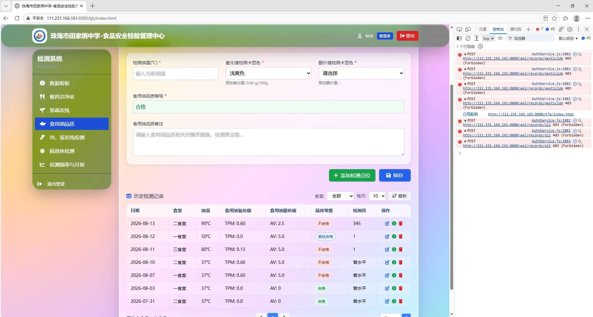
  - 证据图：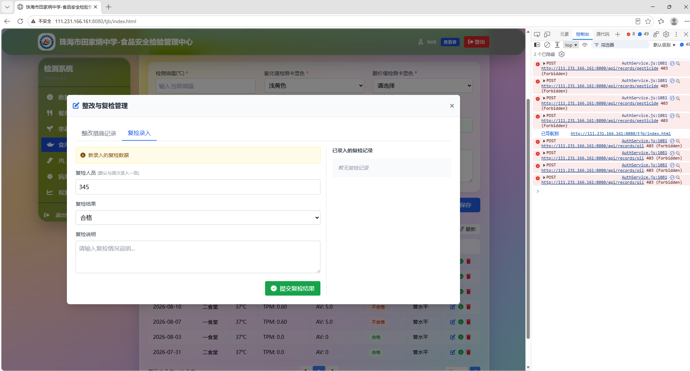
  - 证据图：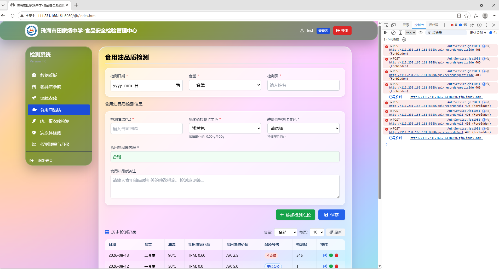
  - 证据图：
  - 证据图：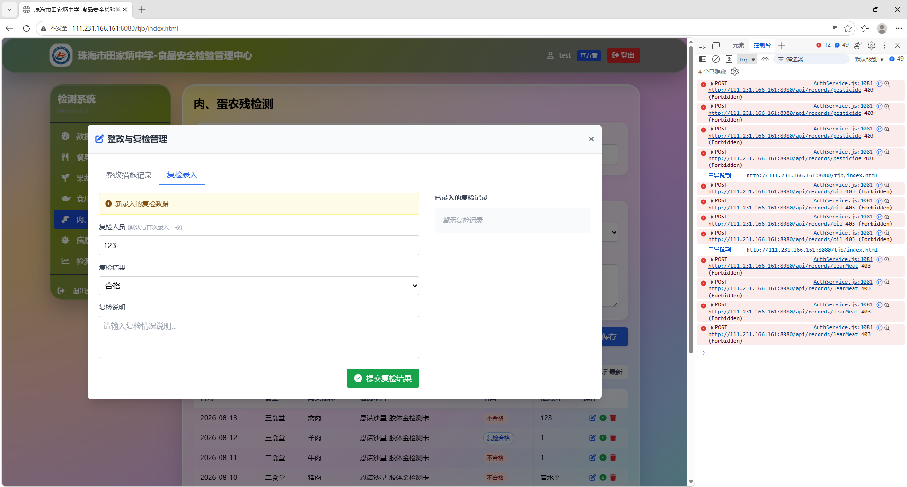
  - 证据图：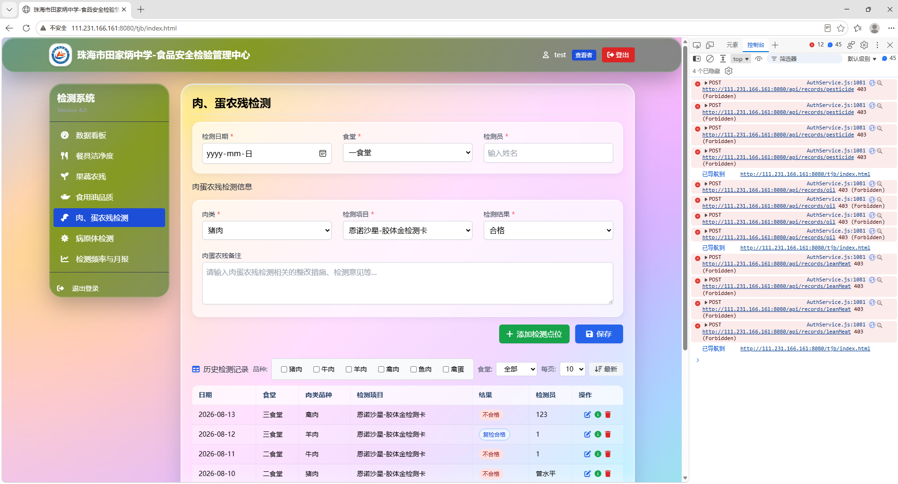
- **NEW-20260813-140219**（失败）
  - 证据图：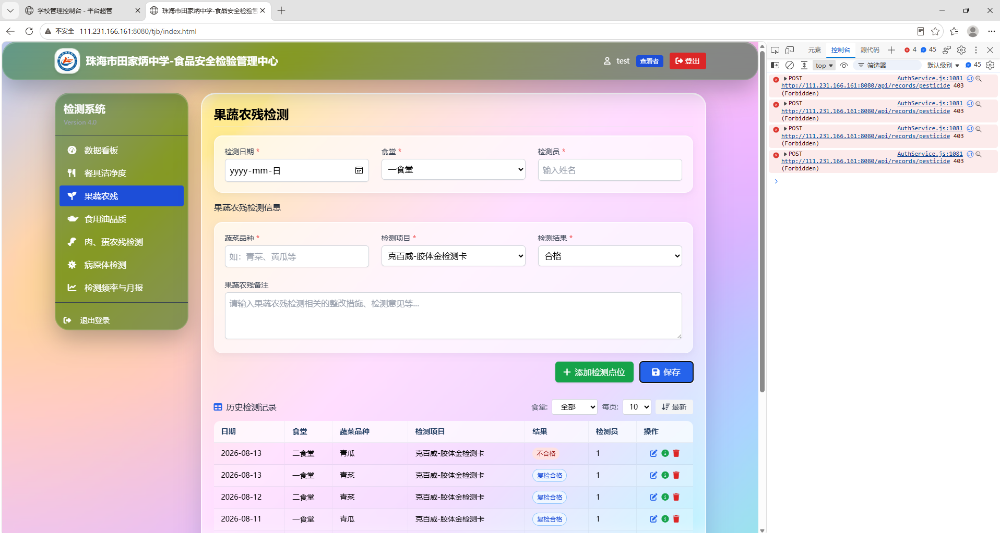
  - 证据图：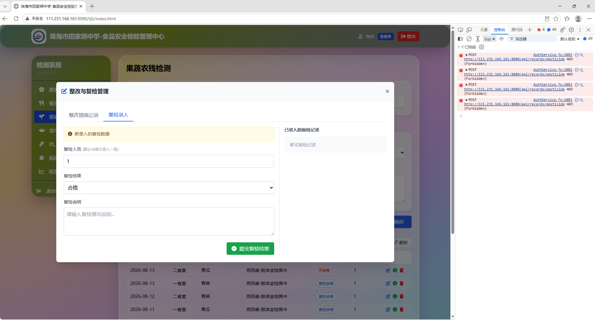
  - 证据图：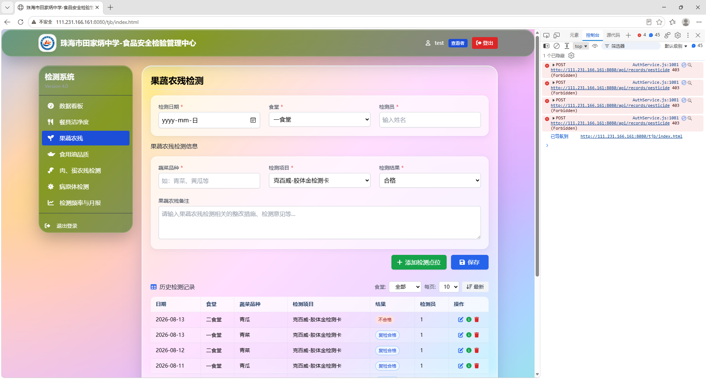
- **NEW-20260812-170648**（失败）
  - 实际表现：识别的结果与肉眼判断的结果不符合，以及识别不到离心管
  - 证据图：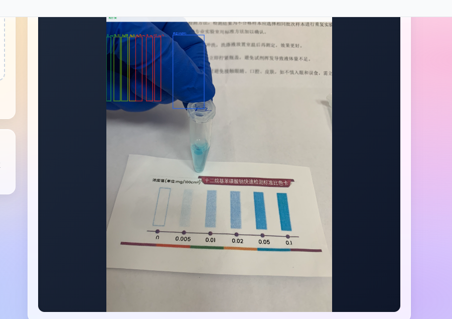
  - 证据图：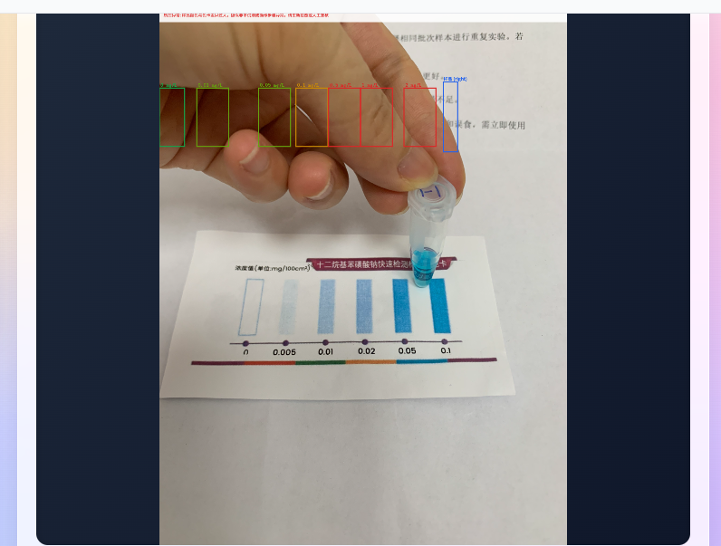
  - 证据图：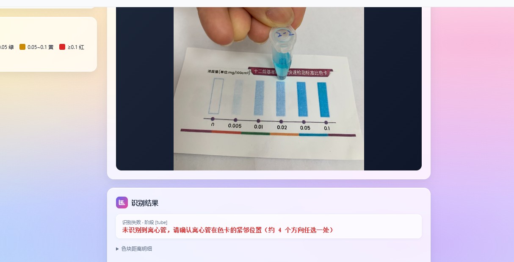
  - 证据图：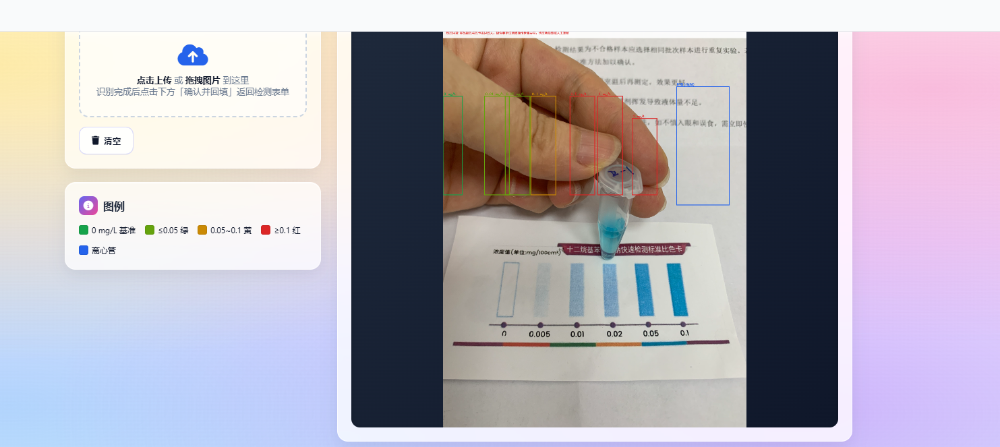
- **NEW-20260812-170647**（失败）
  - 实际表现：识别不符合结果
